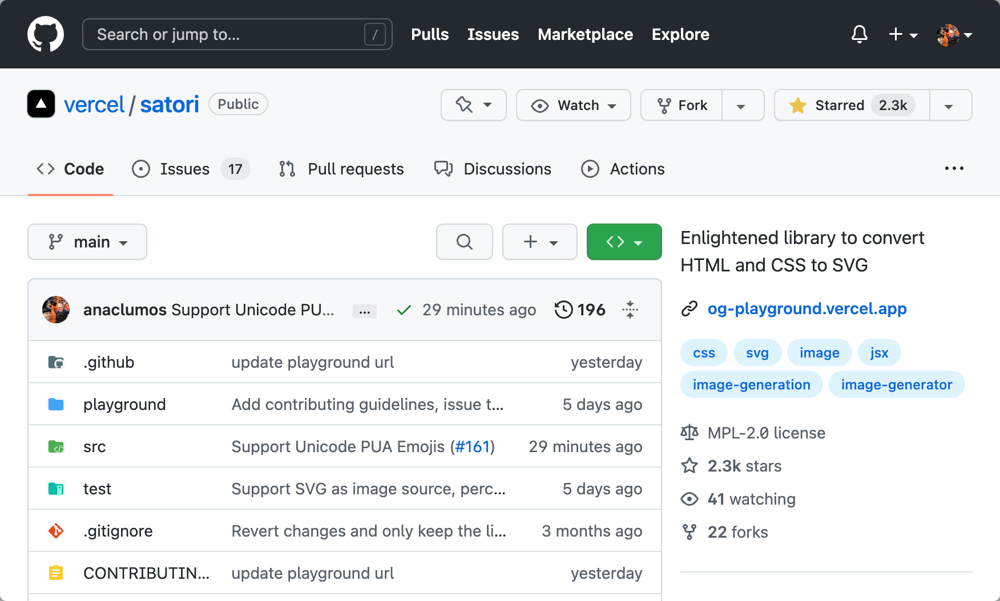
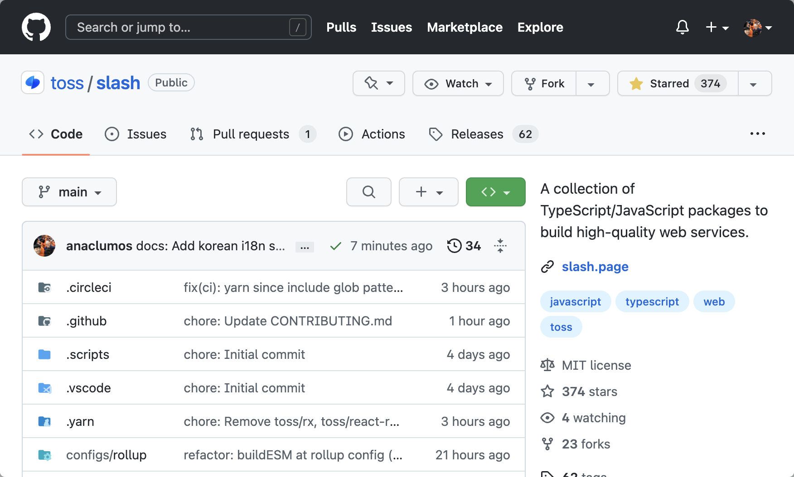

# 2022-10-11

## Personal Research

<figure>

<figcaption>

Merged! [Add Unicode Private Area Support #161](https://github.com/vercel/satori/pull/161)

</figcaption>
</figure>

<figure>

<figcaption>

Merged 2! [docs: Add Korean i18n support #31](https://github.com/toss/slash/pull/31)

</figcaption>
</figure>

- [[Satori]]
- [[Super App and Democracy]]
- [[Handwriting Tools for Thoughts]]
- [[Slow Down Your Brain Clock Cycle]]
- Instead of listing everything on a Journal Page, I should start separating them into individual [[Research]] pages.
- I am unsure if I would backdate to migrate them.
- Had trouble setting HomePod with Wi-Fi. The problem was because of using WPA3 Personal. I switched to WPA2 Personal, and it worked like a charm.

## [[TODO]]

- [ ] [[How is WASM cross-platform]]
- [ ] Study the thread by [Shu](https://twitter.com/shuding_/status/1579607964549513217).
- [ ] Study the thread on [HN](https://news.ycombinator.com/item?id=33151774)
- [ ] Linker Service [[Case Study|CS]] ([[Hacker News|HN]], [Daily](https://app.daily.dev/), Surfit)
