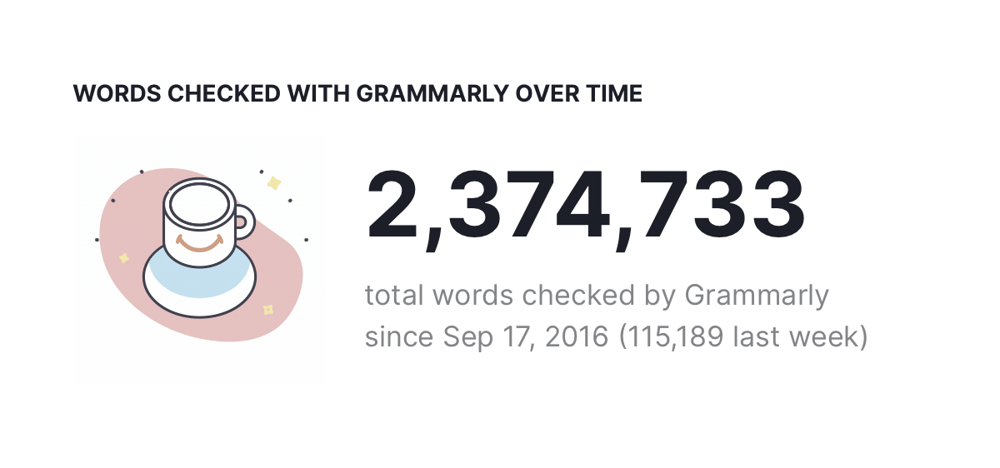

# 2022-10-12

> As the 120-ton space shuttle sits surrounded by almost 4 million pounds of rocket fuel, exhaling noxious fumes, visibly impatient to defy gravity, its onboard computers take command. [They Write the Right Stuff](https://www.fastcompany.com/28121/they-write-right-stuff)

## [[TODO]]

- [x] Reply to [[Grammarly]] Recruiter
- [x] Revert Toggle Design
  - [x] Archived [[iOS Style Toggle in CSS]]
- [x] Review Midterm Results
- [ ] Finish PayPal's OA
- [ ] Finalize [[How is WASM cross-platform]]
- [ ] Study the thread by [Shu](https://twitter.com/shuding_/status/1579607964549513217).
- [ ] Study the thread on [HN](https://news.ycombinator.com/item?id=33151774)
- [ ] Linker Service [[Case Study|CS]] ([[Hacker News|HN]], [Daily](https://app.daily.dev/), Surfit)
- [ ] Review [Alexander Obenauer](https://alexanderobenauer.com/) [[Extracranial]]
- [ ] Review [MailPilot](https://www.mailpilot.app/) [[Markdown Emails]]
- [ ] Attend Ryan Choi's talk (Director of [[Y Combinator]])

## Personal Research

- [[Dynamic Island on the Web]]
- [[Handwriting Tools for Thoughts]]
- [[Slow Down Your Brain Clock Cycle]]
- [[Letter to Mr. Alexander Obenauer on 2022-10-12]]
- [[Personal Training Corpus]]

## Noteworthy

- [[Jetbrains Fleet]] is [[GA]]: [Introducing the Fleet Public Preview](https://blog.jetbrains.com/fleet/2022/10/introducing-the-fleet-public-preview)
