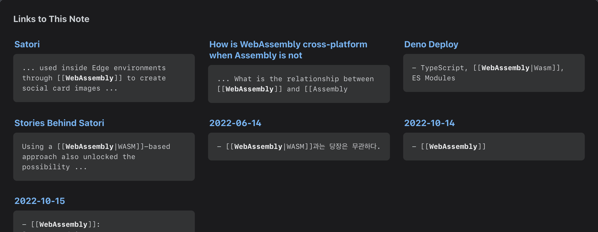

## Academic Research

- [[Primary-Recency Effect]]

## Personal Research

### [[Backlinking for Aldehyde]]

import DisplayFlex from '@site/src/components/DisplayFlex'

<DisplayFlex>

</DisplayFlex>

**[[Backlink|Links to This Note]]** feature is complete.
Heavily inspired by [[Andy Matuschak]].

#### [I built Backlinking for Docusaurus! · Discussion #8217 · facebook/docusaurus](https://github.com/facebook/docusaurus/discussions/8217?notification_referrer_id=NT_kwDOAeMNUrM0NjE4NjQ3NjczOjMxNjU3Mjk4)

> Thanks! I want Docusaurus to have this feature built-in 😃
> To explain how it works, a [python preprocessor](https://github.com/anaclumos/extracranial/blob/main/tools/process-backlinks.py) will parse the document before building the site. This is necessary because I use `[[wikilink]]` for interlinking, which Docusaurus does not support. I have another python script that converts wikilinks to docusaurus-recognizable markdown links. After that, the [corresponding component](https://github.com/anaclumos/extracranial/blob/main/src/components/BacklinkTable/index.tsx) will read the indexed backlink JSON to display it on the client side.

### [[Letter to Mr. Alexander Obenauer on 2022-10-12]]

- [[SendGrid]]

## [[TODO]]

- [ ] Study the thread on [HN](https://news.ycombinator.com/item?id=33151774)
- [ ] Study [Biden-Harris Administration's National Security Strategy](https://www.whitehouse.gov/wp-content/uploads/2022/10/Biden-Harris-Administrations-National-Security-Strategy-10.2022.pdf)
- [ ] Finalize [[How is WebAssembly cross-platform when Assembly is not]]
- [ ] Review [MailPilot](https://www.mailpilot.app/) [[Markdown Email Client]]
