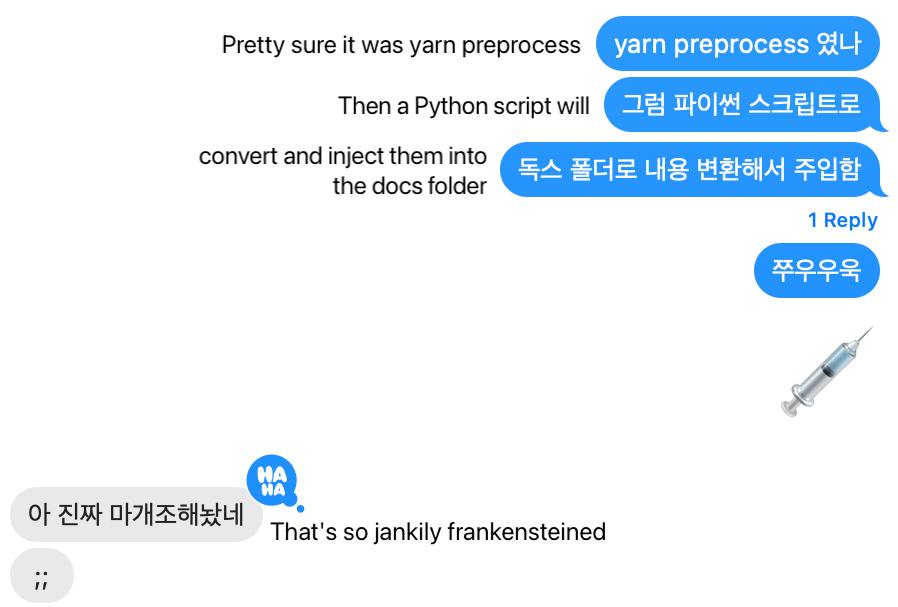

## Welcome!

> This is my personal [Wikipedia](https://en.wikipedia.org/wiki/Wikipedia).
> This is everything I know!

<figure>

<figcaption>

my [[http]] request origin [[Cartography|map]] 🌏 🌎 🌍

</figcaption>
</figure>

Welcome to my research note.
I grew up reading [The Encyclopedia of Absolute and Relative Knowledge](https://en.wikipedia.org/wiki/L%27Encyclop%C3%A9die_du_savoir_relatif_et_absolu) and envisioned a _single source of truth_ just like it that integrated my projects and research.
I am thrilled to present you with the incarnation of this vision.
You will find my most up-to-date interests here.
Check out my [articles](/w/archive) if you seek internationalized content.

:::caution

Please note that while I strive to provide accurate and up-to-date information on this website, there may be times when the information presented needs to be corrected or updated. Therefore, I cannot guarantee the accuracy or completeness of the information provided on this website. Additionally, the information presented on this website should not be construed as professional advice. If you rely on any data presented on this website, you do so at your own risk. I am not legally liable for errors, omissions, or damages arising from using or relying on this website's information.

:::

## Nonlinearity

import Link from '@docusaurus/Link'

<Link href="/3d">

<figure>

<figcaption>One glowing dot represents one post. A link between dots means those two posts correlate.</figcaption>
</figure>

</Link>

One scientist envisioned something called [[Memex]] when transistors were invented.
Memex, as a device that stores and indexes all information and knowledge of a person, is known to be the first description of the internet.
This place **faithfully** implements Memex with modern technology.
Unlike ordinary websites, this place is non-linear.
There are no next/previous posts, parent/child folders, or domain structures, and everything gets regularly rearranged.
No information retains its _physical_ form; everything is handled by metadata, with front matters and hyperlinks.
What's so good that way? Unparalleled flexibility.

## Tech Stacks

I use [[Obsidian]] for taking notes.
I then pipeline those notes into heavily customized [[TypeScript]] [[Docusaurus]] with custom [[React]] components.
I finally use [[Cloudflare]] for deploying, [[caching]], and distributing.
I open-sourced it on [GitHub](https://github.com/anaclumos/extracranial).
Take a look! 😃

<figure>

<figcaption>"Jankily Frankensteined" — perfectly describes how heavily customized this repository is...</figcaption>
</figure>
