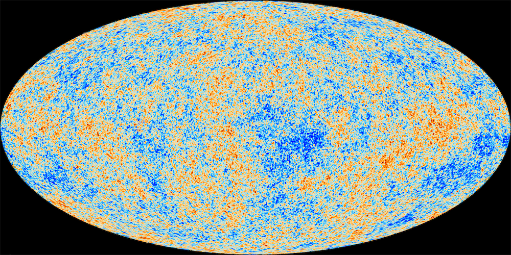

Regardless of the continuous **noises** of life, there are certain things reassured periodically in life.
It's like the grand cross, the lunar eclipse.

If you shut down all the noise around you and focus on the pure silent void...
You will hear a shimmering, lingering background noise — just like the [Cosmic noise](https://en.wikipedia.org/wiki/Cosmic_noise).

For me, that was:

- Knowledge is the core value
- [[수적천석|Persistence]] is the key
