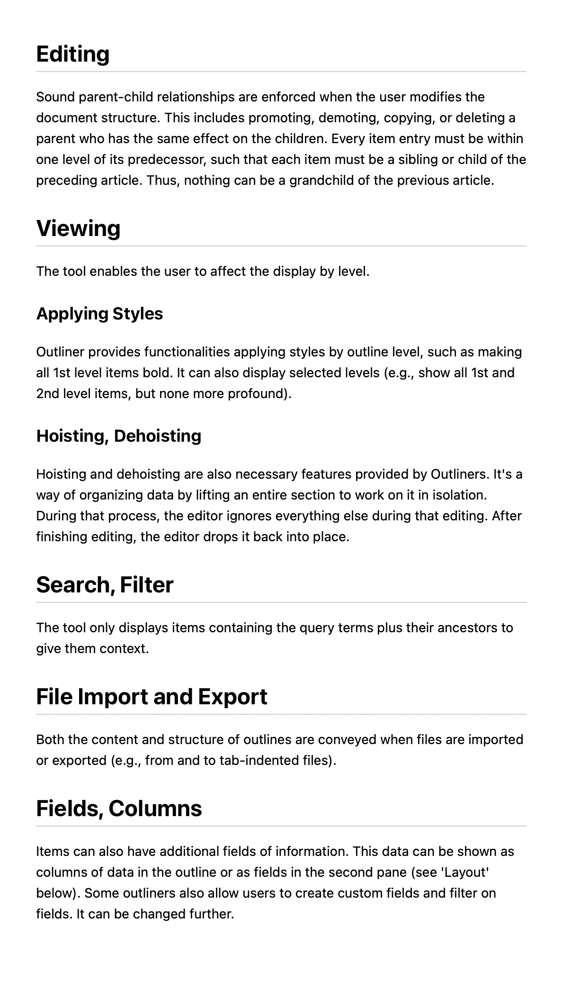
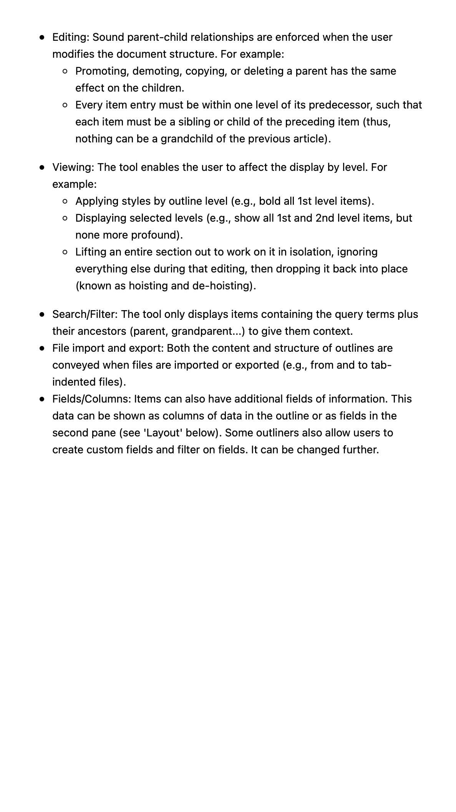

## Definition

Inliner is a mental model or an abstract methodology for organizing data and writing articles.
It originates from the outliner, where every text is a bullet point.
Unlike the Outliner, the Inliner aims to separate the editing and reading experience by utilizing [[Markdown]]'s strict line change mode.
When editing, each sentence shows as a line for more accessible organization and editing.
However, [[Markdown]] will automatically convert them into flowing text, making the reading experience more natural and immersive.

Apart from the paragraph, it also utilizes headers.
Each sub-header and text will become inclusive of the super-header containing all.

That creates a mental model for a tree-like structure for organizing ideas.

## Examples

An Outliner model will look like the following. Text from [Outliner Wikipedia](https://en.wikipedia.org/wiki/Outliner).

```
-   Editing: Sound parent-child relationships are enforced when the user modifies the document structure. For example:
    -   Promoting, demoting, copying, or deleting a parent has the same effect on the children.
    -   Every item entry must be within one level of its predecessor, such that each item must be a sibling or child of the preceding item (thus, nothing can be a grandchild of the previous article).
-   Viewing: The tool enables the user to affect the display by level. For example:
    -   Applying styles by outline level (e.g., bold all 1st level items).
    -   Displaying selected levels (e.g., show all 1st and 2nd level items, but none more profound).
    -   Lifting an entire section out to work on it in isolation, ignoring everything else during that editing, then dropping it back into place (known as hoisting and de-hoisting).
-   Search/Filter: The tool only displays items containing the query terms plus their ancestors (parent, grandparent...) to give them context.
-   File import and export: Both the content and structure of outlines are conveyed when files are imported or exported (e.g., from and to tab-indented files).
-   Fields/Columns: Items can also have additional fields of information. This data can be shown as columns of data in the outline or as fields in the second pane (see 'Layout' below). Some outliners also allow users to create custom fields and filter on fields. It can be changed further.
```

An equivalent Inliner model would look like this.
Notice that the overall information conveyed is similar.
However, Inliner utilizes different headers for organizing data.
Finally, Inliner makes each datapoint (bullets in Outliner, sentences in Inliner) more _flowable_ to read.

```
## Editing

Sound parent-child relationships are enforced when the user modifies the document structure.
This includes promoting, demoting, copying, or deleting a parent who has the same effect on the children.
Every item entry must be within one level of its predecessor, such that each item must be a sibling or child of the preceding article.
Thus, nothing can be a grandchild of the previous article.

## Viewing

The tool enables the user to affect the display by level.

### Applying Styles

Outliner provides functionalities applying styles by outline level, such as making all 1st level items bold.
It can also display selected levels (e.g., show all 1st and 2nd level items, but none more profound).

### Hoisting, Dehoisting

Hoisting and dehoisting are also necessary features provided by Outliners.
It's a way of organizing data by lifting an entire section to work on it in isolation.
During that process, the editor ignores everything else during that editing.
After finishing editing, the editor drops it back into place.

## Search, Filter

The tool only displays items containing the query terms plus their ancestors to give them context.

## File Import and Export

Both the content and structure of outlines are conveyed when files are imported or exported (e.g., from and to tab-indented files).

## Fields, Columns

Items can also have additional fields of information.
This data can be shown as columns of data in the outline or as fields in the second pane (see 'Layout' below).
Some outliners also allow users to create custom fields and filter on fields. It can be changed further.
```

## Comparison with Outliner

import DisplayFlex from '@site/src/components/DisplayFlex'

<DisplayFlex>




</DisplayFlex>

This is a personal preference, but Inliner looks much more _welcoming to read_ for me.

## References

### [Derek Sivers: Writing One Sentence Per Line](https://sive.rs/1s)

- Write one sentence per line to:
  - help judge sentence by itself
  - help varying sentence lengths
  - help you organize content
