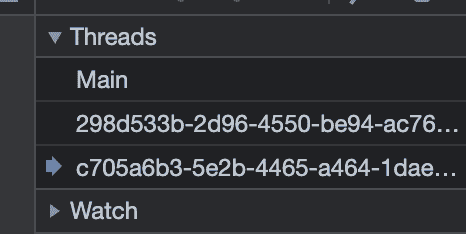

## Personal Notes

- [[PARA]]... might be worse than I thought?
  - The structure is unintuitive and redundant.
  - I might come up with my own structure.
  - Current idea: `Projects`, `Research`, `Readings`, `Journals`.
- contact [[mail]] and signup [[mail]] -- separation necessary?
- Merged! ![[1ED417.jpeg]]
- A successful business sells lifestyles and dreams. Did they succeed by selling a dream, or did they rebrand themselves when they got enough cash?

## Work Notes

### [[Brane]]

- Decided with `two-roots.` Locally confirmed it operates correctly.

- One thing to confirm: `two-roots` uses `getBoundingClientRectAsync`

### [[Brane]] [[WorkerDOM]] Non-blocking Example

![[3AB4D2.png]]

- Implemented the Technical [[Proof of Concept]] and posted here: _[[Proof of Concept|PoC]] that two [[WorkerDOM]] upgraded threads don't block each other_ - [Two Roots](https://brane.vercel.app/two-roots-with-infinite-loop/)

1.  Open Dev Console.
2.  Press Health Check in both Root 1 and Root 2.
3.  Check that both are alive.
4.  After pressing **while(true)** in Root 1, only Root 2 will respond.

## Interesting Webs

### [Bun is a fast all-in-one JavaScript runtime](https://bun.sh/)

- Bun is a fast all-in-one [[JavaScript]] runtime
- Bundle, transpile, install and run [[JavaScript]] & [[TypeScript]] projects — all in Bun. Bun is a new [[JavaScript]] runtime with a native bundler, transpiler, task runner and npm client built-in
