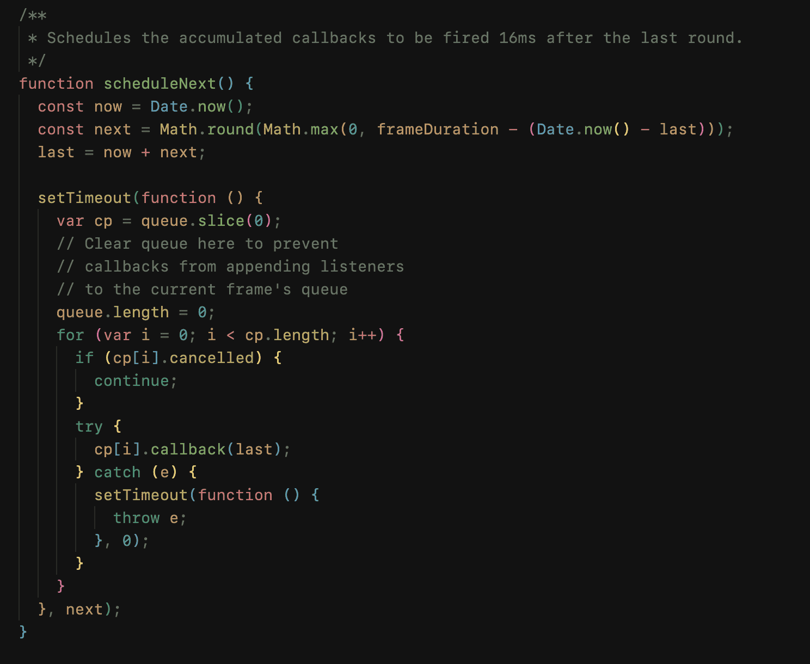
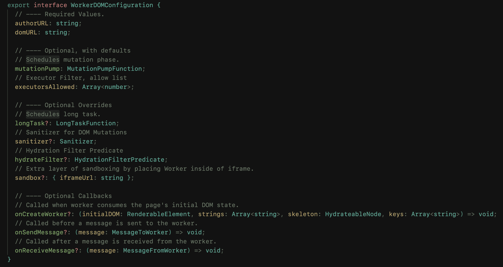

## [[Work Note|Work Notes]]

**Status Quo**.
On [[2022-07-11]], I analyzed that [[Brane]] is harder than it seems.
Thus I now need to reassess our goals.
[[Brane]]'s previous demo goals were:

1. Demo [[JavaScript]] [[animation]] works as expected.
   - This involves [[SharedArrayBuffer|SAB]]
2. Demo Isolation
3. Demo Multitasking (and Preloading)

Everything above seems possible.
However, I don't know how long it will take nor how hard it will be.
It is like a black box.
And typically, black-box situations take at least 4x more time.

### [[Scheduler|Schedulers]] in [[WorkerDOM]]

## Personal Notes

- [[Better Aldehyde]]
- [[Better Obsidian]]
- [[Better Docusaurus]]
- [[Better Hacker News]]
- [chore(theme-translations): complete ko translations](https://github.com/facebook/docusaurus/pull/7762) Merged!

![[D815DD.jpeg]]
