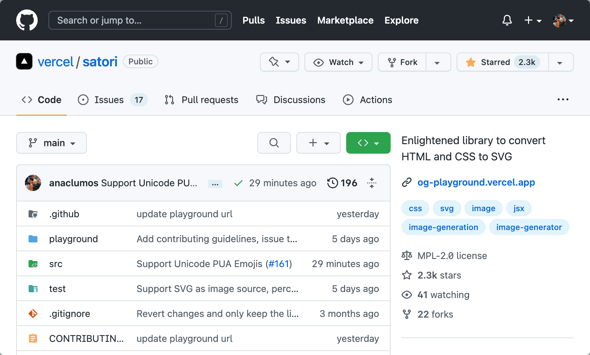

## Personal Research

import DisplayFlex from '@site/src/components/DisplayFlex'

<DisplayFlex>

<figure>

<figcaption>

Merged! [Add Unicode Private Area Support #161](https://github.com/vercel/satori/pull/161)

</figcaption>
</figure>

<figure>

<figcaption>

Merged 2! [docs: Add Korean i18n support #31](https://github.com/toss/slash/pull/31)

</figcaption>
</figure>
</DisplayFlex>

- [[Satori]]
- [[Super App and Democracy]]
- [[Letter to the Heptabase Team on 2022-10-11]]
- Instead of listing everything on a Journal Page, I should start separating them into individual Research pages.
- I am unsure if I would backdate to migrate them.
- Had trouble setting HomePod with Wi-Fi. The problem was because of using WPA3 Personal. I switched to WPA2 Personal, and it worked like a charm.
