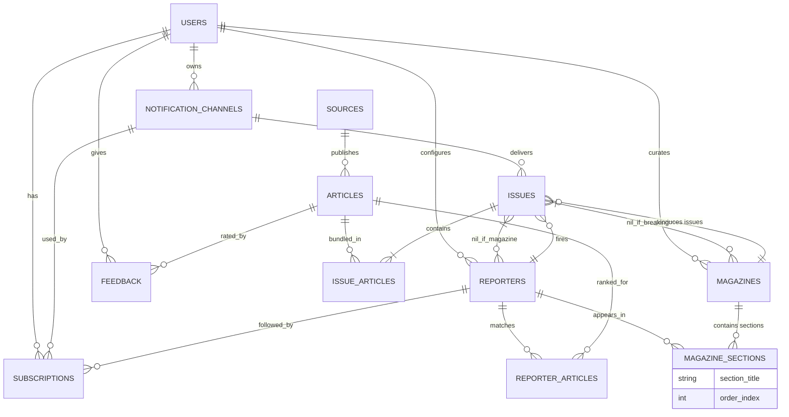

```mermaid
erDiagram
    USERS ||--o{ REPORTERS : creates
    USERS ||--o{ DELIVERY_CHANNELS : configures
    USERS ||--o{ NOTIFICATIONS : receives
    USERS ||--o{ FEEDBACK : provides
    USERS ||--o{ MAGAZINES : creates
    USERS }o--|| TEAMS : belongs_to (optional)

    TEAMS ||--o{ USERS : has_member
    TEAMS ||--o{ REPORTERS : shared_with (optional)
    TEAMS ||--o{ MAGAZINES : shared_with (optional)

    REPORTERS ||--o{ FINDINGS : leads_to
    REPORTERS ||--o{ FEEDBACK : receives_feedback_for
    REPORTERS }o--|| TEAMS : belongs_to_team (optional)
    REPORTERS }o--|| USERS : owned_by
    REPORTERS }o--o{ MAGAZINES : included_in (optional)

    CONTENT_ITEMS ||--o{ FINDINGS : included_in
    CONTENT_ITEMS ||--o{ FEEDBACK : receives_feedback_on
    CONTENT_ITEMS ||--|| BREAKING_NEWS : featured_in

    FINDINGS ||--|{ REPORTERS : found_by
    FINDINGS ||--|{ CONTENT_ITEMS : concerns
    FINDINGS ||--o{ NOTIFICATIONS : triggers

    DELIVERY_CHANNELS ||--o{ NOTIFICATIONS : delivers_via
    DELIVERY_CHANNELS }o--|| USERS : configured_by

    NOTIFICATIONS ||--|{ FINDINGS : generated_from
    NOTIFICATIONS }o--|| USERS : sent_to
    NOTIFICATIONS }o--|| DELIVERY_CHANNELS : sent_via

    FEEDBACK }o--|| USERS : given_by
    FEEDBACK }o--|| REPORTERS : about_reporter
    FEEDBACK }o--|| CONTENT_ITEMS : about_content

    MAGAZINES ||--o{ REPORTERS : has_sections
    MAGAZINES }o--|| USERS : created_by
    MAGAZINES }o--|| TEAMS : belongs_to_team (optional)

    BREAKING_NEWS ||--|| CONTENT_ITEMS : features

    USERS {
        int user_id PK
        string email UK
        string name
        string password_hash
        datetime created_at
        int team_id FK "Optional"
    }

    TEAMS {
        int team_id PK
        string team_name
        datetime created_at
    }

    REPORTERS {
        int reporter_id PK
        int user_id FK
        int team_id FK "Optional"
        string name
        string keywords
        json semantic_query_data
        json relevance_config
        bool is_active
        datetime created_at
        datetime last_run_at
        int magazine_id FK "Optional"
    }

    CONTENT_ITEMS {
        int content_item_id PK
        string url UK
        string title
        text snippet
        string source_name
        datetime published_at
        datetime discovered_at
        vector vector_embedding "Potentially large"
    }

    FINDINGS {
        int finding_id PK
        int reporter_id FK
        int content_item_id FK
        float relevance_score
        datetime found_at
        string status
    }

    DELIVERY_CHANNELS {
        int channel_id PK
        int user_id FK
        string type
        json config_details "Encrypted"
        bool is_default
        bool is_active
    }

    NOTIFICATIONS {
        int notification_id PK
        int finding_id FK
        int user_id FK
        int channel_id FK
        datetime sent_at
        string sent_at
        string status
    }

    FEEDBACK {
        int feedback_id PK
        int user_id FK
        int reporter_id FK
        int content_item_id FK
        bool is_relevant
        datetime feedback_at
    }

    MAGAZINES {
        int magazine_id PK
        string title
        string description
        datetime created_at
        int user_id FK
        int team_id FK "Optional"
    }

    BREAKING_NEWS {
        int breaking_news_id PK
        int content_item_id FK
        datetime created_at
    }
```