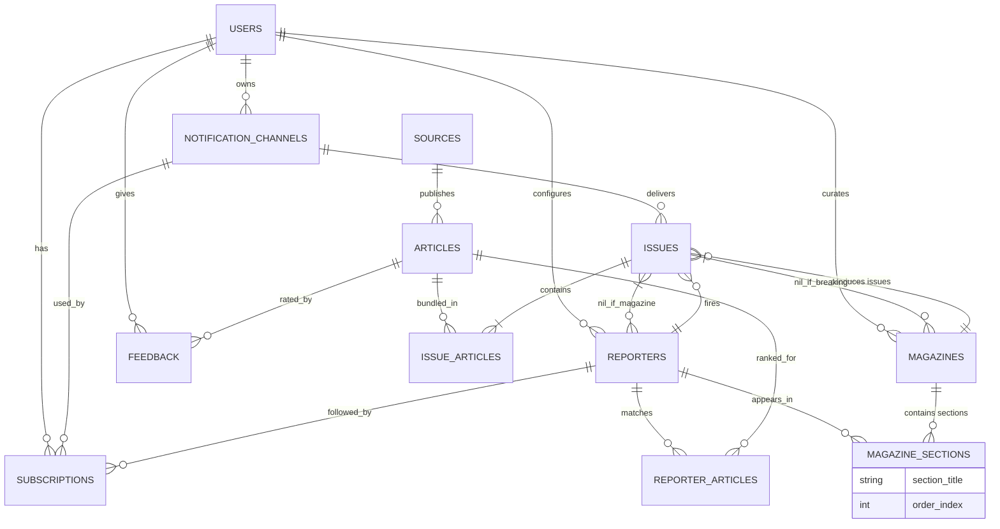

```mermaid
erDiagram
    USERS ||--o{ NOTIFICATION_CHANNELS : owns
    USERS ||--o{ REPORTERS : "configures"
    USERS ||--o{ MAGAZINES : "curates"
    USERS ||--o{ FEEDBACK : "gives"
    USERS ||--o{ SUBSCRIPTIONS : "has"

    NOTIFICATION_CHANNELS ||--o{ SUBSCRIPTIONS : used_by
    NOTIFICATION_CHANNELS ||--o{ ISSUES : delivers

    REPORTERS ||--o{ SUBSCRIPTIONS : followed_by
    REPORTERS ||--o{ REPORTER_ARTICLES : matches
    REPORTERS ||--o{ MAGAZINE_SECTIONS : appears_in
    REPORTERS ||--o{ ISSUES : fires

    MAGAZINES ||--o{ MAGAZINE_SECTIONS : "contains sections"
    MAGAZINES ||--o{ ISSUES : "produces issues"

    MAGAZINE_SECTIONS {
        string section_title
        int    order_index
    }

    SOURCES ||--o{ ARTICLES : publishes
    ARTICLES ||--o{ REPORTER_ARTICLES : ranked_for
    ARTICLES ||--o{ ISSUE_ARTICLES : bundled_in
    ARTICLES ||--o{ FEEDBACK : rated_by

    ISSUES ||--|{ ISSUE_ARTICLES : contains
    ISSUES }|--o{ REPORTERS : nil_if_magazine
    ISSUES }|--o{ MAGAZINES : nil_if_breaking

```
