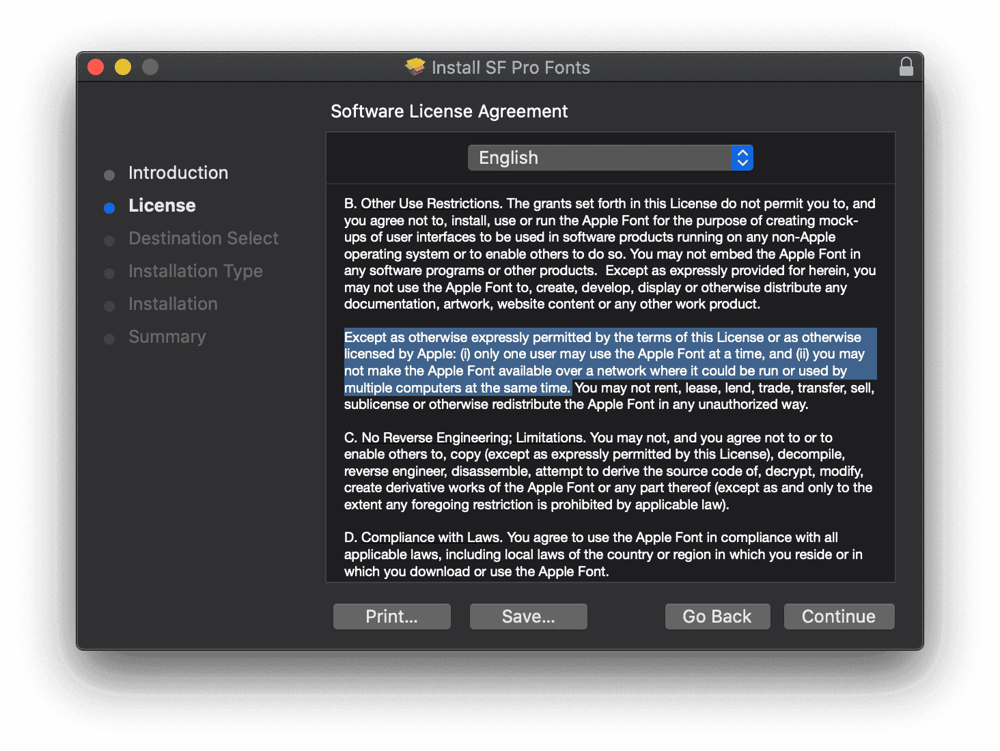
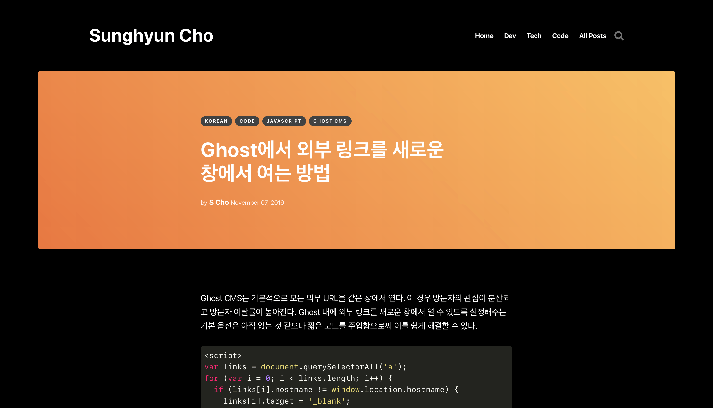
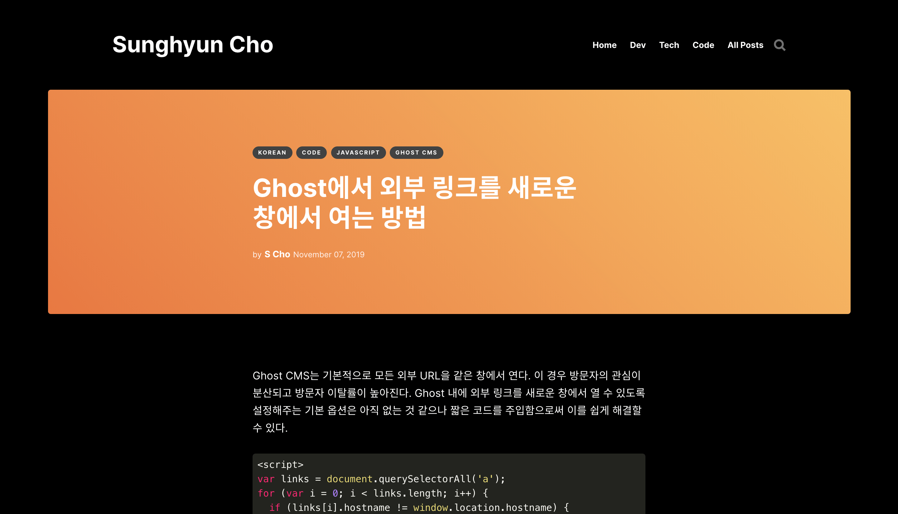

[[2020-04-15]]

:::tip
이하 모든 내용은 2020년 기준으로 작성되었다.
2022년 기준, **그냥 [[Pretendard]]를 사용**하면 된다.
가장 [[Apple|애플]]을 잘 모방한 서체이다.
:::

아주 오랜 기간 나에게 딱 맞는 폰트 [[CSS]]를 찾아왔다. 이 글에서는 드디어 찾은 나만의 폰트 [[CSS]]에 대해서 다뤄볼 것이다.

## 한줄정리

```css
font-family: /* 본문용 서체 */ '-apple-system', 'BlinkMacSystemFont', 'Apple SD Gothic Neo', 'Inter', 'Spoqa Han Sans',
  'Segoe UI', Sans-Serif, 'Apple Color Emoji', 'Segoe UI Emoji', 'Segoe UI Symbol';

font-family: /* 코드용 서체 */ 'SF Mono', 'Consolas', 'Menlo', monospace;
```

Import 잊지 마세요!

## [[San Francisco]]를 사용하고 싶었다

나는 [[San Francisco]]를 가장 좋아한다. 최근 [[Apple]] 제품의 기본 서체로 사용되고 있고 [Apple Newsroom](https://www.apple.com/kr/newsroom)에서도 사용하는 그 폰트이다. 나는 [Apple Newsroom](https://www.apple.com/kr/newsroom)의 디자인을 정말 좋아하기 때문에 최대한 그 느낌을 살리고 싶었다. 하지만 [[San Francisco]] 폰트의 사용 약관에는 약간의 문제가 있었으니...



_Except as otherwise expressly permitted \[...\] you may not make the Apple [[Font]] available over a network where it could be run or used by multiple computers at the same time. (명시적으로 허용되지 않은 이상, Apple의 폰트를 네트워크 상에서 제공하여 여러 컴퓨터에서 동시에 사용할 수 없습니다.)_

일반 사용자는 [[San Francisco]]를 웹 폰트로 사용할 수 없다는 의미이다 (Apple Newsroom은 [[San Francisco|SF Pro]] 웹 폰트를 사용하고 있다.) 그럼 [[Alternative|대안]]을 찾아보자.

## 1\. [[Apple]] 제품에서는 내장된 [[San Francisco|SF]] 폰트를 불러오자

기업들은 종종 제품 폰트로 시스템 기본 폰트를 사용하려 한다. 그럴 때마다 흔하게 사용되는 방식이다. 대표적으로 [[GitHub]]이 이와 같은 방식을 사용한다.

    1. -apple-system,
    /* Safari에서 SF 한글/영문 폰트. Firefox에서 SF 영문 폰트 */
    2. BlinkMacSystemFont,
    /* Chrome 계열에서 SF 한글/영문 폰트 */
    3. Apple SD Gothic Neo,
    /* Firefox에서 SF 한글(산돌 고딕 네오) 폰트*/

[[Apple]]은 한글 폰트로 **산돌고딕 네오**를 사용한다. [[Safari]]와 [[Chrome]]은 `-apple-system`만 있어도 산돌고딕 네오를 불러오는 반면 [[Firefox]] 계열은 그러지 못한다. 때문에 [[Firefox]]에서 알맞은 한글 서체를 사용하도록 `Apple SD Gothic Neo`를 지정해주는 것이다.

## 2\. 그 외에는 [[San Francisco|SF]] 폰트와 닮은 폰트를 사용하자

### 영문: [[Inter]]

    4. [[Inter]]
    /* 비 Apple 제품에서 영문 폰트 */

[Rasmus Andersson](https://rsms.me/about)이라는 분께서 제작하신 Inter Font가 [[San Francisco|SF Pro]]와 가장 닮았다는 생각이 들었다. SF 폰트와는 다르게 웹폰트로 자유롭게 사용할 수 있으며 [rsms.me](https://rsms.me/inter/inter.css)와 [Google Font](https://fonts.google.com/specimen/Inter)에서 모두 제공된다. [Mozilla](https://mozilla.org), [Figma](https://www.figma.com/), [GitHub](https://github.com), [프로그래머스](https://programmers.co.kr/) 등이 Inter Font를 사용한다.

    @import url('https://rsms.me/inter/inter.css');

### 한글: [Spoqa Han Sans (스포카 한 산스)](https://spoqa.github.io/spoqa-han-sans/)

    5. Spoqa Han Sans
    /* 비 Apple 제품에서 한글 폰트 */

스포카 한 산스 서체가 산돌고딕 네오와 가장 닮았다는 생각이 들었다. 그도 그럴 것이 스포카 한 산스의 기반이 되는 Noto Sans, 즉 **본고딕**이 산돌에서 디자인한 서체이기 때문이다. 스포카 한 산스는 본고딕에서 몇 가지 디자인을 수정한 서체이다. [토스](https://toss.im/), [텀블벅](https://tumblbug.com/), [망고플레이트](https://www.mangoplate.com/), [렌딧](https://lendit.co.kr/), [카모아](https://carmore.kr) 등에서 스포카 한 산스를 활용한다.

    @import url(//spoqa.github.io/spoqa-han-sans/css/SpoqaHanSans-kr.css);

## 3\. 그 외의 경우

이미 위에서 모든 한글/영문 폰트가 설정되었다. 이 부분은 네트워크에 문제가 있을 때를 비롯한 약간의 예외 처리를 위한 부분으로 큰 의미가 없다.

    6. Segoe UI
    /* Windows 시스템 서체 */
    7. Sans-serif
    /* 그 외의 Sans Serif 서체.
       Apple은 Helvetica, Windows는 Arial.
     */

## 4\. 빠뜨릴 수 없는 🚀🥊

추가적으로 이모지가 잘 나타날 수 있도록 다음 글씨체들을 설정해준다. 마찬가지로 설정 안 해도 무방하다.

    8. Apple Color Emoji
    /* Apple의 Emoji */
    9. Segoe UI Emoji
    /* Windows의 Emoji */
    10. Segoe UI Symbol
    /* Windows의 특수 기호 */

## 5\. 코드 서체도 [[San Francisco|SF]] Mono

    font-family:
      "SF Mono", "Consolas", "Menlo", monospace;

코드 서체도 마찬가지로 [[San Francisco]] 계열의 [[San Francisco|SF]] Mono를 사용하도록 지정했다. WWDC16에서 첫 공개된 [[San Francisco|SF]] Mono는 여전히 Mac 터미널과 [[Xcode]]의 기본 코드 서체로 사용된다. 그 외의 경우에는 큰 차이가 없을 것 같아 보편적인 Consolas, Menlo를 지정했다.

GitHub의 경우에는 기본 코드 서체로 `SFMono-Regular`을 지정해두었는데, 이렇게 설정하면 [[Chrome]]에서는 [[San Francisco|SF]] Mono를 인식하지만 [[Firefox]]에서 [[San Francisco|SF]] Mono를 인식하지 못한다. 반면 [[San Francisco|SF]] Mono로 설정하면 [[Firefox]]와 [[Chrome]] 모두 인식한다. 와중에 [[Safari]]는 둘 다 인식 못 한다. (...)

## 결론





약간의 자간 차이와 글자 두께 차이가 존재한다. [[San Francisco|SF]] 폰트들이 대체로 글자가 더 촘촘하며 얇다. 하지만 [[Apple]] 제품에서는 @2x 등의 HiDPI 화면이 흔한데 반해 비 [[Apple]] 제품에는 HiDPI가 드물기 때문에 두껍고 넓은 폰트는 가독성을 높여주는 장점으로 작용할 것 같았다. 또한 전반적인 느낌이 매우 비슷하다고 생각이 들기 때문에 만족스럽다. 아마 당분간은 이 규칙을 그대로 사용할 것 같다.

한 가지 아쉬운 점은 네트워크 폰트를 2개나, 그것도 서로 다른 서버에서 불러온다는 점이다. 하지만 두 폰트는 모두 0.5초 이내에 비동기적으로 로드되며 이후에는 브라우저에 캐시된다는 점을 고려할 때 큰 문제는 아닌 것 같았다.

## 추가 정보

- GitHub CSS
- [**System Font Stack** by **CSS Tricks**](https://css-tricks.com/snippets/css/system-font-stack/)
- 단어 하나만으로 [[OS]]의 기본 서체로 설정할 수 있는 `system-ui`라는 CSS 코드를 표준화 하고 있다고 한다. 가까운 미래에는 그냥 `font-family: system-ui` 하나만 적는 날이 올 수도 있겠다.
- 2020년 4월 업데이트된 [[Chromium]] 81에서 BlinkMacSystemFont의 font-weight가 무시되는 [버그](https://bugs.chromium.org/p/chromium/issues/detail?id=1057654)가 발생했다.

## Updated Jul 17, 2020

[PAYW](https://github.com/payw-org)라는 단체를 운영하시는 [jhaemin](https://github.com/jhaemin)님께서 제작하신 [폰트](https://github.com/payw-org/PAYW-Pro)가 있다. Inter의 영문 폰트와 Noto Sans KR의 한글 폰트를 결합하여 만든 폰트로, 이 폰트를 웹폰트로 변환하여 서빙하는 것이 여러 개의 폰트를 로드하는 위의 방법보다 훨씬 간단하고 편리하다.

[GitHub - jhaemin/Interop: The Interop font family](https://github.com/jhaemin/Interop)

## Updated Nov 19, 2020

- 이 블로그의 코드 글씨체는 더 이상 [[San Francisco|SF]] Mono가 아니다! [[Jetbrains]] Mono라는 폰트를 사용 중이다.
- 이 글을 업데이트하지 않고 불시에 블로그의 글씨체를 업데이트할 수도 있다. 즉 지금 보고 있는 화면의 글씨체가 [[San Francisco|SF Pro]]가 아닐수도 있다. 하지만 이 글의 내용은 여전히 유효할테니, 위의 스크린샷 화면을 참고하면 된다.
