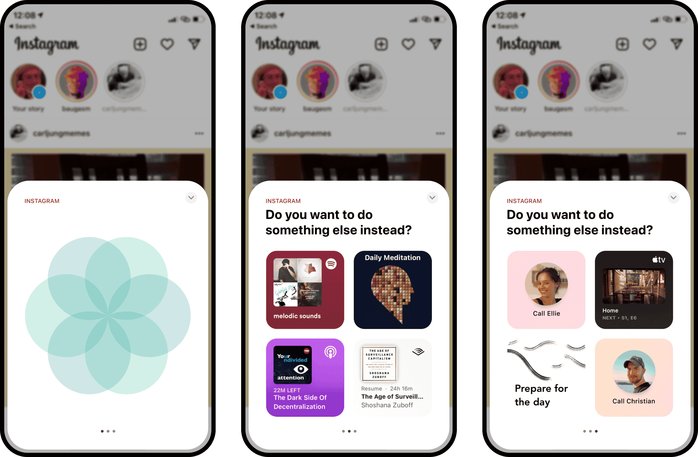

:::danger

I do not own any rights to the materials posted here.
The original page, [Attention Settings](https://attentionsettings.com/), is now inaccessible, and this page is only for [[Data Preservation]] purposes.
If you own the rights to the materials and want them unpublished, please contact me.

:::

import DisplayFlex from '@site/src/components/DisplayFlex'
import Tabs from '@theme/Tabs';
import TabItem from '@theme/TabItem';

<Tabs groupId='lang' queryString>
<TabItem value='en' label='English 🇺🇸' lang='en-US' default>

We believe you deserve transparency and control over how you're being manipulated. Attention Settings demonstrates practical pathways for regulating attention-extracting products to increase consumer agency.

![[E9DA32.png]]

The attention economy uses persuasive design techniques to exploit human vulnerabilities and extract our attention. Because of the advertising-based business model and the limited nature of human attention, these companies will continue to compete to get better at hijacking our brains.

However, for policy-makers, both political (governments) and eco-systemic (Apple & Google) alike, there isn't a clear path forward when it comes to regulating the design of these products.

The Digital Services Act recently introduced by the EU includes an intention to ban 'dark patterns':

> "Under new rules, 'dark patterns' are prohibited. Providers of online platforms will be required not to design, organise or operate their online interfaces in a way that deceives, manipulates or otherwise materially distorts or impairs the ability of users of their services to make free and informed decisions."

However, product design is a shady business — it isn't black and white. The problem of manipulation and attention extraction goes far beyond dark patterns. Addictive loops are at the core of the user experience of the most popular social media platforms. The lines are blurry.

That's where Attention Settings come in.

The basic idea is to give users awareness over how they're being manipulated and tools to selectively opt-out of the most engaging features — to reclaim their attentional, cognitive, and behavioral sovereignty.

This is roughly what it could look like:

<DisplayFlex>

![[6DE1DE.png]]

![[346C75.png]]

![[58745C.png]]

</DisplayFlex>

Products with over 10 million users could be required to provide a) transparency about the techniques they use to increase engagement and b) the option to opt-out of these techniques and features — as a condition for passing App Review.

If a product uses persuasive design, every one of these techniques and features should be listed in the AppStore nutrition card. The Attention Settings then provide the user with the option to opt-out. There could be an educational element to inform users about how these techniques work and why they might want to consider opting out.

Here are some examples of what these changes might look like in different apps:

## Examples

### Facebook

For Facebook, choosing a chronological feed, hiding all short-form videos like Reels, and disabling suggested content would make all the difference. The one on the right is a kind of Facebook I would enjoy using. The one on the left I simply refuse to have on my phone.

![[8DE1B4.png]]

### YouTube

When I open YouTube, I mostly have an intention for what I want to do. Like, maybe I want to play a song, show a specific video to a friend, or learn how to make a perfect poached egg.

But then YouTube shoves an auto-playing ad in my face and shows me an infinite feed of videos and shorts that are probably really fun to watch, but that will also cost me 2 hours that I didn't mean to spend. With 70% of watch-time coming from videos suggested by YouTube's algorithm, it's not about the one video you consciously signed up for.

With Attention Settings, you could turn off suggested videos, prevent auto-play, and remove the Shorts tab.

![[8F9A20.png]]

### Instagram

Just like with Facebook, time on Instagram is much more worthwhile when you get to see what your friends have been up to than when you're watching a bunch of 'entertaining' videos.

With a chronological feed, "Hide Explore Section", and "Hide Suggested Content", it might be viable again for me to have Instagram on my phone and occasionally check what the ~100 people I follow have been up to.

![[ACCDE7.png]]

### TikTok

There's some genuinely wholesome content on TikTok. At the same time, the algorithm underlying the For You Page is incredibly good at keeping us scrolling and watching. Attention Settings could help users see the content they want to see, without getting sucked into binge-watching sessions.

![[EEC7D4.png]]

These are merely examples of the kinds of things that could be done and would be helpful. Eventually, a list should be put together by a consortium of independent organizations that track the leading edge of this space.

The basic principle is this: If you use design techniques that increase user engagement, you need to provide the user with the option to opt-out.

The power asymmetry between the design teams at Facebook and the average user is enormous. They have weapons-grade behavior modification technology aimed at isolated individuals who don't know what's going on.

Their business model incentivizes these companies to maximize engagement at all costs. That means they can't be trusted to honor their duty of care to act in the users best interest.

In order to level the playing field and re-establish the symmetry of power, the user needs to understand what's going on and have control to turn these things off selectively.

These companies have nation-state scale and utilities-grade network effects and lock-in. Voting with your feet doesn't apply — you can't just leave. Right now, that means you're forced to take whatever they offer, regardless of how manipulative it is, how badly it undermines your mental health, etc.

When you're forced to stay, you should at least be empowered to stay on your terms, not just in when it comes to privacy but especially when it comes to attention and manipulation.

## Doubts

It's a very audacious proposal, and I hear your doubts:

- This interferes with 3rd party products in unprecedented ways
- Legal and political pushback is almost inevitable
- On what basis could we possibly do this?
- This will overwhelm users

These are valid concerns, yet I will ask you to put them aside for a minute. If I addressed all your doubts and we would be able to implement this on a waterproof legal basis, at a user-friendly level of simplicity — would it be the right thing to do?

I believe so. And it's possible to a) create this basis of legitimacy and b) make it simple. There are two fundamental questions to answer:

1: What is classified as engagement-maximizing, and by whom?

Who is to say that a particular feature is attention-maximizing? Where is the line between good UX and manipulation? I believe this is a relatively straightforward question to answer. A consortium of independent organizations, informed by foundational research (funded by Apple or the legislators), could surely come up with practical definitions.

2: What might be a sufficient basis of legal legitimacy?

The surveillance-industrial complex will push back on this, and there are plenty of directions they could take. On what basis could Apple or the EU possibly set these requirements?

Two frames seem especially promising as a basis of legitimacy:

## Accessibility

Instead of framing engagement-maximizing products as "bad for everyone", there is a reasonably straightforward argument that problematic smartphone use and social media addiction are handicapping a minority of the population.

From poor self-control to mental health issues and precarious life circumstances, regardless of what causes someone to be more vulnerable to manipulative design and cheap dopamine, the vicious feedback loops of compulsive behavior and increased addiction can have catastrophic consequences on people's wellbeing and productivity.

Not providing the comprehensive tooling required for neurodiverse and otherwise disadvantaged people to participate in the use of these products safely and effectively means we're neglecting to support some of our most vulnerable populations.

## Undue Influence

Persuasive technologies, especially social media, exert undue influence — a severe and systematic form of manipulation that is legally recognized in other contexts. Platform providers like Apple have a fiduciary responsibility to protect their customers from such undue influence.

Based on the technical legal definitions provided by psychologists, persuasive technologies have crossed the threshold from persuasion to coercion — and thus need to be classified as undue influence.

I suggest investing significant resources in constructing a solid legal specification of Undue Influence in the context of persuasive tech. With recursive loops of red-teaming and risk analysis, it should be possible to reach a point where Apple or policymakers could confidently use this as a legal basis for Attention Settings.

Facebook et al. will complain, and legal pushback is likely. Still, they would have to make a case against Undue Influence, in democratic courts, under the eye of legislators and a public that has been waiting for a comprehensive articulation of and response to these companies' perverted practices.

Four qualities of persuasive technology stand out on which legal experts could construct a definitive argument:

1. Privileged Information: With sophisticated psychological profiles, thousands of data points, and years of [[meta]]-data on every user, social media companies have a comprehensive set of privileged information.
2. Statistical Influenceability: If a particular feature or design change influences real-world behaviors with statistical reliability, that's a sound basis for undue influence.
3. Asymmetry of Power: Facebook's data and its ability to use it to modify user behavior are orders of magnitude greater than the average user's awareness, understanding, and ability to protect themselves from that manipulation.
4. Lack of Informed Consent: Most users have no clue that an algorithm — let alone weapons-grade behavioral modification technology — is playing against them. Facebook's research shows that they can shape emotions and behavior without triggering the users' awareness.

The cultural, ethical, and philosophical case for limbic capitalism's immorality has already been made extensively. What _is_ undue influence, if not ruthless attention capture and behavior modification, motivated by advertising revenue?

It is a worthwhile cause. This is an opportunity to create a cultural inflection point, to take a stand on the right side of history.

It's also an opportunity to directly improve the user experience of hundreds of millions of people, helping them get less distracted from the lives they want to live.

_But why stop with Attention Settings? There are countless opportunities for minimizing unintended social media usage. Here are our best ideas for how to help people be more intentional in their technology usage._

## Mindful UX Interventions

iOS could provide users with the option to enjoy a mindful moment before continuing with distracting apps and provide Siri suggestions with activities that might be more attractive than mindless scrolling.

While you can already have this experience with apps like [one sec](https://one-sec.app/) or [Potential](https://potential.app/), it takes some setup and is a less ideal UX than what Apple could build. Even better, Apple could provide an AttentionKit and empower developers to trigger modals like this on top of other apps, based eg. on data from the ScreenTime [[API]].

Three possible contexts for these interventions: App Opening Modal, App Overlay, and Time Limit Suggestions.

![[5DBEEF.png]]

That way the ingenuity of the developer ecosystem could be applied to help people allocate their attention and make better choices in mindless moments. Needless to say that this would be a much better user experience than repeatedly unlocking 15 more minutes of Screen Time…

## Further Suggestions

We put together a whole [library of humane tech products, concepts, and ideas](https://attentionsettings.com/db4ca3bffa264234889402bebbc89212) — but here are three ideas we want to highlight:

### Give [[Researcher|Researchers]] Access to Screen Time Data

We need to understand better the science of problematic smartphone use and effective interventions. This is a no-brainer, and it's a shame it hasn't been done already.

### ScreenTime [[API]] and AttentionKit

Apple could share the current Focus mode, Screen Time schedule and events (eg. the user has been on for 20 minutes) via the ScreenTime [[API]].

Based on that, eg. apps like YouTube could suggest focus music when in work focus, workout videos when in fitness, and calming videos when winding down.

The greater opportunity here is to empower developers to design experiences that are more respectful of people's attention and intentions — and as a result, provide a more wholesome and delightful experience of Apple products.

This could enable a whole ecosystem of apps that specialize in helping people direct their attention and make better choices. With purpose-built tooling and ScreenTime data, apps like one sec and [Potential](https://potential.app/) could build even more elegant and empowering experiences.

### Unbundle Messengers

Very large platforms like Facebook and TikTok represent the primary social environment for a whole generation of teenagers. Their current design is a serious threat to this generation's mental health, yet opting out of the service entirely comes at great social cost and exclusion.

These very large platforms (over 50 million users) should be required to offer dedicated messenger apps that don't include any persuasive design techniques. That way, social participation remains possible without having to sacrifice one's mental health.

## Conclusion

This concept doesn't solve the root problem of misaligned incentives due to the advertising-based business model. But it levels the playing field in a really important way: It gives people control over their experience.

Attention Settings are a practical pathway for policymakers and ecosystem providers to give users the tools they need to make these products work as intended.

Attention Settings have teeth because they allow users to interact with these products on their own terms. They don't need to accept the constant lure of unhealthy doom-scrolling and binge-watching. They get the opportunity to exercise their attention and agency freely — without having to lock themselves out of the public sphere.

## One More Thing

[Potential](https://potential.app/) is the first app ever to introduce Attention Settings. It's also carefully designed to make your phone 10x better at helping you be intentional.

If we can do it, Facebook can too.

## Footnotes

[1] [Social Media Enables Undue Influence](https://consilienceproject.org/social-media-enables-undue-influence/), The Consilience Project, 2021 [↩](https://attentionsettings.com/#block-833e02940eb24b30b6dc7df85f0f35a9)

</TabItem>
<TabItem value='ko' label='한국어 (기계번역) 🇰🇷' lang='ko-KR'>

우리는 당신이 어떻게 조종당하고 있는지에 대해 투명성과 통제를 받을 자격이 있다고 믿는다. 주의력 설정은 소비자를 더 잘 보호하기 위해 주의력력을 "채굴"하는 제품을 규제하는 실용적인 경로를 보여준다.

![[E9DA32.png]]

주의력 경제는 설득력 있는 설계 기법을 사용하여, 인간의 취약성을 이용하고, 우리의 주의력을 채굴한다. 광고 기반 비즈니스 모델과 인간 주의력의 제한된 특성 때문에, 이 회사들은 우리의 뇌를 납치하는 것을 더 잘하기 위해 계속 경쟁할 것이다.

그러나 정치(정부)와 환경(Apple, Google)을 막론하고 정책 입안자들에게는 이러한 제품들의 디자인을 규제하는 데 있어서 명확한 길이 없다.

최근 EU가 도입한 디지털 서비스법에는 '다크 패턴'을 금지하는 내용이 포함되어 있다:

> "새로운 규칙 하에서, '다크 패턴'은 금지됩니다. 온라인 플랫폼의 제공자들은 자신들의 서비스 이용자들이 자유롭고 정보에 입각한 의사결정을 내리는 능력을 속이거나, 조작하거나, 물질적으로 왜곡하거나 손상시키는 방식으로 자신들의 온라인 인터페이스를 설계, 조직 또는 운영하지 말 것이 요구됩니다."

그러나 제품 디자인은 흑백이 아닌 회색지대이다. 조작과 주의력 채굴의 문제는 다크 패턴을 훨씬 넘어선다. 중독성 고리는 가장 인기 있는 소셜 미디어 플랫폼의 사용자 경험의 핵심이다. 선이 흐릿하다.

여기서 주의력 설정이 시작된다.

기본적인 아이디어는 사용자에게 자신이 어떻게 조작되고 있는지에 대한 인식을 제공하고 도구를 선택적으로 가장 매력적인 기능에서 제외시켜 주의력력, 인지력, 행동적 주권을 되찾는 것이다.

대략 다음과 같이 보일 수 있다:

<DisplayFlex>

![[6DE1DE.png]]

![[346C75.png]]

![[58745C.png]]

</DisplayFlex>

1,000만 명 이상의 사용자를 보유한 제품은 a) 참여도를 높이기 위해 사용하는 기술에 대한 투명성을 제공하고 b) 앱 리뷰 통과 조건으로 해당 기술 및 기능을 사용하지 않을 수 있는 옵션을 제공해야 한다.

제품이 설득력 있는 디자인을 사용한다면, 이러한 기법 및 특징들은 모두 앱스토어 "영양 카드"에 나열되어야 한다. 그 다음 주의력 설정은 사용자에게 옵트 아웃에 대한 옵션을 제공한다. 사용자에게 이러한 기법들이 어떻게 작동하는지 및 왜 그들이 옵트 아웃을 고려하기를 원할 수 있는지를 알려주는 교육적 요소가 있다.

다음은 이러한 변화가 다른 앱에서 어떻게 나타날 수 있는지 보여주는 몇 가지 예이다:

## 예시

### 페이스북

페이스북의 경우, 시간대별 피드를 선택하거나, 릴과 같은 짧은 형식의 비디오를 모두 숨기고, 제안된 콘텐츠를 비활성화하는 것이 모든 차이를 만들어 낼 것이다. 오른쪽에 있는 것은 내가 즐겨 사용하는 페이스북의 한 종류이다. 왼쪽에 있는 것은 내가 단순히 휴대폰에 갖기를 거부하는 것이다.

![[8DE1B4.png]]

### 유튜브

유튜브를 열면 내가 하고 싶은 일에 대한 의도가 분명한 경우가 대부분이다. 예를 들면 노래를 들려주거나, 친구에게 특정 영상을 보여주거나, 완벽한 수란 만드는 법을 배우고 싶다.

하지만 유튜브는 자동 재생 광고를 내 얼굴에 밀어넣고, 아마도 정말 보기에 재미있을 비디오와 짧은 동영상의 무한한 피드를 보여주기에 내가 의도하지 않은 2시간의 비용이 들 것이다. 시청 시간의 70%가 유튜브의 알고리즘에 의해 제안된 비디오에서 나오는 것이므로, 그것은 당신이 의식적으로 등록한 그 비디오에 관한 것이 아니다.

주의력 설정을 사용하면 제안된 비디오를 끄고 자동 재생을 방지하고 단축 탭을 제거할 수 있다.

![[8F9A20.png]]

### 인스타그램

페이스북과 마찬가지로, 인스타그램에서의 시간은 많은 '흥미로운' 비디오를 볼 때보다 친구들의 근황을 볼 때 훨씬 더 가치가 있다.

연대기적 피드인 "탐구하기 섹션 숨김"과 "추천 콘텐츠 숨김"을 통해 제가 휴대폰에 인스타그램을 가지고 내가 팔로우하는 ~100명의 사람들이 무엇을 하고 있는지 가끔 확인하는 것이 다시 실행 가능할지도 모른다.

![[ACCDE7.png]]

### 틱톡

틱톡에는 진정으로 건전한 콘텐츠도 있다. 동시에 For You 페이지의 기본이 되는 알고리즘은 우리가 스크롤하고 볼 수 있도록 하는 데 믿을 수 없을 정도로 훌륭하다. 주의력 설정은 사용자가 몰아보기 세션에 빨려 들어가지 않고 보고 싶은 콘텐츠를 볼 수 있도록 도울 수 있다.

![[EEC7D4.png]]

이것들은 할 수 있고 도움이 될 수 있는 것들의 종류의 예시일 뿐이다. 궁극적으로 목록은 이 공간의 선두를 추적하는 독립적인 단체들의 컨소시엄에 의해 작성되어야 한다.

기본 원칙은 다음과 같다. 사용자 참여도를 높이는 디자인 기법을 사용할 경우 사용자에게 opt-out 옵션을 제공해야 한다.

페이스북의 디자인팀과 일반 사용자 사이의 파워 비대칭은 엄청나다. 그들은 무슨 일이 일어나고 있는지 모르는 고립된 개인을 겨냥한 무기급 행동수정 기술을 보유하고 있다.

그들의 비즈니스 모델은 이 회사들이 어떤 대가를 치르더라도 참여를 극대화하도록 동기를 부여한다. 그것은 사용자들에게 최선의 이익을 위해 행동해야 할 주의력 의무를 준수하도록 신뢰할 수 없다는 것을 의미한다.

경기장의 평준화와 힘의 대칭성을 재정립하기 위해서는 사용자가 상황을 이해하고 이러한 것들을 선택적으로 끌 수 있는 컨트롤이 필요한다.

이 회사들은 전국적인 규모와 공공사업 수준의 네트워크 효과를 가지고 있고 가입도 가능한다. 발로 투표하는 것은 해당되지 않다. 그냥 떠날 수는 없다. 지금 당장은, 그것이 얼마나 조작적인지, 얼마나 정신 건강을 해치는지 등에 관계없이, 그 회사들이 제공하는 것은 무엇이든 가져가야만 한다는 것을 의미한다.

어쩔 수 없이 자리를 비워야 할 때는 적어도 사생활뿐만 아니라 특히 주의력과 조작에 관해서는 자신의 조건을 지킬 수 있는 권한이 있어야 한다.

## 반론

아주 대담한 제안이지만 이런 반론을 제기할 수 있다:

- 이로 인해 타사 제품이 전례 없이 방해를 받음
- 법적, 정치적 반발은 거의 불가피하다
- 우리가 어떤 근거로 이것을 할 수 있을까?
- 이것은 사용자들을 압도할 것이다

이것들은 타당한 우려 사항이지만, 잠시만 제쳐두고 말씀드리겠다. 만약 내가 여러분의 의심을 모두 해소하고 방수가 가능한 법적 근거와 사용자 친화적인 수준의 단순성으로 이를 구현할 수 있다면 그것이 옳은 일일까?

나는 그렇게 믿고 있다. 그리고 a) 이러한 정당성의 근거를 만들고 b) 그것을 단순화하는 것도 가능하다. 답해야 할 근본적인 질문은 두 가지이다:

1: 참여 극대화로 분류되는 것은 무엇이며, 누구에 의해?

특정 기능이 주의력을 최대화한다고 말할 사람은 누구인가? 훌륭한 UX와 조작의 경계는 어디에 있는가? 나는 이것이 비교적 쉽게 대답할 수 있는 질문이라고 믿는다. (애플이나 입법자들이 자금을 지원하는) 기초 연구의 정보를 받는 독립적인 기관들의 컨소시엄이 분명 실질적인 정의를 내릴 수 있을 것이다.

2: 법적 정당성의 충분한 근거는 무엇일까

감시산업단지는 이에 반발할 것이고, 이들이 취할 수 있는 방향은 얼마든지 있다. 애플이나 EU는 어떤 근거로 이러한 요구사항들을 정할 수 있을까?

합법성의 기초로서 특히 유망한 두 가지 프레임:

### 접근성

참여를 극대화하는 제품을 "모두에게 나쁘다"라고 프레임하는 대신, 문제가 되는 스마트폰 사용과 소셜 미디어 중독이 소수의 인구를 장애물로 만들고 있다는 합리적으로 단도직입적인 주장이 있다.

잘못된 자기 통제부터 정신 건강 문제, 불안정한 삶의 환경까지, 조작적인 설계와 값싼 도파민에 더 취약하게 만드는 것이 무엇이든 간에, 강박적인 행동과 중독 증가의 악랄한 피드백 루프는 사람들의 안녕과 생산성에 재앙적인 결과를 가져올 수 있다.

신경 다양성 및 기타 소외 계층이 이러한 제품을 안전하고 효과적으로 사용하는 데 필요한 포괄적인 도구를 제공하지 않는 것은 우리가 가장 취약한 일부 인구를 지원하는 데 소홀하다는 것을 의미한다.

### 부당한 영향력

설득력 있는 기술, 특히 소셜 미디어는 부당한 영향력을 행사하는데, 이는 다른 맥락에서 법적으로 인정되는 심각하고 체계적인 형태의 조작이다. 애플과 같은 플랫폼 제공자들은 그러한 부당한 영향력으로부터 고객들을 보호할 신인의무가 있다.

심리학자들이 제공하는 기술적 법적 정의에 따르면persu적 기술은 설득에서 강제로 넘어가는 문턱을 넘었기 때문에 부당한 영향력으로 분류될 필요가 있다.[1](https://attentionsettings.com/#block-691a6e60aeea4d8c9e383bc1fc0c58b3)

나는 설득력 있는 기술의 맥락에서 부당한 영향력의 견고한 법적 명세를 구축하는 데 상당한 자원을 투자할 것을 제안한다. 재귀적인 레드 팀 구성과 위험 분석 루프를 사용하면, 애플이나 정책 입안자들이 이것을 주의력 집중 설정의 법적 근거로 자신 있게 사용할 수 있는 지점에 도달할 수 있을 것이다.

페이스북 등은 불평할 것이고, 법적인 반발도 있을 것이다. 그럼에도 불구하고, 페이스북 등은 입법자들과 이들 기업들의 비뚤어진 관행에 대한 포괄적인 표현과 대응을 기다려온 국민들의 눈 아래, 민주법원에서 부당한 영향력에 대한 소송을 제기해야 할 것이다.

법률 전문가들이 확정적인 논증을 구성할 수 있는 설득력 있는 기술의 네 가지 특징이 눈에 띈다:

1. 특권 정보: 정교한 심리 프로파일, 수천 개의 데이터 포인트, 모든 사용자에 대한 수년간의 [[Meta|메타]] 데이터를 가진 소셜 미디어 회사는 포괄적인특권 정보 집합을 가지고 있다.
2. 통계적 영향력: 특정한 특징이나 디자인 변화가 통계적 신뢰성을 가지고 실제 행동에 영향을 준다면, 그것은 과도한 영향력의 타당한 근거가 된다.
3. 힘의 비대칭: 페이스북의 데이터와 그것을 사용하여 사용자의 행동을 수정하는 능력은 그 조작으로부터 자신을 보호하는 평균적인 사용자의 인식, 이해 및 능력보다 훨씬 더 크다.
4. 정보에 입각한 동의 부족: 대부분의 사용자들은 무기급 행동 수정 기술은 말할 것도 없고 알고리즘이 자신들과 맞서고 있다는 것을 전혀 알지 못한다. 페이스북의 연구는 사용자들의 인식을 유발하지 않고 감정과 행동을 형성할 수 있다는 것을 보여준다.

변연계 자본주의력의 부도덕성에 대한 문화적, 윤리적, 철학적 사례는 이미 광범위하게 만들어졌다. 광고 수익에 의한 무자비한 주의력 포착과 행동 수정까지는 아니더라도 부당한 영향력은 무엇일까?

그것은 가치 있는 대의이다. 이것은 문화적 변곡점을 만들고, 역사의 올바른 입장을 취할 수 있는 기회이다.

또한 수억 명의 사람들의 사용자 경험을 직접적으로 향상시켜 그들이 살고 싶은 삶에서 덜 산만해지도록 도와줄 수 있는 기회이기도 하다.

그러나 왜 주의력집중 설정에서 멈추나? 의도하지 않은 소셜 미디어 사용을 최소화할 수 있는 수많은 기회들이 있다. 여기 사람들이 기술 사용에 있어서 더 의도적이 되도록 돕는 방법에 대한 우리의 최고의 아이디어들이 있다

## 의도적인 UX 중재

iOS는 사용자들에게 주의력을 산만하게 하는 앱들을 계속하기 전에 마음을 사로잡는 순간을 즐길 수 있는 옵션을 제공할 수 있으며, 마음을 빼앗기지 않는 스크롤보다 더 매력적인 활동들을 시리를 통해 제안할 수 있다.

이미 [one sec](https://one-sec.app/) 또는 [Potential](https://potential.app/)과 같은 앱에서 이러한 경험을 할 수 있지만, 이는 어느 정도의 설정이 필요하며 애플이 구축할 수 있는 것보다 덜 이상적인 UX이다. 더욱 좋은 점은, 애플이 어텐션 키트를 제공하고 개발자들이 ScreenTime [[API]]의 데이터에 기반하여 다른 앱 위에 이와 같은 모드를 트리거할 수 있도록 권한을 부여할 수 있다는 것이다.

이러한 개입을 위한 세 가지 가능한 맥락: 앱 열기 모드, 앱 오버레이 및 시간 제한 제안.

![[5DBEEF.png]]

그렇게 하면 개발자 생태계의 기발함이 사람들이 무심한 순간에 주의력을 집중하고 더 나은 선택을 할 수 있도록 도와주는 데 적용될 수 있다. 말할 것도 없이 스크린 타임을 15분 더 반복적으로 여는 것보다 훨씬 더 나은 사용자 환경이 될 것이다…

## 추가 제안

[인간적인 기술 제품, 개념 및 아이디어에 대한 library](https://attentionsettings.com/db4ca3bffa264234889402bebbc89212) 를 구성했지만, 여기에 강조하고 싶은 세 가지 아이디어가 있다:

### 연구원에게 스크린 시간 데이터에 대한 접근 권한 부여

우리는 문제가 되는 스마트폰 사용과 효과적인 개입에 대한 과학을 더 잘 이해할 필요가 있다. 이것은 쉬운 결정이며, 아직 이루어지지 않은 것이 아쉽다.

### ScreenTime [[API]] 및 Attention Kit

애플은 ScreenTime [[API]]를 통해 현재 포커스 모드, ScreenTime 스케줄 및 이벤트(예: 사용자가 20분 동안 기기를 사용하고 있음)를 공유할 수 있다.

예를 들어, 유튜브와 같은 앱들은 일에 집중할 때 포커스 음악을, 피트니스를 할 때 운동 비디오를, 그리고 몸을 감을 때 진정시키는 비디오를 제안할 수 있다.

여기서 더 좋은 기회는 개발자들이 사람들의 관심과 의도를 더 존중하는 경험을 설계할 수 있도록 권한을 부여하는 것이며, 결과적으로 애플 제품에 대한 더 건전하고 즐거운 경험을 제공하는 것이다.

이것은 사람들이 주의력을 집중시키고 더 나은 선택을 할 수 있도록 돕는 것에 특화된 앱 생태계 전체를 가능하게 한다. 목적에 맞게 제작된 도구와 ScreenTime 데이터로, 1초와 [Potential](https://potential.app/)과 같은 앱들은 훨씬 더 우아하고 힘을 실어주는 경험을 쌓을 수 있다.

### 메신저 Lock-in 해제

페이스북과 틱톡과 같은 매우 큰 플랫폼은 십대 전 세대의 주요한 사회적 환경을 나타낸다. 그들의 현재 디자인은 이 세대의 정신 건강에 심각한 위협이지만, 그 서비스에서 완전히 벗어나는 것은 큰 사회적 비용과 배제를 가져온다.

이들 초대형 플랫폼(5천만 명이 넘는 사용자)은 설득력 있는 설계 기법을 전혀 포함하지 않는 전용 메신저 앱을 제공해야 한다. 그 방식으로 개인의 정신 건강을 희생할 필요 없이 사회 참여가 가능하다.

## 결론

이 개념은 광고를 기반으로 한 비즈니스 모델 때문에 동기가 어긋나는 근본적인 문제를 해결하지는 못한다. 하지만 그것은 사람들에게 그들의 경험에 대한 통제권을 준다는 정말 중요한 방식으로 경기장의 평준화를 제공한다.

주의력 설정은 정책 입안자와 생태계 제공자가 이러한 제품이 의도한 대로 작동하는 데 필요한 도구를 사용자에게 제공할 수 있는 실질적인 방법이다.

주의력 설정은 사용자들이 자신만의 조건으로 제품과 상호 작용할 수 있도록 하기 때문에 이빨이 있다. 건강하지 못한 파멸을 쫓고 폭거를 하는 끊임없는 유혹을 받아들일 필요가 없다. 공공장소에 자신을 가두어 놓을 필요 없이, 자신의 주의력력을 자유롭게 행사하고 행동할 기회를 얻는다.

## 원 모어 씽

[Potential](https://potential.app/)은 주의력력 설정을 최초로 도입한 앱이다. 또한 의도적으로 사용할 수 있도록 휴대폰을 10배 더 잘 만들 수 있도록 세심하게 설계되었다.

우리가 할 수 있다면 페이스북도 할 수 있다.

## 각주

[1] [소셜미디어 부당한 영향력 행사](https://consilienceproject.org/social-media-enables-undue-influence/), The Consilience Project, 2021 [↩](https://attentionsettings.com/#block-833e02940eb24b30b6dc7df85f0f35a9)

</TabItem>
</Tabs>
