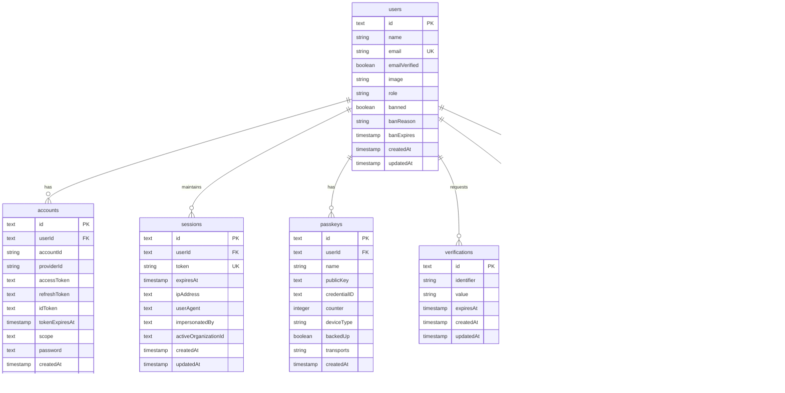

```mermaid
erDiagram
  %% AUTH CORE
  users ||--o{ accounts : has
  users ||--o{ sessions : maintains
  users ||--o{ passkeys : has
  users ||--o{ verifications : requests

  organizations ||--o{ members : contains
  organizations ||--o{ invitations : manages
  users ||--o{ members : belongs_to
  users ||--o{ invitations : creates

  users {
    text id PK
    string name
    string email UK
    boolean emailVerified
    string image
    string role
    boolean banned
    string banReason
    timestamp banExpires
    timestamp createdAt
    timestamp updatedAt
  }

  sessions {
    text id PK
    text userId FK
    string token UK
    timestamp expiresAt
    text ipAddress
    text userAgent
    text impersonatedBy
    text activeOrganizationId
    timestamp createdAt
    timestamp updatedAt
  }

  accounts {
    text id PK
    text userId FK
    string accountId
    string providerId
    text accessToken
    text refreshToken
    text idToken
    timestamp tokenExpiresAt
    text scope
    text password
    timestamp createdAt
    timestamp updatedAt
  }

  verifications {
    text id PK
    string identifier
    string value
    timestamp expiresAt
    timestamp createdAt
    timestamp updatedAt
  }

  passkeys {
    text id PK
    text userId FK
    string name
    text publicKey
    text credentialID
    integer counter
    string deviceType
    boolean backedUp
    string transports
    timestamp createdAt
  }

  organizations {
    text id PK
    string name
    string slug UK
    string logo
    text metadata
    timestamp createdAt
  }

  members {
    text id PK
    text organizationId FK
    text userId FK
    string role
    timestamp createdAt
  }

  invitations {
    text id PK
    text organizationId FK
    text inviterId FK
    string email
    string role
    string status
    timestamp expiresAt
    timestamp createdAt
  }
```
