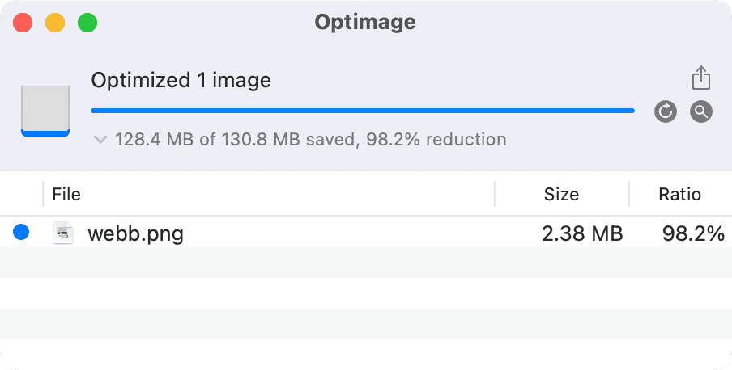

[Blurry JPEG]] is a thought-provoking article by science fiction legend Ted Chang. Ted makes an interesting analogy between large-scale language models ([[LLM|LLMs]]) like [[ChatGPT]] and lossy compression algorithms like blurry JPEG images. Ted argues that [[LLM|LLMs]] provide only a superficial understanding of a topic and can ultimately hinder the pursuit of proper knowledge. **I disagree with the conclusion of this article.** We need to recognize that even blurry images have value for learning and knowledge acquisition because taking data from the real world and processing it is very time-consuming. Sometimes we need less detailed but more efficient representations to facilitate faster understanding and progress.

If we squint, learning is ultimately a process of fetching data from the world, just like a computer retrieves information from data storage. If that's the case, then the speed at which information is fetched from any storage medium significantly impacts learning. I once did an exciting thought experiment where I visualized the calendar scale of a [[CPU]]. Imagine that one cycle of a [[CPU]] takes one second in CPU terms. (That's 4 trillion times slower.) So how long do everyday computer tasks take?

| Action                         | Physical Time | CPU Time     |
| ------------------------------ | ------------- | ------------ |
| 1 CPU Cycle                    | 0.25ns        | 1 second     |
| L1 cache reference             | 1ns           | 4 seconds    |
| L2 cache reference             | 4ns           | 16 seconds   |
| Main memory reference          | 100ns         | 6.67 minutes |
| Read 1MB from memory           | 3μs           | 3.33 hours   |
| SSD random read                | 16μs          | 17.78 hours  |
| Read 1MB from SSD              | 49μs          | 2.27 days    |
| Read 1MB from the disk         | 825μs         | 38.20 days   |
| Disk seek                      | 2ms           | 92.60 days   |
| SCSI command timeout           | 30s           | 3,802 years  |
| Hardware virtualization reboot | 40s           | 5,070 years  |
| Physical system reboot         | 5m            | 38,026 years |

According to the imaginative CPU calendar scale, it would take a staggering 38 days for the CPU to read 1MB from a disk fully. This reminds us of how long it would take an individual to study and comprehend 1MB of text, which is a considerable amount of information. Furthermore, the disk seeks time amounts to 92 days, an eerily similar duration to what real-world researchers may spend investigating, analyzing, and understanding complex subjects or concepts. This parallel between the CPU's data processing and human learning highlights the striking resemblances between technology and the human pursuit of knowledge. **Your brain is no more than a CPU that fetches information from various mediums.**

![[D26259.png]]

Now, let us consider a scenario where you are the CPU, and you need to fetch an image of 130.8MB (this is the released version of the James Webb Space Telescope photo.) Bringing such a large image would take almost 14 CPU years to process. However, consider an [[alternative]] – a compressed version of the same image less than 2.5MB. Of course, it's a "blurry JPEG," but for most people, the difference in quality would be hardly noticeable.

Now let's come back to [[ChatGPT]]. the "blurry image" loses quality due to compression, but it's much smaller and tens of thousands of times faster to decode. The same is true for [[ChatGPT]]. the quality of the information is often compromised, but as long as we're careful about the accuracy, it can revolutionize how we learn and process information.

**In this way, we must embrace blurry JPEGs and use them wherever possible. This is the approach taken by internet companies to compress information and make it more accessible. Just as we strive to develop better compression algorithms, we must also push [[LLM|LLMs]] like [[ChatGPT]] further to make knowledge compression more efficient and affordable.**

However, there is still the importance of learning. Many people question the necessity of knowledge when we have [[LLM|LLMs]]. The need for education is because storing information in our brains, like registers and caches, allows us to access it in CPU hours, not months or years. Relying on [[LLM|LLMs]] may be faster than traditional learning mechanisms, but it still needs to catch up to orders of magnitude compared to memorizing and processing information within our minds. Thus, while [[LLM|LLMs]] can serve as valuable tools in our pursuit of knowledge, they should complement, rather than replace, our innate capacity for learning and understanding.
