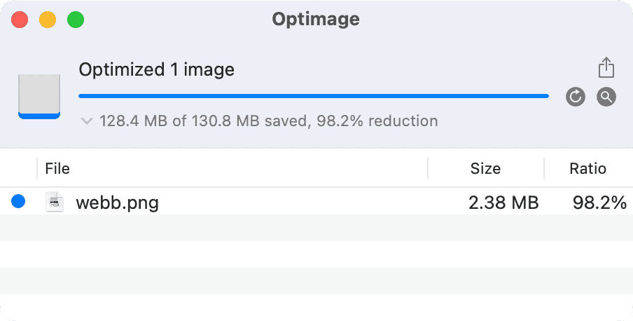

[[Blurry JPEG]]은 SF계의 거장 [[Ted Chiang|테드 창]]이 작성한 훌륭한 글입니다.
[[Ted Chiang|테드 창]]은 [[ChatGPT]]와 같은 대규모 언어 모델([[LLM]])을 흐릿한 JPEG 이미지로 흥미롭게 비유합니다.
[[Ted Chiang|테드 창]]은 [[LLM]]은 "주제에 대한 피상적인 이해만 제공하며 궁극적으로 진정한 지식 추구를 방해할 것"이라 주장합니다.

**저는 이 글의 결론에 반대합니다**.
흐릿한 이미지도 다른 면에서 장점이 있습니다.
때로는 필수적입니다.
현실 세계에서 데이터를 처리하는 것은 시간이 많이 걸립니다.
때때로 더 빠른 이해와 진행을 촉진하기 위해 덜 세밀하지만 더 효율적인 표현이 필요합니다.

생각해보면, 궁극적으로 학습이란 것은 컴퓨터가 데이터 스토리지에서 정보를 검색하는 것처럼 세상에서 데이터를 가져오는 과정입니다.
그렇다면 어느 저장 매체에서 정보를 가져오는 속도 또한 학습에 엄청난 영향을 줍니다.
예전에 [[CPU]]의 달력 스케일을 시각화하는 흥미로운 사고 실험을 한 적이 있는데요.
[[CPU]] 한 사이클에 [[CPU]] 기준 1초가 걸린다고 상상해 봅시다. (4조 배 느린 것입니다.)
그렇다면 일상적인 컴퓨터 작업들은 얼마나 시간이 걸릴까요?

| 액션                      | 물리적 시간 | [[CPU]] 시간 |
| ------------------------- | ----------- | ------------ |
| 1 [[CPU]] 주기            | 0.25ns      | 1초          |
| L1 캐시 참조              | 1ns         | 4초          |
| L2 캐시 참조              | 4ns         | 16초         |
| 메인 메모리 참조          | 100ns       | 6.67분       |
| 메모리에서 1MB 읽기       | 3μs         | 3.33시간     |
| SSD 랜덤 읽기             | 16μs        | 17.78시간    |
| SSD에서 1MB 읽기          | 49μs        | 2.27일       |
| 디스크에서 1MB 읽기       | 825μs       | 38.20 일     |
| 디스크 검색               | 2ms         | 92.60일      |
| SCSI 명령 시간 초과       | 30초        | 3,802년      |
| 하드웨어 가상화 재부팅    | 40초        | 5,070년      |
| 물리적 시스템 재부팅 시간 | 5분         | 38,026년     |

이 가상의 [[CPU]] 달력에 따르면, [[CPU]]가 디스크에서 1MB를 읽는 데는 무려 38일이 걸립니다.
생각해보면 1MB는 엄청나게 많은 텍스트입니다.
사람이 1MB에 달하는 텍스트를 공부하려 한다면 비슷한 시간이 걸리겠지요.

또한, 디스크 탐색 시간은 92일에 달하는데, 이는 실제 [[Researcher|연구자들]]이 복잡한 주제나 개념을 조사, 분석, 이해하는 데 소요되는 시간과 매우 유사합니다.
[[CPU]]의 데이터 처리와 인간의 학습 사이의 이러한 유사성은 기술과 인간의 지식 추구가 놀랍도록 유사하다는 것을 강조합니다.
**결국 뇌는 다양한 매체에서 정보를 가져오는 [[CPU]]에 지나지 않습니다.**

![[D26259.png]]

이제 우리가 [[CPU]]이고 130.8MB의 이미지(제임스 웹 우주망원경 사진의 공개 버전)를 가져와야 하는 시나리오를 생각해봅시다. 이렇게 큰 이미지를 가져오는 데는 처리하는 데 거의 [[CPU]] 시간으로 14년이 소요됩니다. 하지만 위 이미지는 같은 사진을 2.5MB 선으로 압축한 겁니다. [[CPU]]가 학교 한 학기 정도면 다 공부할 수 있는 시간입니다. "흐릿한 JPEG"이지만... 대부분의 사람들이 알기나 할까요?

이제 [[ChatGPT]]로 돌아와봅시다. '흐릿한 이미지'는 압축으로 인해 품질이 손상되지만, 크기가 훨씬 작고 디코딩 속도가 수만 배나 빠릅니다. [[ChatGPT]]도 마찬가지입니다. 종종 정보의 품질이 손상되지만, 정확성에 대해 조심하는 한, 정보를 학습하고 처리하는 방식에 혁신을 가져올 수 있습니다.

**이런 식으로 우리는 흐릿한 JPEG를 최대한 활용해야 합니다. 마치 인터넷 기업들이 정보를 압축하고 맨날 이미지 압축을 하는 것처럼 말입니다. 더 나은 압축 알고리즘을 개발하기 위해 노력하는 것과 마찬가지로, 지식 압축을 더 효율적이고 저렴하게 만들기 위해 [[ChatGPT]]와 같은 [[LLM]]을 더욱 발전시켜야 합니다.**

하지만 배움의 중요성은 여전히 존재합니다. 많은 사람들이 [[LLM]]이 있는 상황에서 지식의 필요성에 의문을 제기합니다. 교육이 필요한 이유는 레지스터나 캐시처럼 정보를 두뇌에 저장하면 몇 달이나 몇 년이 아니라 몇 시간 내에 정보를 액세스할 수 있기 때문입니다. [[LLM]]에 의존하는 것이 기존의 학습 메커니즘보다 빠를 수는 있지만, 우리 머릿속에서 정보를 암기하고 처리하는 것에 비하면 여전히 엄청나게 뒤처집니다. 따라서 [[LLM]]은 지식을 추구하는 데 유용한 도구가 될 수 있지만, 학습과 이해에 대한 인간의 타고난 능력을 대체하는 것이 아니라 보완하는 역할을 해야 합니다.
