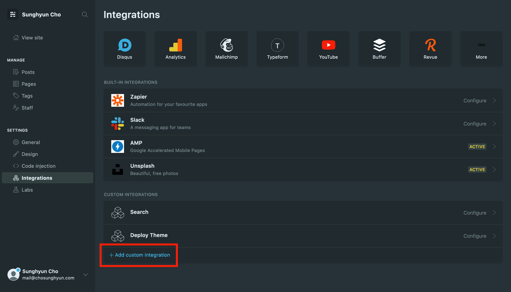
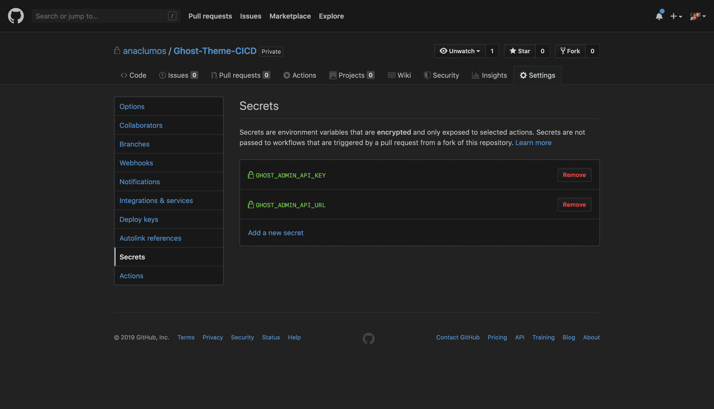
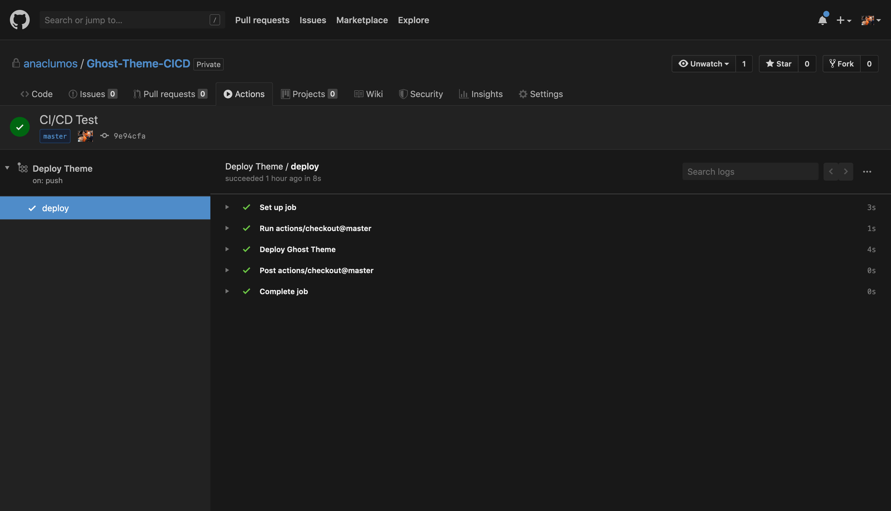

이 블로그는 [Ghost Content Management System](https://github.com/TryGhost/Ghost)을 AWS에 호스팅하여 사용한다. Ghost CMS는 **헤드리스**하다. 말 그대로 머리가 없다는 뜻으로, 백엔드는 존재하지만 [[Front-end|프론트엔드]] (헤드)는 내가 원하는 대로 제작할 수 있다는 것이다. 하지만 Ghost 2까지는 다음과 같이 그 '헤드'를 Deploy하는 과정이 무척 번거로웠다.

1.  완성된 테마 폴더를 압축한다.
2.  Ghost Admin에 접속한다.
3.  Settings → Design → Upload a theme 메뉴에 들어간다.
4.  압축된 테마 파일을 선택한다.
5.  (테마 적용 완료)
6.  완성된 테마 파일을 GitHub Repository에 Push한다.

프로그래머의 핵심 자질이 무엇이던가. 반복 업무를 줄이고 중요한 문제에 집중하는 것이다. 여기서 군더더기는? 테마를 업로드하는 반복 업무이다. 여기서 중요한 것은? 테마 개발을 통한 블로그 방문 경험 개선이다. 다행히도 Ghost 2.25.5부터 [[GitHub Actions]]를 이용해 다음과 같이 Ghost 테마 개발을 자동화할 수 있게 되었다.

1.  완성된 테마 파일을 GitHub Repository에 Push한다.
2.  [[GitHub Actions]]가 완성된 테마를 자동으로 Deploy한다.

Ghost 테마 업로드 및 적용을 GitHub Action에게 맡겨 보자.

## 설정 방법

제일 먼저 테마를 관리할 GitHub Repository를 만든다. 기존에 개발하고 있던 테마 파일이 있다면 그 파일들을 Push 한다.

GitHub Action에게 테마를 업로드할 권한을 주기 위해 `Ghost API URL`과 `Ghost Admin API Key`가 필요하다. Ghost Admin → Settings → Integration에 접속하여 Custom Integrations을 하나 추가한다. 기능을 명확하게 나타내도록 이름은 Deploy Theme으로 설정해주자.



[[GitHub Actions]] 통합을 끝낸 상태에서 스크린샷을 찍었기에 이미 Deploy Theme Integration이 추가되어 있다.

새로운 Integration을 추가하면 Configuration 창이 나타난다. Configuration 창 하단에 Content API Key, Admin API Key, 그리고 API URL 값이 있다. 여기서 Admin API Key와 API URL이 필요하다. 이 값들은 절대 외부에 공유하면 안된다.

이 값을 복사하여 GitHub Repository Secrets로 등록한다. GitHub Repository Secrets는 한 Repository 내에 암호화되어 저장되는 환경 변수이다. 오직 [[GitHub Actions]]를 통해서만 접근할 수 있으며 설령 저장소가 복사된다 하더라도 GitHub Repository Secrets 값은 유출되지 않는다.

GitHub Secrets는 GitHub Repository → Settings → Secrets에서 설정할 수 있다.



Secrets 이름은 가급적 그대로 설정하는 것을 추천한다.

이제 [[GitHub Actions]]를 생성하자. [[GitHub Actions]] 탭에 들어가서 `New workflow` 버튼을 누른 뒤 `Set up a workflow yourself`를 누른다. 새로운 workflow의 이름은 `deploy-theme.yml`라고 설정하고 다음 YAML 코드를 복사하여 붙여넣는다. GitHub Secrets에 Key 이름을 다르게 저장했다면 마지막 두 줄을 수정하여 Key 이름을 맞춰주어야 한다.

```yaml
name: Deploy Theme
on:
  push:
    branches:
      - master
jobs:
  deploy:
    runs-on: ubuntu-18.04
    steps:
      - uses: actions/checkout@master
      - name: Deploy Ghost Theme
        uses: TryGhost/action-deploy-theme@v1.2.0
        with:
          api-url: ${{ secrets.GHOST_ADMIN_API_URL }}
          api-key: ${{ secrets.GHOST_ADMIN_API_KEY }}
```

이 코드는 GitHub Marketplace에 공개된 코드이다. 코드가 변경되었을 수 있으니 [여기](https://github.com/marketplace/actions/deploy-ghost-theme)에서 업데이트된 코드를 확인하는 것을 권장한다. [[GitHub Actions]]를 생성하고 나면 `.github/workflows/deploy-theme.yml`가 생긴 것을 확인할 수 있을 것이다.

마지막으로 Ghost Admin에 접속해서 기존에 업로드되어있던 테마 파일을 삭제하고 잠시 기본 테마(Casper)를 활성화하자. 버그인지 모르겠으나 동명의 테마 파일이 그대로 남아있으면 [[GitHub Actions]]가 테마를 Deploy하지 못한다.

이제 모든 준비는 끝났다. 새로운 Commit을 Push한 뒤 [[GitHub Actions]]에 접속해보자. 다음과 같이 테마가 Deploy된다.



Ghost Admin에 들어가면 방금 삭제했던 테마 파일이 다시 나타나있을 것이다. [[GitHub Actions]]가 새로이 Deploy한 테마 파일이다. 그 테마를 활성화해주자.

이제 [[GitHub Actions]]가 완성됐다. Ghost 테마를 개발하여 GitHub에 Push하면 자동으로 Ghost에 테마가 Deploy될 것이다. 앞으로 Ghost 테마를 Deploy하는 시간을 아껴서 블로그 방문 경험을 향상하는데 사용해보자.

## 추가 자료

- Deploy Ghost Theme, GitHub Marketplace Actions  
  [https://github.com/marketplace/actions/deploy-ghost-theme](https://github.com/marketplace/actions/deploy-ghost-theme)
- [[GitHub Actions]] Documentation  
  [https://help.github.com/en/actions](https://help.github.com/en/actions)
