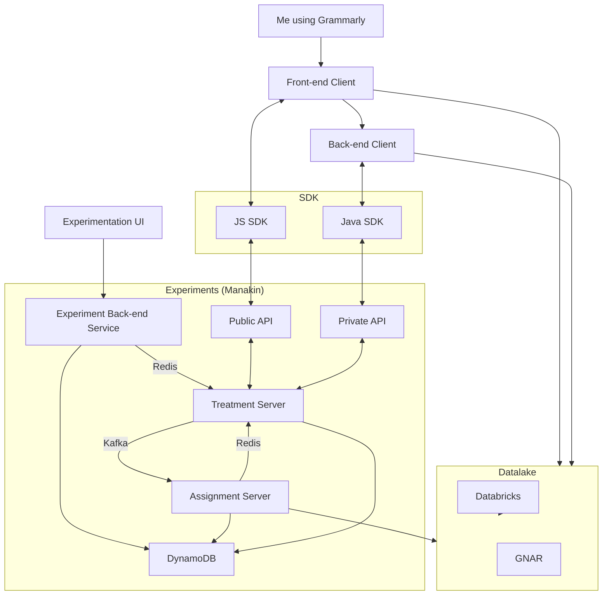
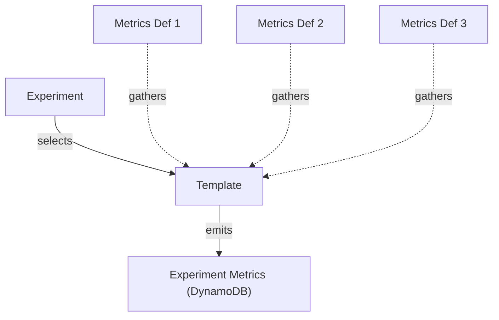

[[Grammarly Work Note]]

## Experiments Team's Goal is to...

- Make experiments easy
- Make experiments consistent

- [[GNAR]] is the single source of truth that logs all of the relevant data. [[Grammarly]] is trying to move away from [[GNAR]] to [[Databricks]].
- [[Manakin]] has 4 versions: `Dev`, `QA`, `Preprod`, and `Prod`. `Preprod` and `Prod` must be the same, and whereas Dev and QA is relatively free to tamper with data.
- **Metrics** is what we use to extract information.

## Entity Relationships

## Experiment Team services

- Tools to configure experiments
- SDKs
- [[Feature Flag]]

## Metrics

- Target Metrics (Cannot modify after creating the experiment. i.e., no cheating after the event)
- Health Metrics
  - Guardrail Metrics (I don't want to screw this up accidentally)
  - Informational Metrics

## Improving Scorecards

![[57FF25.png]]

Managing metrics is easier with a scorecard as it serves as the front end. In the past, we didn't have a scorecard and relied on experimenting with birds to extract [[GNAR]] data, which only showed numbers and not the [[p-value]]. Our goal is to create historical lines to improve our metrics management.

## Why not buy a solution at [[Grammarly]]?

The reasons for this are mainly historical. First, [[Grammarly]] boasts a comprehensive, personalized architecture. The initial setup did not include a data lake. At its inception, there were no suitable public [[Alternative|alternatives]] available. Additionally, the experimentation culture is ingrained in the user interface. Finally, choosing to purchase the product means adopting its unique work style. Our goal was to establish a work style that suited our needs.

## Some things to keep in mind

- [[p-value hacking]]
- [[E2E testing]] should be something we must do as a failsafe. It prevents the human problem from happening again.
- Improving testing cadence: but we should be careful about [[Vanity Metrics]]
- [[Interaction Effect]]. when two experiments affect each other.
- Potential solutions:
  - 1 experiment at a time.
  - each experiment in one swim lane.
  - measure independently → Our goal!
