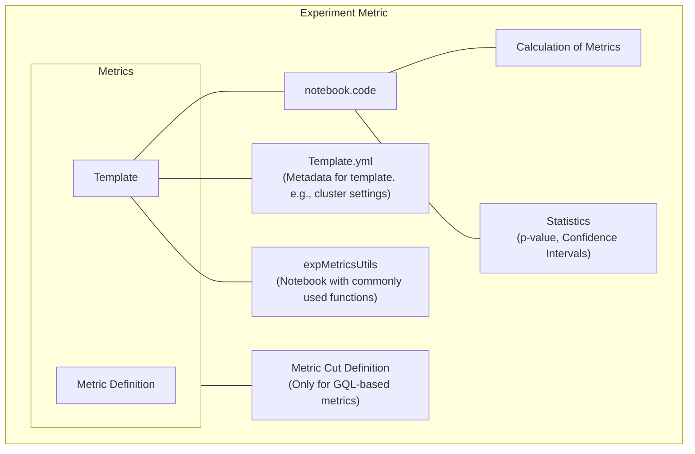

---

lang: 'en'
slug: '/564602'
---Experiment Metric

Databricks Notebooks are analytical tools that can extract information from the data lake.

To create these notebooks on a mass scale, we use templates. The template will be filled out when a user attaches a metric to an experiment and then saved to Databricks.

Notebooks will have `expMetricUtils` and filled-out parameters.

Templates will have documentation + data pull + aggregation + calculation + writing to delta tables

Functions are either in Python or Scala
