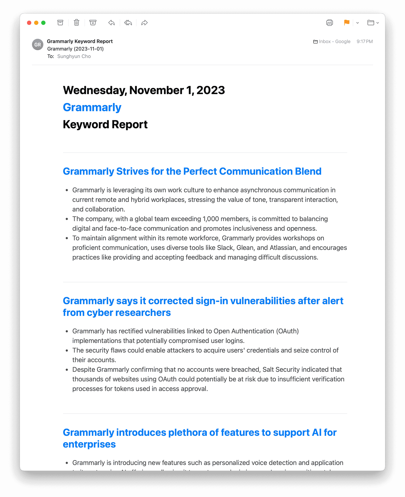
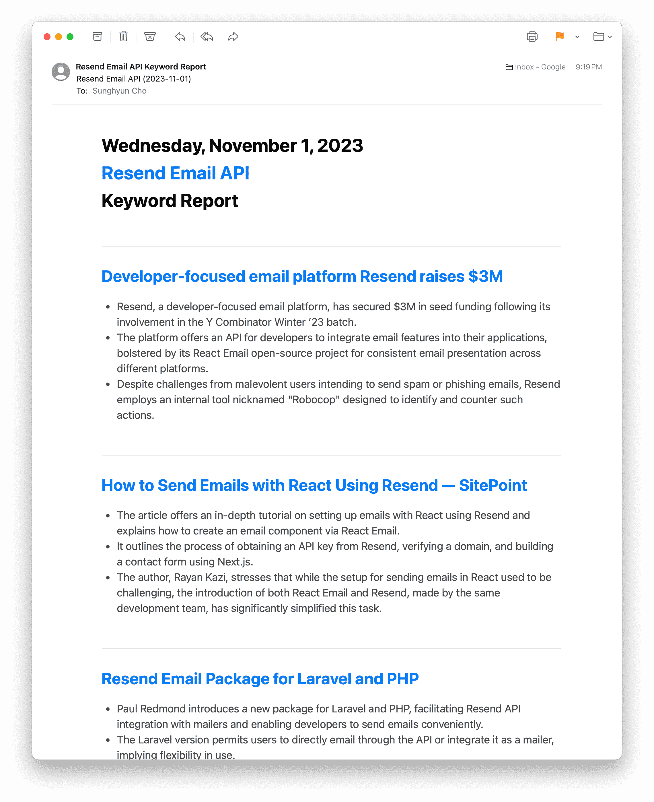
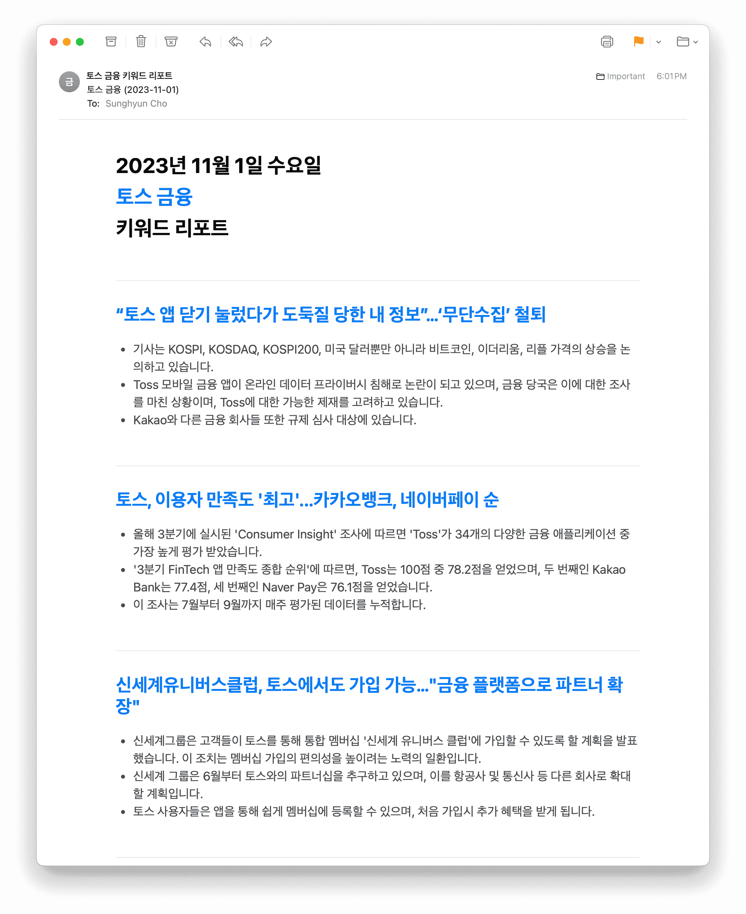

import Tabs from '@theme/Tabs';
import TabItem from '@theme/TabItem';

<Tabs groupId='lang' queryString>
<TabItem value='en' label='English 🇺🇸' lang='en-US' default>

## Welcome!

Welcome to Heimdall Pro (Temporary Name).

- Heimdall = Summarizes **Hacker News** into 30 languages
- Heimdall Pro = Summarizes **Any Topic** into 30 languages

Heimdall is now subscribed by thousands of professionals around the world. Now, I am happy to introduce Heimdall Pro: keyword alerts summarized and sent to your inbox!

## Show not tell

And I believe in **show > tell**, so let me just show you some examples.

### Get updates from your industry!

import DisplayFlex from '@site/src/components/DisplayFlex'

<DisplayFlex>

</DisplayFlex>

<DisplayFlex>

</DisplayFlex>

### Monitor new legislation!

<DisplayFlex>

</DisplayFlex>

### Monitor your brand!

<DisplayFlex>

</DisplayFlex>

### Monitor region-specific news

<DisplayFlex>

</DisplayFlex>

## Sign Ups

- Free during Alpha
- No SLA (This Alpha experiment can shut down anytime, without any notice.)
- [Sign up for Alpha Testing here!](https://airtable.com/appLfbX7pNQxpBx00/shrkP8rkkbJxpBWE6)

</TabItem>
<TabItem value='ko' label='한국어 🇰🇷' lang='ko-KR'>

## 환영합니다!

헤임달 프로(가칭)에 오신 것을 환영합니다.

- 헤임달 = **해커 뉴스**를 30개 언어로 요약 번역
- 헤임달 프로 = **아무 주제**나 30개 언어로 요약 번역

헤임달은 이제 전세계 수천명의 프로들이 구독하고 있습니다. 이제, 헤임달 프로를 소개합니다. 키워드 기반으로 뉴스레터를 생성해 이메일로 보내드립니다!

## 백문이 불여일견

저는 **보는 것 > 듣는 것**이라고 생각하기에, 예시를 직접 보여드리겠습니다.

### 업계 새 소식을 모니터링하세요!

import DisplayFlex from '@site/src/components/DisplayFlex'

<DisplayFlex>

</DisplayFlex>

<DisplayFlex>

</DisplayFlex>

### 새로운 법률 규제를 모니터링하세요!

<DisplayFlex>

</DisplayFlex>

### 브랜드를 모니터링하세요!

<DisplayFlex>

</DisplayFlex>

### 국지적 뉴스를 모니터링하세요!

<DisplayFlex>

</DisplayFlex>

## 알파 테스트

- 알파 기간 동안 무료입니다!
- SLA는 없습니다 (언제든지 중단될 수 있는 테스트입니다.)
- [여기에서 알파 테스트를 신청해주세요!](https://airtable.com/appLfbX7pNQxpBx00/shrkP8rkkbJxpBWE6)

</TabItem>
</Tabs>
