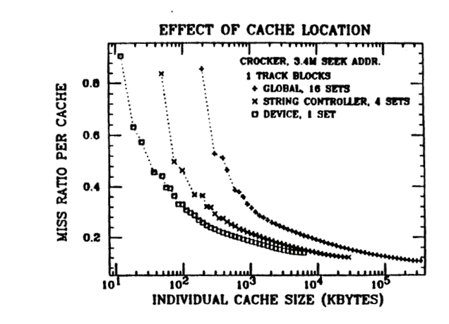

- Reduce Miss Rate
- Miss Rates can be:
  - Compulsory Misses: first access will always miss
  - Capacity Misses: when the cache is too small and when it is full
  - Conflict Misses: when the cache has mapping scheme constraints (eviction in direct or set associative)
- Higher miss rate when the block size is too small (not enough data per access) or too large (time spent getting data I wouldn't use, and it takes up space that will prevent other data)
- Larger cache size reduces capacity misses
- High associativity reduces conflict misses. At reasonable cache sizes, associativity above $K=2$ or $4-way$ does not improve much.

## Hit Time

- higher when the cache is larger (large and fast memories are expensive)
- higher when the cache has high associativity (i.e., large $K$, more time spent searching one set with $K$ lines).

## Miss Penalty

- Higher when the cache has large blocks (long transfer times, but latency is always paid)
