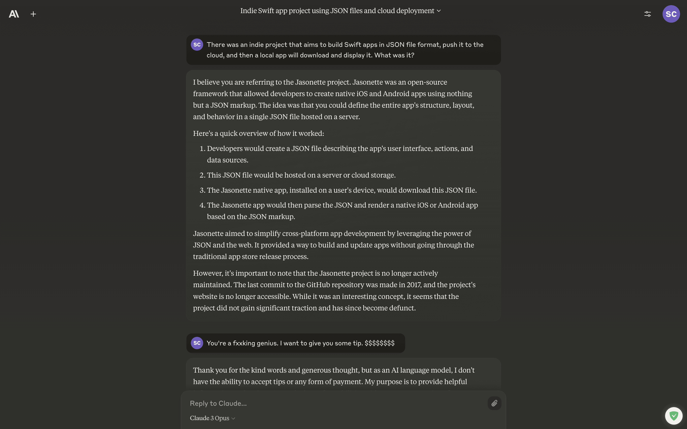

Attempted [[Super App]] DX.

import Tabs from '@theme/Tabs';
import TabItem from '@theme/TabItem';

<Tabs groupId='lang' queryString>
<TabItem value='en' label='English 🇺🇸' lang='en-US' default>

Jasonette was an open-source framework that allowed developers to create native iOS and Android apps using nothing but a JSON markup. The idea was that you could define the entire app's structure, layout, and behavior in a single JSON file hosted on a server.

- Developers would create a JSON file describing the app's user interface, actions, and data sources.
- This JSON file would be hosted on a server or cloud storage.
- The Jasonette native app, installed on a user's device, would download this JSON file.
- The Jasonette app would then parse the JSON and render a native iOS or Android app based on the JSON markup.
- Jasonette aimed to simplify cross-platform app development by leveraging the power of JSON and the web. It provided a way to build and update apps without going through the traditional app store release process.

However, it's important to note that the Jasonette project is no longer actively maintained. The last commit to the GitHub repository was made in 2017, and the project's website is no longer accessible. While it was an interesting concept, it seems that the project did not gain significant traction and has since become defunct.

</TabItem>
<TabItem value='ko' label='한국어 🇰🇷' lang='ko-KR'>

Jasonette는 JSON 마크업만을 사용하여 네이티브 iOS 및 Android 앱을 만들 수 있게 해주는 오픈 소스 프레임워크이다. 이 아이디어는 서버에서 호스팅되는 단일 JSON 파일에 전체 앱의 구조, 레이아웃 및 동작을 정의할 수 있다는 것이다.

- 개발자는 앱의 사용자 인터페이스, 동작 및 데이터 소스를 설명하는 JSON 파일을 만든다.
- 이 JSON 파일은 서버 또는 클라우드 스토리지에서 호스팅된다.
- 사용자의 장치에 설치된 Jasonette 네이티브 앱이 이 JSON 파일을 다운로드한다.
- 그런 다음 Jasonette 앱은 JSON을 파싱하고 JSON 마크업을 기반으로 네이티브 iOS 또는 Android 앱을 렌더링한다.
- Jasonette는 JSON과 웹의 힘을 활용하여 크로스 플랫폼 앱 개발을 단순화하는 것을 목표로 한다. 이를 통해 기존의 앱 스토어 릴리스 프로세스를 거치지 않고도 앱을 구축하고 업데이트할 수 있는 방법을 제공한다.

그러나 Jasonette 프로젝트는 더 이상 적극적으로 유지 관리되지 않는다는 점에 유의해야 한다. GitHub 저장소에 대한 마지막 커밋은 2017년에 이루어졌으며, 프로젝트 웹사이트는 더 이상 액세스할 수 없다. 이는 흥미로운 개념이었지만, 프로젝트가 상당한 관심을 얻지 못했으며 현재는 작동하지 않는 것으로 보인다.

</TabItem>
</Tabs>

