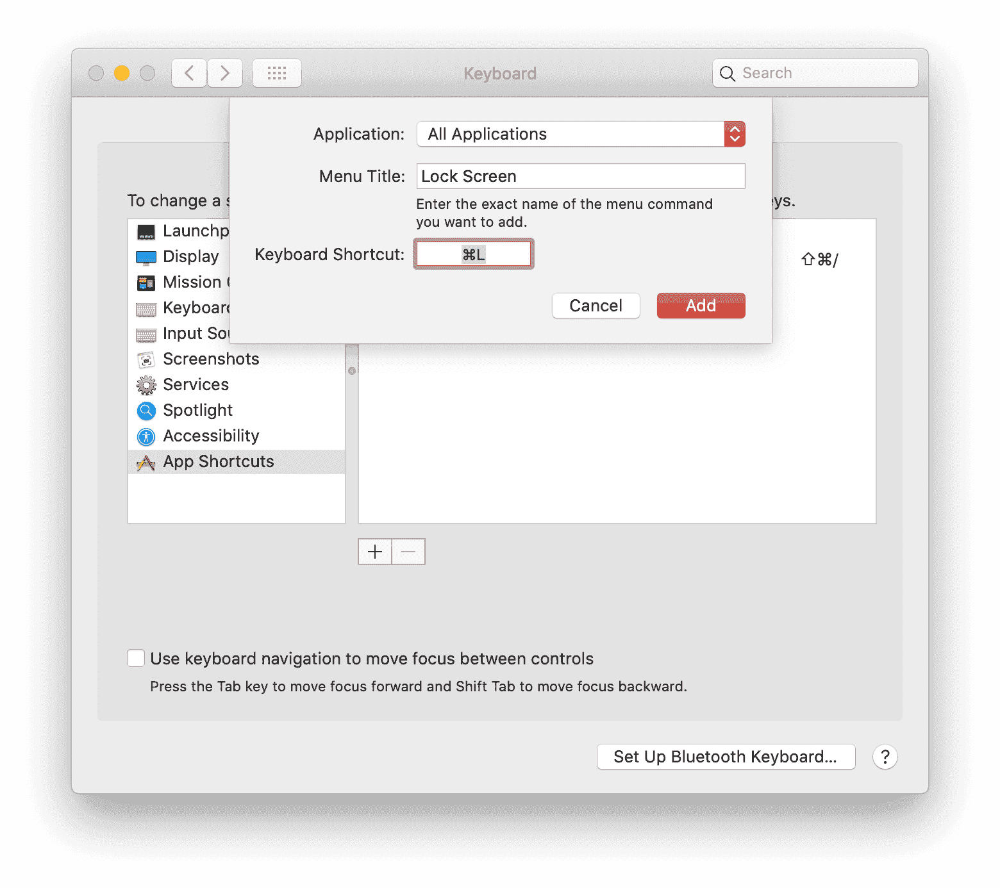
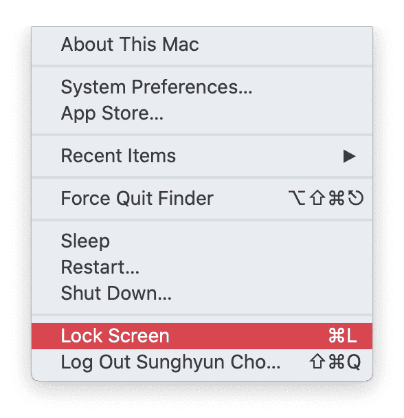
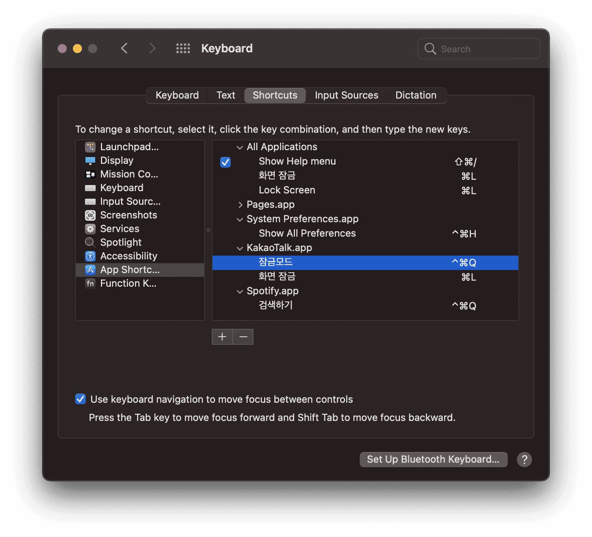

The only thing I missed about my Windows computer was locking the screen since I was so used to locking my computer with **⊞Win+L**. Mac offered an alternative called the **Hot Corner**. But it never was so intuitive and fast as pressing **⊞Win+L**. However, Mac now supports locking the computer by pressing **⌘Command+L** from macOS Mojave.

## How do I do it?

1. Go to System Preferences.

2. Go to **Keyboard → [[Shortcuts]] → App [[Shortcuts]]** and press **+** at the bottom.

3. On your Menu Bar, press the ** [[Apple]] Logo**. Check the name of **^Control+⌘Command+Q**. It is responsible for locking your Mac. Remember the name of the menu.

4. Go back to the Preference app. Select **All Applications** at Application Setting. Next, enter the Menu Title you have just checked. This title will vary according to your macOS Language Preference. Finally, enter **⌘Command+L** at Keyboard Shortcut. You can enter it here if you want to lock your Mac with Keyboard Shortcut other than **⌘Command+L**. Press Add if you are finished.

5. Now you can see that the same **Lock Screen** option at your menu bar will show the Keyboard Shortcut you just changed.

This method works in almost every case. Sometimes, the app will have **⌘Command+L** as its Keyboard Shortcut. One example is the System Preferences app that uses the **⌘Command+L** as going to the Lobby of System Preferences. I have never seen any other cases where **⌘Command+L** doesn't work as expected.

- If some app uses **⌘Command+L** as their default [[shortcuts]], you can set them to some other random [[shortcuts]], clearing the path for the **Lock Screen** shortcut.

- You can now click the Touch ID button from macOS Big Sur to lock your Mac.
