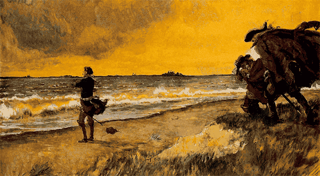

> Petersburg was founded on tears and corpses.
>
> — Nikolai Karamzin

## The Myth of Petersburg

Was it Utopia? Or was it a nightmare of an authoritarian empire?
On one side, it was a utopia; it was all about development and wrenching nature.
However, It is built on a swamp.
The death rate of such construction on a swamp was miserable.
Petersburg's surroundings were chaotic; it was never a good place to live.

Also, Swedish outposts already existed; it was not a pure discovery.

## Why does Petersburg need to be sold as a paradise?

Petersburg was symbolic; everything about the city was westernized.
Petersburg is an artificial embodiment of the symbol of the state.
No spiritual, economic, or cultural center. With only one man's will.

> The city can be the antithesis of the surroundings...

Pushkin put [[Peter the Great]] as **the Bronze Horseman**. a robust and powerful individual dealing with natural consequences.
Pushkin is Russia's greatest poet and innovator in Romanticism, archaist, socially progressive, and conservative.
However, V. N. Berkh put it entirely differently...

> A wave-swept shore, remote, forlorn, Here stood it, rapt in thought and drawn... To distant prospects. Broad and chartless. The river run along it borne; a lonely skiff, ...
