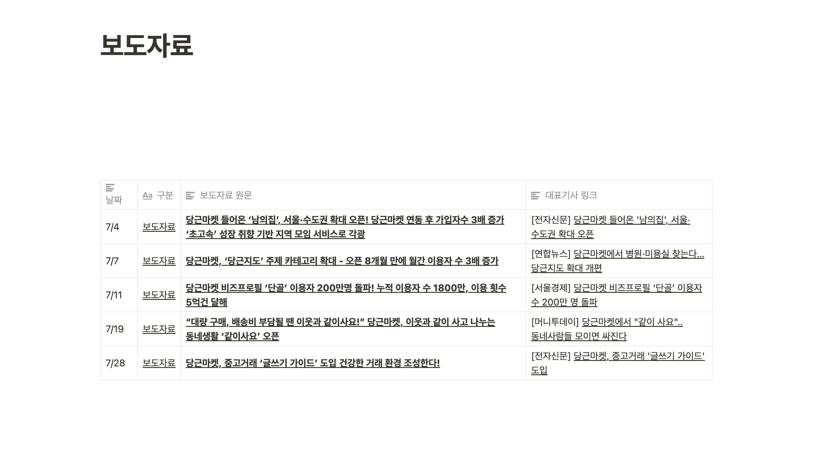

[[2023-04-19]]

## [[Prehistoric]]

Where would [[hn.cho.sh]] lead us? An [[AI]]-powered news portal? Reference: [[일일일]], [[News Minimalist]]. Would it eventually lead to a portal? Or should I remain as a newsletter? Would there be any other form?

## After some contemplation...

It should be **Super Long Range Radar**, **The Oracle's Eye**, **The ALL-SEER** that keeps you up to date on specific topics.

[[AI]]-powered news portal can never be the answer; it should be a platform where people can proactively seek and search foreign intelligence.

### Imagine a workflow...

At [[Karrot]], scraping the news over the internet was a daily activity.

What if we can ask the **All-seer** to check for keywords [[Karrot|당근마켓]] 캐롯 and [[Karrot]] every day?

An example:

<blockquote class="twitter-tweet">
At Simple Analytics, we use AI to detect if new articles on Hacker News or Google Alerts are relevant to our business.  We ask for a rating between 0-100 and why the article is getting that rating.  We send ourselves alerts when rating is 30+ <a href="https://t.co/eqMLHcrAvX">https://t.co/eqMLHcrAvX</a>… <a href="https://t.co/V9rQwxPnxe">pic.twitter.com/V9rQwxPnxe</a>
&mdash; Adriaan 📊 Simple Analytics (@AdriaanvRossum) <a href="https://twitter.com/AdriaanvRossum/status/1633318894508146689?ref_src=twsrc%5Etfw">March 8, 2023</a></blockquote>

### Themed Newsletters

What if we want to keep ourselves up to date on various topics but in a non-aggressive, [[Anti-Tiktok]] manner? Users can ask:

- Hey Heimdall, give me daily reports on **Hacker News** (the current [[hn.cho.sh]] service)
- Hey Heimdall, give me daily reports on **TechCrunch**
- Hey Heimdall, give me daily reports on **대한민국 연예계 뉴스**
- Hey Heimdall, give me daily reports on **European Fashion Market**

Then Heimdall will give reports every day.
