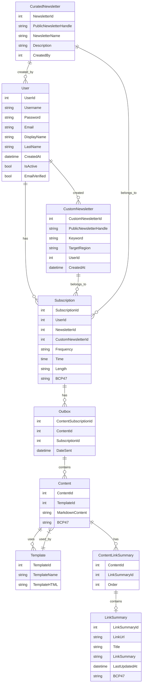

### User Table

- `UserId` (Primary Key): A unique identifier for each user.
- `Username`: The username of the user.
- `Password`: The user's password (hashed and stored securely).
- `Email`: The user's email address.
- `DisplayName`
- `LastName`
- `CreatedAt`
- `IsActive`
- `EmailVerified`

### Curated Newsletter Table

- `NewsletterId` (Primary Key): A unique identifier for each pre-curated Newsletter.
- `PublicNewsletterHandle`
- `NewsletterName`: The name of the Newsletter.
- `Description`: A brief description of the Newsletter.
- `CreatedBy`: Who created it?

### Custom Newsletter Table

- `CustomNewsletterId` (Primary Key): A unique identifier for each custom Newsletter.
- `PublicNewsletterHandle`
- `Keyword`: The keyword related to the custom Newsletter.
- `Target Region`: The Target Region to search the keyword.
- `UserId` (Foreign Key): The user who created the custom Newsletter.
- `CreatedAt`

### Subscription Table

- `SubscriptionId` (Primary Key): A unique identifier for each subscription.
- `UserId` (Foreign Key): The user who owns the subscription.
- `NewsletterId` (Foreign Key): The pre-curated Newsletter being subscribed to (null if it's a custom Newsletter).
- `CustomNewsletterId` (Foreign Key): The custom Newsletter being subscribed to (null if it's a pre-curated Newsletter).
- `Frequency`: How often the Newsletter is sent. (`daily`, `weekly`, `biweekly`, `monthly`)
- `Time`: When to receive the Newsletter in UTC
- `Length`: The desired length of the Newsletter.
- `BCP47`: The BCP-47 language tag represents the user's preferred language for this subscription.

### Template Table

- `TemplateId` (Primary Key): A unique identifier for each template.
- `TemplateName`: The name of the template.
- `TemplateHTML`: The HTML of the template.

### Content Table

- `ContentId` (Primary Key)
- `TemplateId` (Foreign Key, links to the Template that this Content uses)
- `MarkdownContent` (optional field, a string containing the markdown-formatted Content)
- `BCP47` (the BCP-47 language tag representing the language of the Content)

### ContentLinkSummary Table

- `ContentId` (Foreign Key, links to the Content that this link belongs to)
- `LinkSummaryId` (Foreign Key, links to the LinkSummary that is included in the Content)
- `Order` (An integer representing the order of this link in the Content)

### Outbox Table

- `ContentSubscriptionId` (Primary Key): A unique identifier for each Content-subscription relation.
- `ContentId` (Foreign Key): The Content involved in the relation.
- `SubscriptionId` (Foreign Key): The subscription involved in the relation.
- `DateSent`: The date and time when the Newsletter was sent.

### LinkSummary Table

- `LinkSummaryId` (Primary Key)
- `LinkUrl`: The URL of the link.
- `Title`: The title of the linked Content.
- `LinkSummary`: The summary generated by the AI.
- `LastUpdatedAt`: The time when the summary was generated.
- `BCP47`: The BCP-47 language tag represents the language of the summary.
