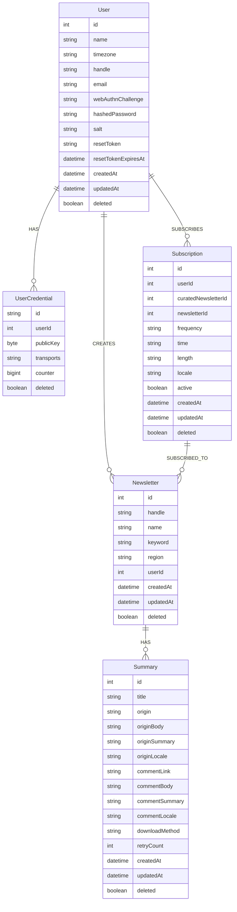
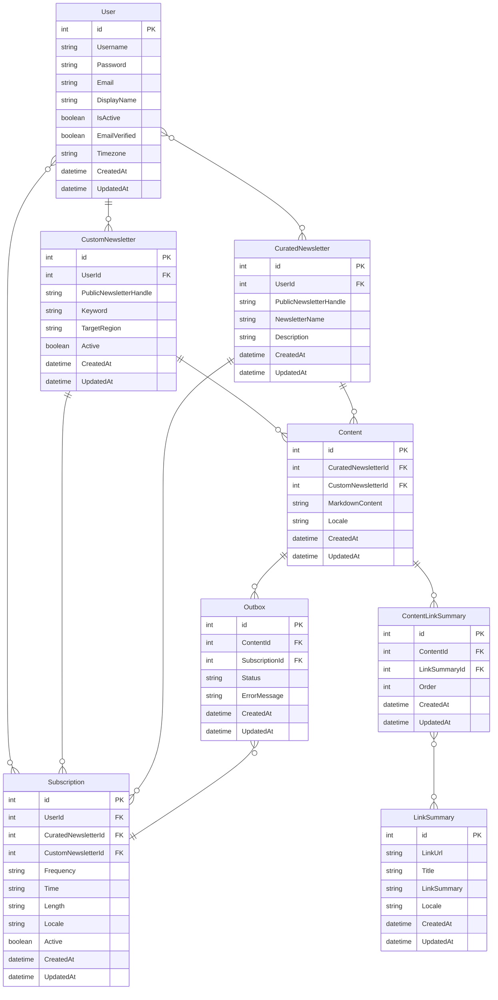

[[2023-07-11]] Version

```mermaid
erDiagram
    User ||--o{ UserCredential : "HAS"
    User ||--o{ Subscription : "SUBSCRIBES"
    User ||--o{ Newsletter : "CREATES"
    Subscription ||--o{ Newsletter : "SUBSCRIBED_TO"
    Newsletter ||--o{ Summary : "HAS"

    User {
        int id
        string name
        string timezone
        string handle
        string email
        string webAuthnChallenge
        string hashedPassword
        string salt
        string resetToken
        datetime resetTokenExpiresAt
        datetime createdAt
        datetime updatedAt
        boolean deleted
    }

    UserCredential {
        string id
        int userId
        byte publicKey
        string transports
        bigint counter
        boolean deleted
    }

    Newsletter {
        int id
        string handle
        string name
        string keyword
        string region
        int userId
        datetime createdAt
        datetime updatedAt
        boolean deleted
    }

    Subscription {
        int id
        int userId
        int curatedNewsletterId
        int newsletterId
        string frequency
        string time
        string length
        string locale
        boolean active
        datetime createdAt
        datetime updatedAt
        boolean deleted
    }

    Summary {
        int id
        string title
        string origin
        string originBody
        string originSummary
        string originLocale
        string commentLink
        string commentBody
        string commentSummary
        string commentLocale
        string downloadMethod
        int retryCount
        datetime createdAt
        datetime updatedAt
        boolean deleted
    }

```

[[2023-06-18]] Version

```mermaid
erDiagram
  User }o--o{ Subscription : ""
  User ||--o{ CustomNewsletter : ""
  User }o--o{ CuratedNewsletter : ""
  CustomNewsletter ||--o{ Subscription : ""
  CuratedNewsletter ||--o{ Subscription : ""
  CustomNewsletter ||--o{ Content : ""
  CuratedNewsletter ||--o{ Content : ""
  Content ||--o{ ContentLinkSummary : ""
  Content ||--o{ Outbox : ""
  Outbox }o--|| Subscription : ""
  ContentLinkSummary }o--o{ LinkSummary : ""
  User {
    int id PK
    string Username
    string Password
    string Email
    string DisplayName
    boolean IsActive
    boolean EmailVerified
    string Timezone
    datetime CreatedAt
    datetime UpdatedAt
  }
  CuratedNewsletter {
    int id PK
    int UserId FK
    string PublicNewsletterHandle
    string NewsletterName
    string Description
    datetime CreatedAt
    datetime UpdatedAt
  }
  CustomNewsletter {
    int id PK
    int UserId FK
    string PublicNewsletterHandle
    string Keyword
    string TargetRegion
    boolean Active
    datetime CreatedAt
    datetime UpdatedAt
  }
  Subscription {
    int id PK
    int UserId FK
    int CuratedNewsletterId FK
    int CustomNewsletterId FK
    string Frequency
    string Time
    string Length
    string Locale
    boolean Active
    datetime CreatedAt
    datetime UpdatedAt
  }
  Content {
    int id PK
    int CuratedNewsletterId FK
    int CustomNewsletterId FK
    string MarkdownContent
    string Locale
    datetime CreatedAt
    datetime UpdatedAt
  }
  ContentLinkSummary {
    int id PK
    int ContentId FK
    int LinkSummaryId FK
    int Order
    datetime CreatedAt
    datetime UpdatedAt
  }
  Outbox {
    int id PK
    int ContentId FK
    int SubscriptionId FK
    string Status
    string ErrorMessage
    datetime CreatedAt
    datetime UpdatedAt
  }
  LinkSummary {
    int id PK
    string LinkUrl
    string Title
    string LinkSummary
    string Locale
    datetime CreatedAt
    datetime UpdatedAt
  }

```

