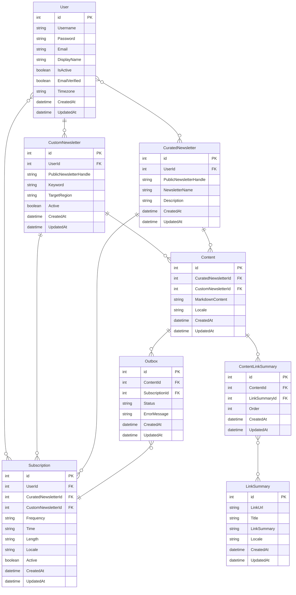

```mermaid
erDiagram
  User }o--o{ Subscription : ""
  User ||--o{ CustomNewsletter : ""
  User }o--o{ CuratedNewsletter : ""
  CustomNewsletter ||--o{ Subscription : ""
  CuratedNewsletter ||--o{ Subscription : ""
  CustomNewsletter ||--o{ Content : ""
  CuratedNewsletter ||--o{ Content : ""
  Content ||--o{ ContentLinkSummary : ""
  Content ||--o{ Outbox : ""
  Outbox }o--|| Subscription : ""
  ContentLinkSummary }o--o{ LinkSummary : ""
  User {
    int id PK
    string Username
    string Password
    string Email
    string DisplayName
    boolean IsActive
    boolean EmailVerified
    string Timezone
    datetime CreatedAt
    datetime UpdatedAt
  }
  CuratedNewsletter {
    int id PK
    int UserId FK
    string PublicNewsletterHandle
    string NewsletterName
    string Description
    datetime CreatedAt
    datetime UpdatedAt
  }
  CustomNewsletter {
    int id PK
    int UserId FK
    string PublicNewsletterHandle
    string Keyword
    string TargetRegion
    boolean Active
    datetime CreatedAt
    datetime UpdatedAt
  }
  Subscription {
    int id PK
    int UserId FK
    int CuratedNewsletterId FK
    int CustomNewsletterId FK
    string Frequency
    string Time
    string Length
    string Locale
    boolean Active
    datetime CreatedAt
    datetime UpdatedAt
  }
  Content {
    int id PK
    int CuratedNewsletterId FK
    int CustomNewsletterId FK
    string MarkdownContent
    string Locale
    datetime CreatedAt
    datetime UpdatedAt
  }
  ContentLinkSummary {
    int id PK
    int ContentId FK
    int LinkSummaryId FK
    int Order
    datetime CreatedAt
    datetime UpdatedAt
  }
  Outbox {
    int id PK
    int ContentId FK
    int SubscriptionId FK
    string Status
    string ErrorMessage
    datetime CreatedAt
    datetime UpdatedAt
  }
  LinkSummary {
    int id PK
    string LinkUrl
    string Title
    string LinkSummary
    string Locale
    datetime CreatedAt
    datetime UpdatedAt
  }

```
