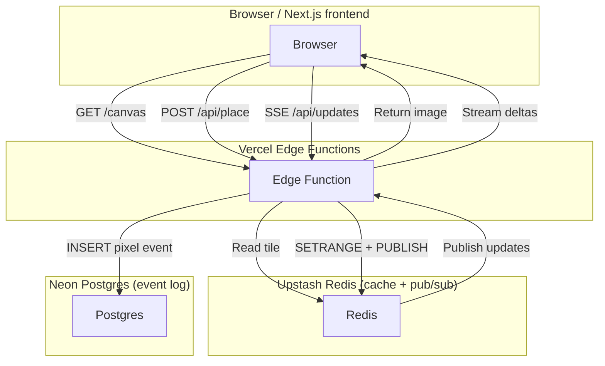

### 1.High‑level architecture



- **Vercel** hosts the static Next.js UI, Edge Functions, and scheduled (cron) jobs.
- **Upstash Redis** is the _hot_ data‑plane:
  - single‑bit/byte writes (`SETBIT`/`SETRANGE`) keep the canvas in memory with O(1) latency([upstash.com](https://upstash.com/docs/redis/sdks/ts/commands/bitmap/setbit 'SETBIT - Upstash Documentation'))
  - native Pub/Sub plus Server‑Sent Events (SSE) push updates globally([upstash.com](https://upstash.com/blog/realtime-notifications 'Building Real-Time Notifications with Upstash Redis, Next.js Server Actions and Vercel | Upstash Blog'))
  - atomic Lua scripts and the Upstash Rate‑Limit helper enforce "1 pixel /Nsec" per user.
- **Neon Postgres** is the durable system‑of‑record. The edge‑compatible serverless driver lets Edge Functions upsert rows over HTTPS/WebSockets with 10ms cold‑start overhead([neon.com](https://neon.com/docs/serverless/serverless-driver 'Neon serverless driver - Neon Docs')). Keeping history here enables time‑lapse, analytics, and roll‑back with Neon's cheap "branching" snapshots([neon.com](https://neon.com/docs/introduction/architecture-overview 'Neon architecture - Neon Docs')).

---

### 2.Data layout in Upstash Redis

| Key                     | Type            | Purpose                                       | Est. size                                                                                                                                                                                                                 |
| ----------------------- | --------------- | --------------------------------------------- | ------------------------------------------------------------------------------------------------------------------------------------------------------------------------------------------------------------------------- |
| `board:<tileX>:<tileY>` | String (4096B)  | 64×64 chunk; one byte per pixel (256 colours) | ≤1MB total for 1024×1024 board – under Upstash's 100MB record limit([upstash.com](https://upstash.com/docs/redis/troubleshooting/max_record_size_exceeded 'ERR max single record size exceeded - Upstash Documentation')) |
| `last:<userId>`         | String          | Unix ms of last placement                     | 8B                                                                                                                                                                                                                        |
| `updates`               | Pub/Sub channel | JSON `{x,y,color}` deltas                     | transient                                                                                                                                                                                                                 |

**Atomic write + broadcast script**

```lua
-- EVALSHA in Edge Function
-- KEYS[1] = tile key, ARGV[1] = offset, ARGV[2] = colour byte, ARGV[3] = userId
redis.call('SETRANGE', KEYS[1], ARGV[1], ARGV[2])
redis.call('PUBLISH', 'updates', cjson.encode{ x=..., y=..., c=ARGV[2], u=ARGV[3] })
return true
```

`SETRANGE` modifies `≤1byte` so requests stay `<1MB`([upstash.com](https://upstash.com/docs/redis/troubleshooting/max_request_size_exceeded 'ERR max request size exceeded - Upstash Documentation')) and are atomic at the Redis level.

---

### 3.Edge Function: **POST/api/place**

1. **Auth** – header cookie/JWT or fallback to IP.
2. **Rate‑limit** – Upstash helper (`@upstash/ratelimit`) → 429 if user has written in the last \_N_seconds.
3. **Tile calculation** – map `x,y` to `tileKey` and byte offset.
4. **Lua script EVALSHA** – atomic write + publish.
5. **Async durability** – `await sql` via `@neondatabase/serverless` to insert into `pixel_events(id, ts, x, y, color, user_id)`; errors are logged but don't block the user path.

Edge Functions are short‑lived; they fit Vercel's normal limits (max 30s run, 25MB bundle([vercel.com](https://vercel.com/docs/functions/limitations 'Vercel Functions Limits'))).

---

### 4.Real‑time fan‑out (**/api/updates**)

Vercel doesn't keep raw WebSockets alive end‑to‑end([vercel.com](https://vercel.com/guides/do-vercel-serverless-functions-support-websocket-connections 'Do Vercel Serverless Functions support WebSocket connections?')), but long‑running **SSE** streams _are_ supported because they're just HTTP responses.  
The route:

```ts
export const runtime = 'edge'
export async function GET() {
  const { subscribe } = Redis.fromEnv() // Upstash edge SDK
  const stream = new ReadableStream({
    async start(controller) {
      for await (const m of subscribe('updates')) {
        controller.enqueue(`data:${m}\n\n`)
      }
    },
  })
  return new Response(stream, {
    headers: {
      'Content-Type': 'text/event-stream',
      'Cache-Control': 'no-store',
      Connection: 'keep-alive',
    },
  })
}
```

The browser's `EventSource` patches the `<canvas>` in ~50ms worldwide (Upstash's multi‑region POPs).

---

### 5.Cold‑start & initial page load

- **Path1 – Static snapshot** — hourly Vercel Cron downloads all tiles, flattens to a PNG, uploads to Vercel Blob Storage or the Next.js public folder (served by Vercel CDN). First paint shows a compressed image.
- **Path2 – Progressive tiles** — client lazily `GET /api/tile?x=3&y=7` (Edge Function reads `GETRANGE` 4096B and responds with Uint8Array).

---

### 6.Background jobs (Vercel Cron)

| Schedule   | Task                | Details                                                        |
| ---------- | ------------------- | -------------------------------------------------------------- |
| Every 5min | **Snapshot → Neon** | `SELECT publish_snapshot()` stores board hash + diff as JSONB. |
| Hourly     | **Analytics**       | Aggregate `pixel_events` into leaderboard per user/colour.     |
| Nightly    | **Cleanup**         | `DEL` or `EXPIRE` old `last:<user>` keys to reclaim memory.    |

Cron functions are entirely serverless; zero cost when idle.

---

### 7.Scaling & limits

| Layer            | Bottleneck                                                                                                                                                                                                        | Mitigation                                                             |
| ---------------- | ----------------------------------------------------------------------------------------------------------------------------------------------------------------------------------------------------------------- | ---------------------------------------------------------------------- |
| Upstash commands | 100req/s on $50 fixed‑price DB([community.fly.io](https://community.fly.io/t/upstash-for-redis-new-fixed-price-plan-and-payg-plan-changes/19058 'Upstash For Redis: New Fixed Price Plan and PAYG plan changes')) | Batch writes (tiles) + local client diffing reduces command rate ~20×. |
| Traffic          | SSE is unidirectional; outbound only                                                                                                                                                                              | Browsers auto‑reconnect; no extra Upstash ops.                         |
| Neon connections | HTTP multiplexed driver                                                                                                                                                                                           | Each Edge Function uses a short‑lived fetch, no pool required.         |
| Storage          | Board ≈1MB RAM, pixelevents ≈6GB/day @ 10keps                                                                                                                                                                     | Neon branch pruning + ZSTD compression.                                |

Cost example (1keps, 2M MAU):

| Service       | Tier                         | Est. cost          |
| ------------- | ---------------------------- | ------------------ |
| Vercel        | Hobby → Pro                  | $20 – $55          |
| Upstash Redis | Fixed‑price 100req/s + 3GB   | $50                |
| Neon Postgres | 1GB storage, auto‑scale‑to‑0 | $30                |
| **Total (≈)** |                              | **$100 – $135/mo** |

---

### 8.Security & abuse protection

- **HTTPS only**; Vercel auto‑TLS.
- **Origin shielding** – strict CORS and `Referrer‑Policy`.
- **Rate‑limit** at API layer + Cloudflare Turnstile to deter scripts.
- **Auditable history** – every pixel stored immutably in Postgres, write‑blocked by RLS so only Edge Functions can insert.

---

### 9.Extensibility

- **Multiple boards** – prefix keys `board:<id>:<tileX>:<tileY>`; Postgres foreign‑key `board_id`.
- **Undo / disputes** – keep last colour in Lua script return; moderators can "rewind" by replaying events.
- **Time‑lapse video** – Neon Branch → generate frames in a Vercel Job, push to Cloudflare Stream.
- **Gamification** – Postgres materialized view for streaks, leaderboards.

---

### 10.Why this stays "serverless"

- **Scale‑to‑zero** — no container or DB CPU when idle (Neon & Upstash pause).
- **Global latency** — Vercel Edge + Upstash POPs replicate closer to users; no region pinning.
- **Ops burden** — backups, fail‑over, TLS, and upgrades are delegated to the three SaaS providers.
