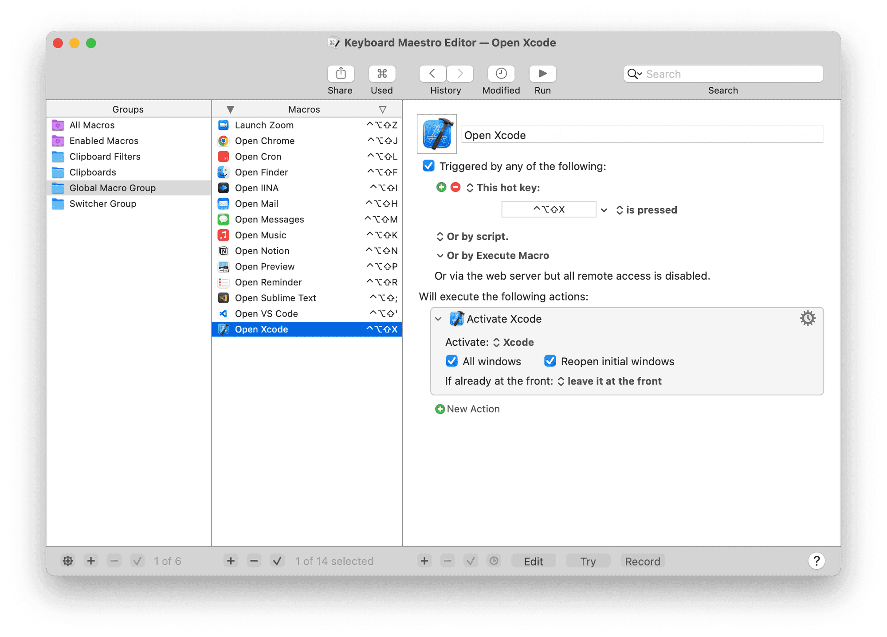

:::danger

Superseded by [[sssss]]

:::

[[2022-05-07]]

## Path for Karabiner Advanced Settings

```
~/.config/karabiner/assets/complex_modifications/keyboard.json
```

:::tip
See https://github.com/anaclumos/karabiner.json/ for more up-to-date configs.
:::

```json
// `keyboard.json`
{
  "title": "Caps Lock → Hyper Key (control+shift+option) (F16 if alone)",
  "rules": [
    {
      "description": "Caps Lock → Hyper Key (control+shift+option) (F16 if alone)",
      "manipulators": [
        {
          "from": {
            "key_code": "caps_lock"
          },
          "to": [
            {
              "key_code": "left_shift",
              "modifiers": ["left_control", "left_option"]
            }
          ],
          "to_if_alone": [
            {
              "key_code": "f16"
            }
          ],
          "type": "basic"
        }
      ]
    }
  ]
}
```

```json
// `hyper.json`
{
  "title": "Hyper Key Combinations",
  "rules": [
    {
      "description": "Use Hyper + D to F13",
      "manipulators": [
        {
          "type": "basic",
          "from": {
            "key_code": "d",
            "modifiers": {
              "mandatory": ["left_shift", "left_control"]
            }
          },
          "to": [
            {
              "key_code": "f13"
            }
          ]
        }
      ]
    },
    {
      "description": "Use Hyper + E to control + up_arrow",
      "manipulators": [
        {
          "type": "basic",
          "from": {
            "key_code": "e",
            "modifiers": {
              "mandatory": ["left_shift", "left_control"]
            }
          },
          "to": [
            {
              "key_code": "up_arrow",
              "modifiers": ["left_control"]
            }
          ]
        }
      ]
    }
  ]
}
```

```json
// `language.json`
{
  "title": "Multilingual Input Methods",
  "rules": [
    {
      "description": "R Command to Gureum Han2",
      "manipulators": [
        {
          "type": "basic",
          "from": {
            "key_code": "right_command",
            "modifiers": {
              "optional": ["any"]
            }
          },
          "to": [
            {
              "key_code": "right_command",
              "lazy": true
            }
          ],
          "to_if_alone": [
            {
              "select_input_source": {
                "input_source_id": "org.youknowone.inputmethod.Gureum.han2"
              }
            }
          ]
        }
      ]
    },
    {
      "description": "L Command to Gureum Roman",
      "manipulators": [
        {
          "type": "basic",
          "from": {
            "key_code": "left_command",
            "modifiers": {
              "optional": ["any"]
            }
          },
          "to": [
            {
              "key_code": "left_command",
              "lazy": true
            }
          ],
          "to_if_alone": [
            {
              "select_input_source": {
                "input_source_id": "org.youknowone.inputmethod.Gureum.system"
              }
            }
          ]
        }
      ]
    }
  ]
}
```

Then I configured a bunch of shortcuts to fly through my Mac. Remember ⌃⌥⇧ is the so-called **Hyper Key** that I made, which uses the Caps Lock key or 한/영 키 ([[한국어|Korean]]-English Key). That is, because, I never use the Caps Lock key (I use shift) and I click the right command key to type [[한국어|Korean]] and click the left command key to type English, inspired by the [[일본어|Japanese]] Apple keyboard's [[일본어|Kana]] ([[일본어|かな]]) and English Key (英数) [Link](https://en.wikipedia.org/wiki/Language_input_keys#:~:text=Apple%20keyboards%20designed%20for%20Mac%20OS%20X%20have%20two%20language%20input%20keys).




