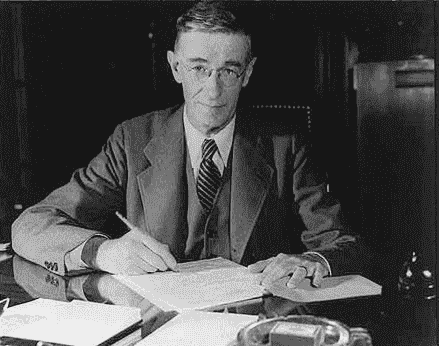

import Tabs from '@theme/Tabs';
import TabItem from '@theme/TabItem';

<Tabs groupId='lang' queryString>
<TabItem value='en' label='English 🇺🇸' lang='en-US' default>

> Vannevar Bush (March 11, 1890 – June 28, 1974) was an [[American]] engineer, inventor, and science administrator who, during World War II, headed the [[United States of America|U.S.]] Office of Scientific Research and Development (OSRD), through which almost all wartime military R&D was carried out, including significant developments in radar and the initiation and early administration of the Manhattan [[Project]]. He emphasized the importance of scientific research to national security and [[Economy|economic]] well-being. He was chiefly responsible for the movement that led to the creation of the National Science Foundation. [Vannevar Bush](https://en.wikipedia.org/wiki/Vannevar_Bush)

</TabItem>
<TabItem value='ko' label='한국어 🇰🇷' lang='ko-KR'>

> 버니바 부시는 [[United States of America|미국]]의 기술자이자 아날로그 컴퓨터의 선구자이다. 역사적으로 부시는 2차 세계 대전에서 원자 폭탄을 개발한 맨해튼 계획을 관리하고 추진한 주역 중 한 사람이었으며 메멕스([[Memex]])라고 불리는 기억 확장기 개념을 최초로 주창하여 현재 인터넷과 하이퍼텍스트의 발전에 영감을 준 과학 사상가였다. [버니바 부시](https://ko.wikipedia.org/wiki/%EB%B2%84%EB%8B%88%EB%B0%94_%EB%B6%80%EC%8B%9C)

</TabItem>
</Tabs>
