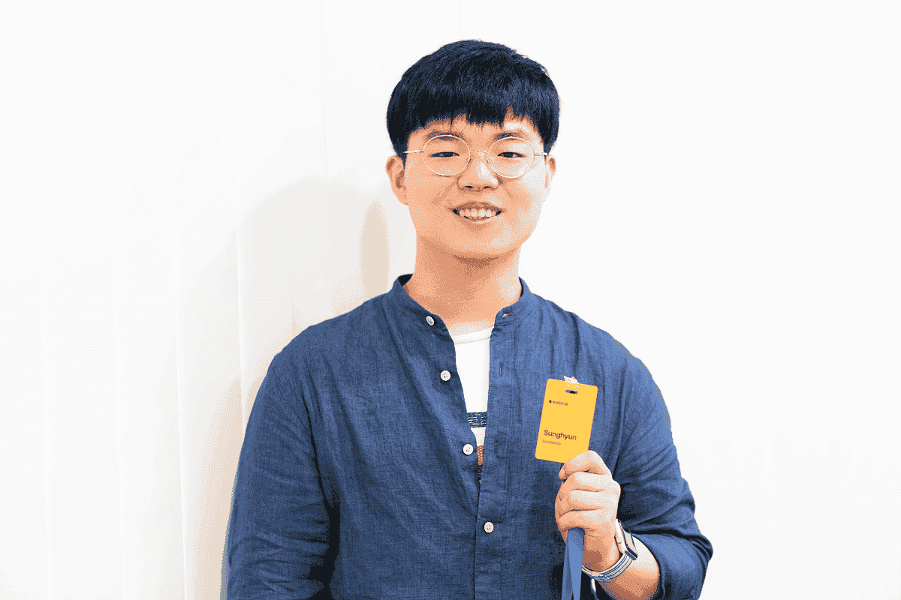
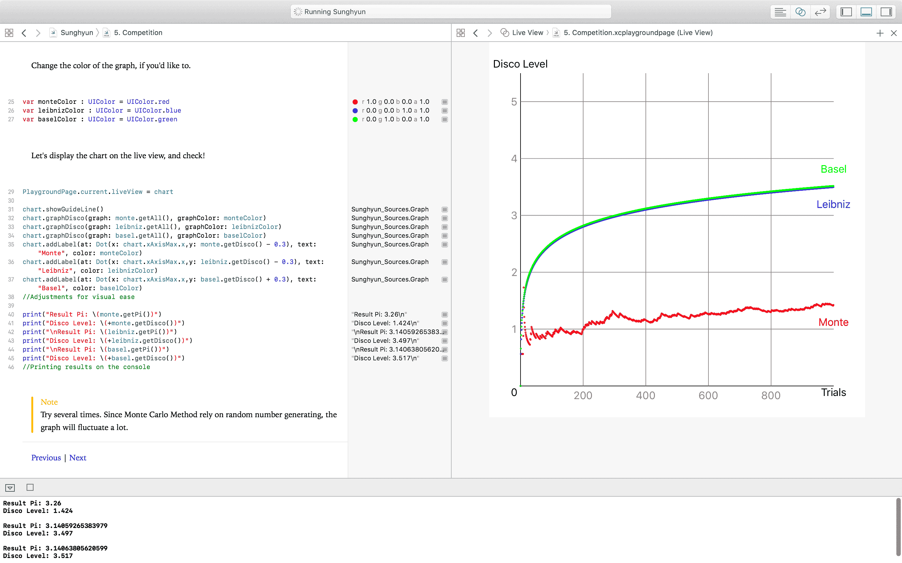
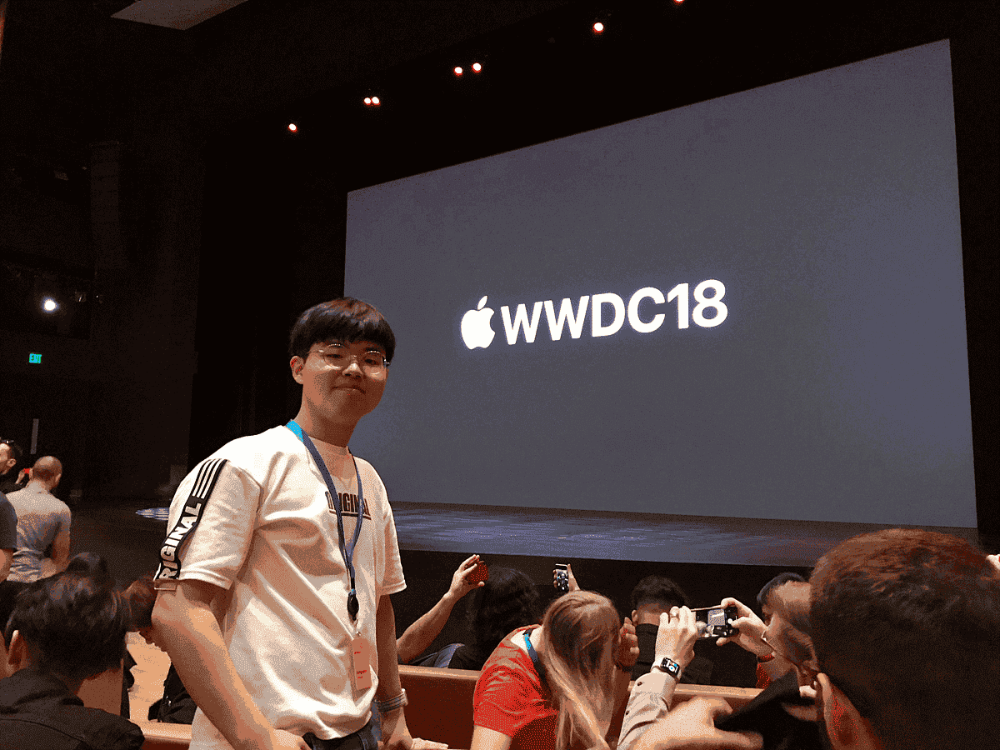

## [애플 WWDC가 뽑은 한국인 장학생, 조성현](https://n.news.naver.com/mnews/article/293/0000022478?sid=105)

애플 '세계개발자회의(WWDC)'에도 장학생 제도가 있다. WWDC는 세계적으로 주목받는 개발자 행사 중 하나로 국내에서도 많은 사람이 키노트 발표를 보기 위해 밤잠을 설치곤 한다. 개발자들은 WWDC 행사를 통해 서로의 경험과 영감을 주고받는다. 애플은 전문 개발자뿐만 아니라 재능있는 학생들에게도 WWDC에 참여할 기회를 제공한다. 지난 6월 미국 캘리포니아주 산호세에서 열린 ['WWDC 2018'](http://www.bloter.net/archives/311810)에는 350명이 장학생으로 선정돼 참석했다. 이 중에는 한국인 고등학생도 포함돼 있었다. 19살 조성현 씨가 그 주인공이다.

['WWDC 스콜라십'](https://developer.apple.com/wwdc/scholarships/)은 개발자 생태계의 밑거름이 되는 학생들을 위해 만들어진 제도다. 꼭 학생이 아니어도 되지만, 기본적으로는 학생을 대상으로 한다. 지원서와 더불어 코딩 교육 도구 ['스위프트 플레이그라운드'](http://www.bloter.net/archives/264343)로 만든 결과물을 제출해 선정되면 WWDC 무료 참석 기회가 주어진다. 행사가 열리는 일주일 동안 숙식비도 제공된다. 심사 기준은 기술적 성취도와 창의성이다. 민족사관고등학교 2학년에 재학 중인 조성현 씨는 원주율을 계산하는 방법을 보여주는 코드를 짜 제출했다.

### 원주율 구하는 방법 배우는 코딩 결과물로 수상

조성현 씨는 우연히 스콜라십 제도를 알게 돼 신청했다. 평소 애플 팬인 조성현 씨는 올해 WWDC 키노트를 보기 위해 관련 사이트를 확인하던 중 스콜라십 제도를 알게 됐다. 스콜라십 혜택은 돈이 아닌 경험이다. '구글I/O', 마이크로소프트 '빌드' 등과 함께 세계적인 개발자 행사로 꼽히는 WWDC에서 개발자들과 교류할 기회다. WWDC는 티켓 가격만 1599달러(약 181만원)에 이르며 이마저도 높은 인기 탓에 무작위 추첨을 통해 제공된다. 스콜라십 수상자는 이 티켓과 함께 일주일간 숙박과 식사가 제공되며 1년간 애플 개발자 프로그램 멤버십을 무료로 지원받는다. 성현 씨는 "키노트를 눈으로 직접 볼 수 있는 것 하나만으로 엄청난 의미가 있을 거 같아서 지원하게 됐다"라고 말했다.

스콜라십에 지원하기 위해선 지원 에세이와 코딩 교육 아이패드용 앱 스위프트 플레이그라운드로 만든 코딩 결과물을 제출해야 한다. 성현 씨는 2주간 독학을 통해 스위프트 플레이그라운드 결과물을 제출했다. 개발자 커뮤니티 '깃허브'를 통해 합격 작품과 탈락 작품을 비교해 분석하기도 했다. 애플은 3분 이내 설명 가능한 스위프트 플레이그라운드 경험을 요구한다. 성현 씨는 주제를 수학으로 좁혀 원주율을 구하는 여러 수학적 방법을 경험하고 배울 수 있는 스위프트 플레이그라운드를 만들었다. 원주율을 계산하는 대표적인 알고리즘인 몬테카를로 방법을 포함해 여러 수학적 방법을 시각화하고 각 방법 간 신뢰도를 비교할 수 있도록 했다.

### 스콜라십 선정을 위해 필요한 것

애플이 요구하는 건 창의성이다. 13세 이상의 학생이어야 한다는 스콜라십 지원 자격 조건이 있지만, 실제로는 그보다 어린 학생이나 70대 노인이 참석하기도 한다. 전문 개발자가 아닌 아마추어를 대상으로 하는 만큼 전문성보다는 창의성을 중점적으로 평가할 것으로 보인다. 성현군은 "스위프트 플레이그라운드를 잘 다루는 개발자를 뽑기보다는 아이디어가 있는 사람을 뽑는 것 같다"라고 말했다. 애플은 평가 기준으로 '기술적 성취', '아이디어의 창의성', '에세이에 담긴 콘텐츠' 등을 명시했다.

조성현 씨는 애플에 제출한 [스위프트 플레이그라운드와 함께 자신이 느낀 스콜라십 선정 팁을 정리해 깃허브에 공유](https://github.com/anaclumos/WWDC2018-Scholarship-Submission/blob/master/README%20in%20Korean.md)했다. 오픈소스 공유 문화를 통해 도움을 얻은 만큼 공유로 답한 셈이다. 성현 씨는 "다른 분들이 참여했으면 하는 것도 있고, 지난해 다른 분들이 올린 걸 보고 덕을 많이 봤다"라며 "내년에도 이 세계 어딘가에서 WWDC 스콜라십에 대해 궁금한 사람이 있다면 내 지원서가 도움이 됐으면 한다"라고 밝혔다. 또 화려한 장식보다는 통일성 있는 아이디어가 중요하며 에세이를 통해 자신을 잘 설명하는 일도 중요하다고 꼽았다.

### 얻은 건 다양한 배경의 사람들

WWDC 스콜라십을 통해 얻을 수 있는 경험은 다양하다. 국내에서 WWDC는 키노트 발표 중심으로 알려졌지만, 실제 현장에서는 일주일간 개발을 둘러싼 다양한 세션이 열리며 개발자 간의 활발한 네트워킹이 이뤄진다. 특히 조성현 씨는 다양한 사람을 만날 수 있었다는 점을 가장 소중한 경험으로 꼽았다. 성현 씨는 "다양한 배경을 지닌 사람과 만나 대화를 통해 그들의 시각을 이해하고 경험을 공유하면서 세상을 넓게 보게 됐다"라며 "타인의 시선에 구애받지 않고 나이와 상관없이 토론하고 경험을 공유할 수 있었던 점이 인상적이었다"라고 말했다.

조성현 씨는 WWDC 스콜라십을 통해 인연을 맺은 사람들과 교류를 이어가고 있다. 다른 장학생들과 연락을 주고받으며 해커톤을 위한 프로젝트를 함께 준비 중이다. 성현 씨의 꿈은 애플과 같은 기술 기업을 창업하는 것이다. 그는 "애플이 내리는 결정들이 논리적이고 기업 메시지가 잘 와닿아서 애플을 좋아한다"라며 "소프트웨어와 하드웨어 전부 한 기업에서 관리하는 이상적인 제품을 만들어 애플을 넘어보고 싶다"라고 포부를 밝혔다.

> **[새소식]**
>
> 기사에서 소개한 조성현 씨에 앞서, 2009년 박진형 씨가 'WWDC 스콜라십'을 수상한 것으로 추가 확인됐습니다. 박진형 씨는 2015년 애플에 입사해 현재 본사에서 페이스타임/메시지 백엔드를 개발하는 엔지니어로 재직 중입니다. 이에 기사 제목 및 내용 일부를 수정했습니다. _(2018년 7월23일 오전 10시33분)_

:::info

내가 최초가 맞다. 왜냐하면 WWDC 스콜라십에는 직접 들은 다음과 같은 비하인드 이야기가 있다. 원래 WWDC 스콜라십은 대학생을 대상으로 하는 제도였다.

![[B4EED6.png]]

근데 2011년 경 초등학생이 호기롭게 나이를 속이고 지원하여 선발되는 일이 벌어진다. 그때부터 대대적으로 제도를 개편하여 나이 제한이 사라지고, 실제 iOS 앱을 프로그래밍하여 내는 것으로 변경되었다. 이후 2016-2017년부터 Swift Playground를 이용하는 것으로 변경되었다. 즉, iOS 제출물을 내는 현 제도의 WWDC 장학 제도에서는 내가 최초이다.

하지만 뭐 별 상관 있겠나. 이제는 한국인 WWDC 장학생 그룹이 수십명씩 나오는 바람에 카카오톡 오픈채팅방으로 옮겨야했다. 내 기사를 보고 시작한 사람들이 많다는 것이 가장 뿌듯했다.

:::
