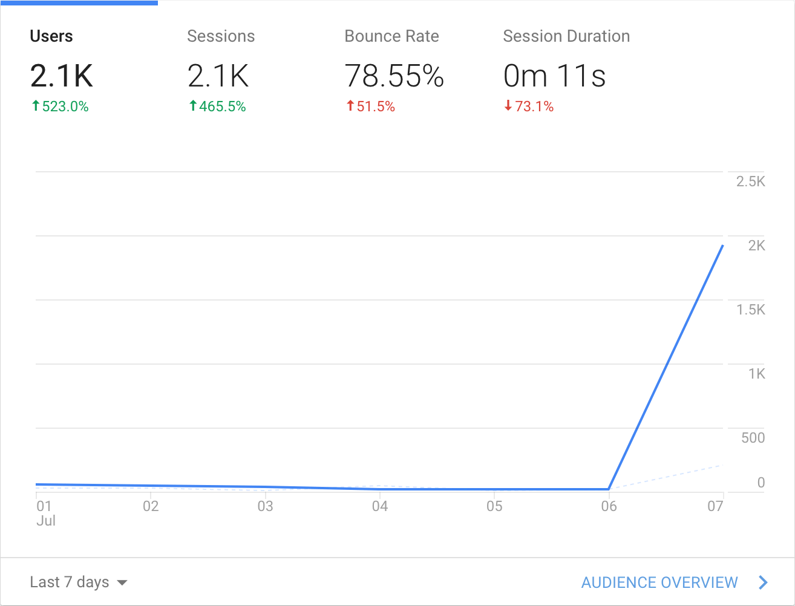
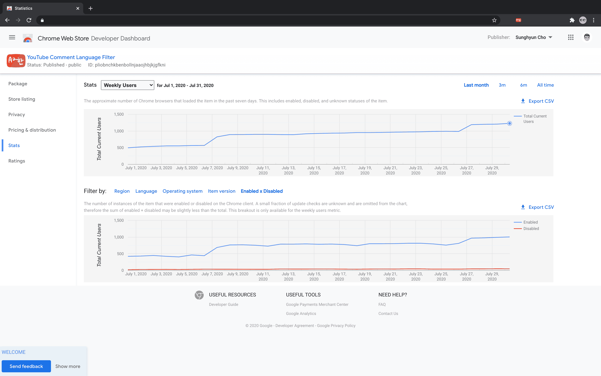
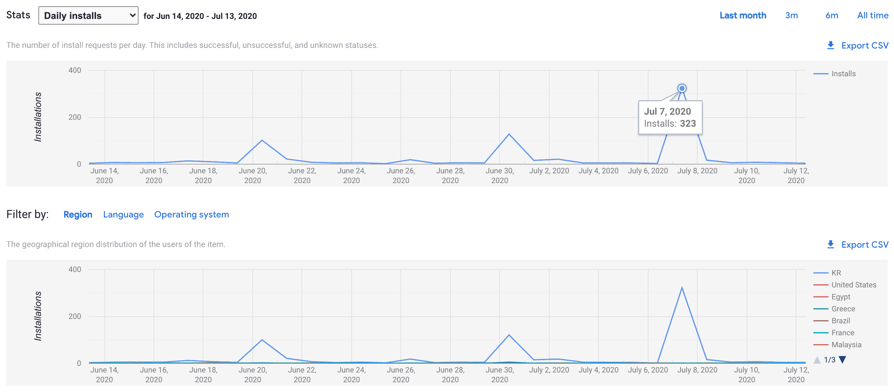

[YouTube Comment Language Filter](https://chrome.google.com/webstore/detail/youtube-comment-language/pliobnchkbenbollnjaaojhbjkjgfkni)의 주간 사용자가 1,000명을 돌파했다. 사용자 분들께 조금이나마 감사한 마음을 공유하고자 약간의 TMI를 적어볼 것이다.

## 1. 크롬 익스텐션 스토어의 집계

정말 부정확하다. 며칠 단위로 과거 기록이 **보정**된다. 우선 [Chrome Web Store의 Developer Relations Lead의 글](https://groups.google.com/a/chromium.org/g/chromium-apps/c/Sie4cmSTZmk/m/d-YJtCdcvW0J)에 따르면 크롬 익스텐션의 주간 사용자는 **한 주 동안 익스텐션의 업데이트를 확인한 유저의 수**를 기준으로 집계된다고 한다. 또 [이 글](https://stackoverflow.com/questions/30245932/how-do-i-check-if-a-google-chrome-extension-needs-to-be-updated)에 따르면 크롬은 약 5시간에 한 번씩 익스텐션의 업데이트를 확인한다고 한다.

근데 이 집계 시스템에 오류가 있는 것인지 과거의 숫자가 변한다.

크롬 익스텐션은 위와 같은 주간 사용자 지표를 제공하는데 이 그래프가 조금씩 높낮이가 바뀌는 것 같아 CSV로 저장해서 비교해보니 정말로 바뀌고 있었다.

| 날짜 (2020) | 7/31 오후 집계 | 8/1 새벽 집계 | 8/1 오후 집계 |
| ----------- | -------------- | ------------- | ------------- |
| 이전        | 동일           | 동일          | 동일          |
| 7/24        | 986            | 986           | 986           |
| 7/25        | 990            | 990           | 1198          |
| 7/26        | 986            | 986           | 1191          |
| 7/27        | 981            | 1191          | 1191          |
| 7/28        | 986            | 1200          | 1200          |
| 7/29        | 1206           | 1206          | 1206          |
| 7/30        | n/a            | 1228          | 1228          |

또 익스텐션 설치 페이지 사용자 수는 혼자 따로 논다 (...)

## 2. 커뮤니티의 홍보 게시글

[5월 말 경에 스토어 링크 복사 버튼을 추가](https://chosunghyun.com/youtube-comment-language-filter/updates/#v13)했다. 유튜브 데스크톱에서 관련 확장 프로그램까지 설치해서 쓸 사람이라면 이미 비슷한 사람들이 모이는 커뮤니티에서 활동을 하고 있을 것 같았고 홍보를 간편하게 도와주는 것만으로 자발적인 홍보 효과가 날 것이라고 생각했기 때문이다. 이후 신규 사용자가 급증하는 날이 몇 차례 있었다. 커뮤니티에 관련 게시물 또는 댓글이 올라간 것이었다.

Google Analytics Referrals 추적 기능을 통해 어느 링크를 타고 들어오는지 파악이 가능했다. 댓글로 등판하진 않았지만 이 익스텐션을 다룬 글은 거의 다 읽었다. 게시물 또는 댓글을 작성해주신 분들께 정말 감사하다는 인사를 하고 싶다.

## 3. 앞으로

GitHub 이슈를 남겨준 분들도 계셨고 메일을 보내주신 분들도 계셨다. 유용한 피드백을 많이 주셨다. 정말 감사했다. 지금 여름 인턴을 하고 있는 관계로 당장 관련 기능들을 뚝딱 구현하진 못하지만 [이슈](https://github.com/anaclumos/youtube-comment-language-filter/issues)에 등록해두었고 차차 진행할 계획이다 (정말이다..!)
