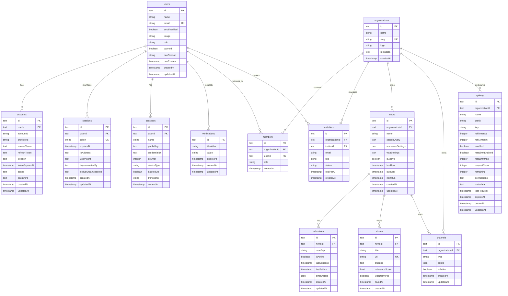

To generate user-related Schemas,

```bash
pnpx @better-auth/cli generate --config src/auth/config.ts
```


```mermaid
erDiagram
    %% Auth Core
    users ||--o{ accounts : has
    users ||--o{ sessions : maintains
    users ||--o{ passkeys : has
    users ||--o{ verifications : requests

    %% Organization Structure
    organizations ||--o{ members : contains
    organizations ||--o{ invitations : manages
    users ||--o{ members : belongs_to
    users ||--o{ invitations : creates

    %% News System
    organizations ||--o{ news : owns
    organizations ||--o{ channels : owns
    organizations ||--o{ apikeys : configures
    news ||--o{ schedules : has
    news ||--o{ stories : tracks
    news ||--o{ channels : uses

    users {
        text id PK
        string name
        string email UK
        boolean emailVerified
        string image
        string role
        boolean banned
        string banReason
        timestamp banExpires
        timestamp createdAt
        timestamp updatedAt
    }

    sessions {
        text id PK
        text userId FK
        string token UK
        timestamp expiresAt
        text ipAddress
        text userAgent
        text impersonatedBy
        text activeOrganizationId
        timestamp createdAt
        timestamp updatedAt
    }

    accounts {
        text id PK
        text userId FK
        string accountId
        string providerId
        text accessToken
        text refreshToken
        text idToken
        timestamp tokenExpiresAt
        text scope
        text password
        timestamp createdAt
        timestamp updatedAt
    }

    verifications {
        text id PK
        string identifier
        string value
        timestamp expiresAt
        timestamp createdAt
        timestamp updatedAt
    }

    passkeys {
        text id PK
        text userId FK
        string name
        text publicKey
        text credentialID
        integer counter
        string deviceType
        boolean backedUp
        string transports
        timestamp createdAt
    }

    organizations {
        text id PK
        string name
        string slug UK
        string logo
        text metadata
        timestamp createdAt
    }

    members {
        text id PK
        text organizationId FK
        text userId FK
        string role
        timestamp createdAt
    }

    invitations {
        text id PK
        text organizationId FK
        text inviterId FK
        string email
        string role
        string status
        timestamp expiresAt
        timestamp createdAt
    }

    apikeys {
        text id PK
        text organizationId FK
        string name
        string prefix
        string key
        integer refillInterval
        integer refillAmount
        boolean enabled
        boolean rateLimitEnabled
        integer rateLimitMax
        integer requestCount
        integer remaining
        text permissions
        text metadata
        timestamp lastRequest
        timestamp expiresAt
        timestamp createdAt
        timestamp updatedAt
    }

    news {
        text id PK
        text organizationId FK
        string name
        json searchQuery
        json relevanceSettings
        json waitSettings
        boolean isActive
        timestamp lastRun
        timestamp lastSent
        timestamp nextRun
        timestamp createdAt
        timestamp updatedAt
    }

    schedules {
        text id PK
        text newsId FK
        string cronExpr
        boolean isActive
        timestamp lastSuccess
        timestamp lastFailure
        json errorDetails
        timestamp createdAt
        timestamp updatedAt
    }

    stories {
        text id PK
        text newsId FK
        string title
        string url UK
        text snippet
        float relevanceScore
        boolean wasDelivered
        timestamp foundAt
        timestamp createdAt
    }

    channels {
        text id PK
        text organizationId FK
        string type
        json config
        boolean isActive
        timestamp createdAt
        timestamp updatedAt
    }
```
