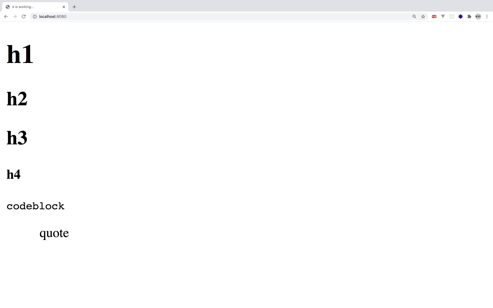

우아한테크캠프 2일차 [[Project|프로젝트]] 중 `http` 모듈 (당연히 `express` 모듈도) 없이 `http` 서버를 구현하는 [[Project|프로젝트]]가 있었다. 인터넷에 검색해 봐도 [관련된 자료가 전혀 나오지 않아](https://ko.wikipedia.org/wiki/%EB%B0%94%ED%80%B4%EC%9D%98_%EC%9E%AC%EB%B0%9C%EB%AA%85) 이렇게 기록을 남겨둔다. [[Project|프로젝트]]의 의도 자체는 `http` 프로토콜을 이해하라는 것이었다.

`http` 자체도 기본적으로는 tcp/[[ip]] 프로토콜을 사용하기 때문에 `net` 모듈을 사용하면 이를 해결할 수 있다. `net` 모듈을 이용해서 `http` 프로토콜에 맞추어 응답을 보내주면 된다.

## 코드

- project/app.js

```js
var net = require('net')
var fs = require('fs')

let server = net.createServer((sock) => {
  let client = sock.remoteAddress
  console.log('serving stream to ' + client)
  fs.readFile('public/index.html', function (err, data) {
    if (err) {
      console.log(err)
      return
    }
    sock.write('HTTP/2.0 200 OK\r\n' + '\r\n')
    sock.write(data)
    sock.end()
  })
})

server.listen(8080)
```

다음과 같은 `index.html`도 준비했다.

- project/public/index.html

```html
<!DOCTYPE html>
<html lang="en">
  <head>
    <meta charset="UTF-8" />
    <meta
      name="viewport"
      content="width=device-width, initial-scale=1.0"
    />
    <title>It is working...</title>
  </head>

  <body>
    <h1 id="toc_0">h1</h1>
    <h2 id="toc_1">h2</h2>
    <h2 id="toc_2">h3</h2>
    <h4 id="toc_3">h4</h4>
    <div>
      <pre
        class="line-numbers"
      ><code class="language-none">codeblock</code></pre>
    </div>
    <blockquote>
      <p>quote</p>
    </blockquote>
  </body>
</html>
```

## 결과



`http` 프로토콜에서 명시된 모든 헤더들을 구현하진 않았지만 [[Project|프로젝트]]의 요구 조건에는 부합한다!
