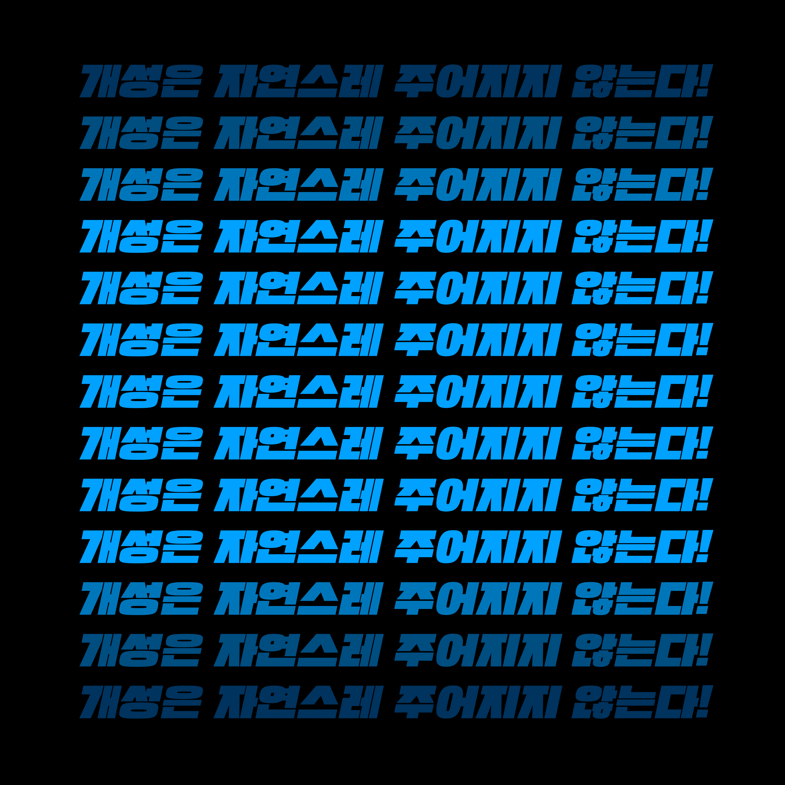

**[[대한민국]]에는 독립적인 자아가 부족하다** — 14성현이 중학교 암기 과목을 공부하며 한 생각입니다.
당시 시험 문제는 개념마다 키-밸류 형태로 $O(1)$에 답이 나올 수 있도록 암기하는 [[Hash Map|해시맵]] 형태였습니다.
구태여 **암기를 해야만 평생 머리에 남고 그게 언젠가 미래에 쓰이겠지** — 라고 의미 부여를 하기도 했지만
14성현은 그럼에도 도대체 이 과정이 왜 필요한 것인지 당최 이해할 수 없었습니다.
그러던 어느날 14성현은 다음과 같은 생각을 하게 됩니다.

> 개성, 창의성, 그리고 꿈을 격리하고 보존해야 한다.
> 그리고 최대한 빨리 이 입시의 무한궤도에서 탈출할 길을 찾아야 한다.

개성, 창의성, 그리고 꿈은 개인의 자아에 있어서 가장 중요한 3요소입니다.
이 세 가지를 규정하기까지 어느 정도 시간이 좀 걸렸습니다.
이 중에서도 꿈은 자기가 자기에게 지우는 유리천장이라고 생각합니다.
그렇다고 창대한 꿈이 없으면 안된다는 식의 지루한 꼰대의 이야기는 아닙니다.
가치 비중이 다른 것 뿐이니까요.
삭막한 세상에서 자신의 행복과 주변인의 행복만 잘 챙기고 사는 것도 충분히 창대합니다.
그것마저 창대해진... 그런 세상이 돼버렸습니다.

오늘은 이 중에서 첫번째, **개성**에 관한 이야기입니다.
어디론가 가려면 내가 어디서 출발하는지 알아야 합니다.
이 개성에는 취향의 영역이 상당한 부분을 차지합니다.
**결국에는 우리 모두는 자신이 좋아하는 것이 되어가니까요.**

저는 **개성이 없으면 나라는 [[Metaphor|메타포]]는 죽은 것이나 마찬가지**라는 생존의 문제로 받아들였습니다.
일단 제가 누구인지, 어떤 사람인지는 어느 정도 중심을 잡은 것 같습니다.
하지만 이제는 [[Ideas are worthless|정보의 존재보다 실체의 발현]]이 중요한 세상입니다.
수많은 [[Information among Data|데이터 중 정보]]만이 중요한 세상입니다.

즉 **나**라는 개성이 어딘가 실질적으로 접근 가능한 <ruby>**물**<rp>(</rp><rt>**•**</rt><rp>)</rp></ruby><ruby>**리**<rp>(</rp><rt>**•**</rt><rp>)</rp></ruby><ruby>**적**<rp>(</rp><rt>**•**</rt><rp>)</rp></ruby><ruby>**인**<rp>(</rp><rt>**•**</rt><rp>)</rp></ruby> <ruby>**무**<rp>(</rp><rt>**•**</rt><rp>)</rp></ruby><ruby>**언**<rp>(</rp><rt>**•**</rt><rp>)</rp></ruby><ruby>**가**<rp>(</rp><rt>**•**</rt><rp>)</rp></ruby>로 치환되었으면 좋겠다 — 그런 생각을 했습니다.

살다보면 주변에 아무런 저항 없이 휩쓸리기 참 쉽습니다.
남들이 하니까 하고,
남들이 보니까 보고,
남들이 해야한다니까 한다!
이는 생각보다 더 자주 우리 주변에 나타납니다.
하지만 깊게 생각해보면 **왜?**라는 질문에는 답하지 못합니다.
그 답을 찾으려면 **나다움**을 알아야 합니다.

불행히도 **나다움**이란 한여름 바람 흐르는 소리보다도 작고 미약합니다.
또한 사소한 것들이 집합이기에 포착하기도 어렵습니다.
그래서 우리는 다음의 문장을 길이길이 가슴 속에 되뇌이며 살아야 합니다.

개성이란 자연스럽게 주어지는 것이 아닙니다.
끊임없이 알아보고 기록하고 연구해야만 **나 이거 좋아하네?**하면서 알게 되는 것입니다.

저는 언젠가부터 제 개성에 마음껏 투자하기로 결정했습니다.
제가 무언가를 좋아할 때 아무런 부끄럼 없이 강렬하게 표출하기로 마음 먹었습니다.
예를 들어, 저는 여러분들께 시도때도 없이 [[K-Pop|케이팝]] 영상을 보내곤 합니다.
거기에 각종 찬미를 덧붙이곤 합니다.
이런 강렬한 표출은 일부러 그렇게 하기 시작한 것입니다.
"이렇게라도 남들에게 뭘 좋아하는지 잔뜩 얘기하다보면 내가 뭘 좋아하는지 알게 되지 않겠나..."
하는 생각이었습니다.
갈 길이 아직 멀지만 여러분 사이에서 컨셉 확실하다는 소리는 들었으니 어느 정도 성공했다 느낍니다.
그래서 제가 가장 듣기 좋아하는 말도 「이건 [[딱 봐도 조성현]] ㅋㅋㅋㅋ」 이라는 말이었습니다.

로마는 하루아침에 이루어지지 않았습니다.
[[서울]]도 하루아침에 이루어지지 않았습니다.
여러분의 **창대하고 찬란한 문화**도 그저 공책 그저 한 구석의 끄적임에서 발현되기 마련입니다.
그것을 어떻게 포착하고 어떻게 육성할지는 여러분의 몫입니다.

— [[2021-06-23]]에 작성된 기록 중 발췌.

## 연관

- [[한국의 입시와 거짓된 명예]]
- [[In The End Trust Yourself|결국에는 본인을 믿자]]
