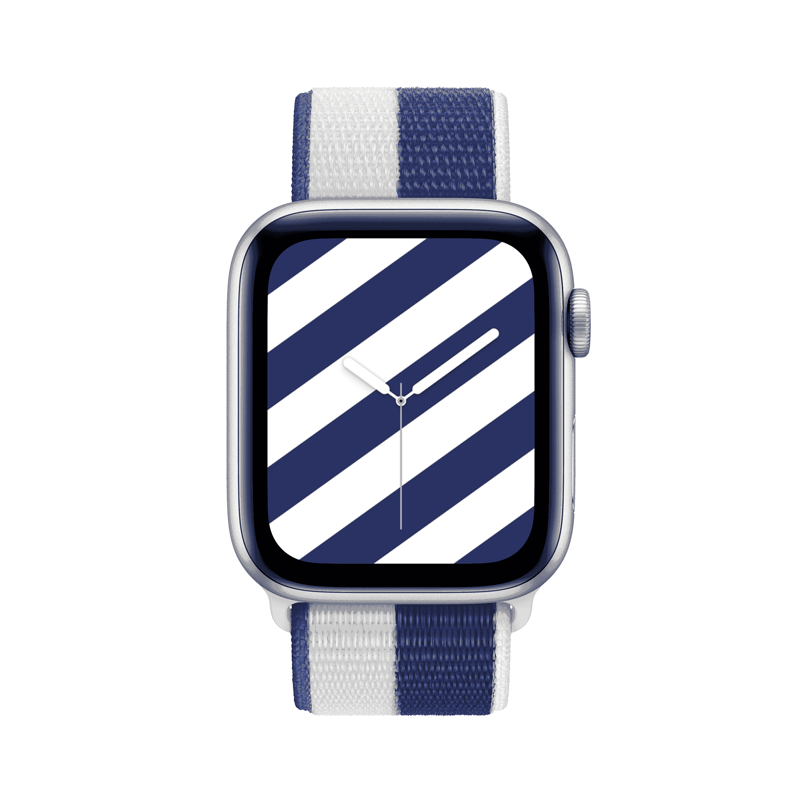

나는 [[한복 정장]]을 서양식 정장처럼 보급화하고 싶은데,
그 과도기에 해외 친구들에게 그 나라 국기의 키컬러를 색동저고리 한복 정장 형태로 만들어서 선물하고 싶다.

예전에 도쿄 올림픽 당시에 애플워치 밴드가 국기 디자인이었던 적이 있는데, 색동저고리는 색깔이 들어갈 공간이 많으니 더 잘 맞출 수 있을 것이다.

[[한민족의 문화]] [[네오 코리안 르네상스]] [[성현적 발상]]

import DisplayFlex from '@site/src/components/DisplayFlex'

<DisplayFlex>

</DisplayFlex>

<DisplayFlex>

</DisplayFlex>

<DisplayFlex>

</DisplayFlex>

<DisplayFlex>

</DisplayFlex>

<DisplayFlex>

</DisplayFlex>

<DisplayFlex>

</DisplayFlex>

<DisplayFlex>

</DisplayFlex>
