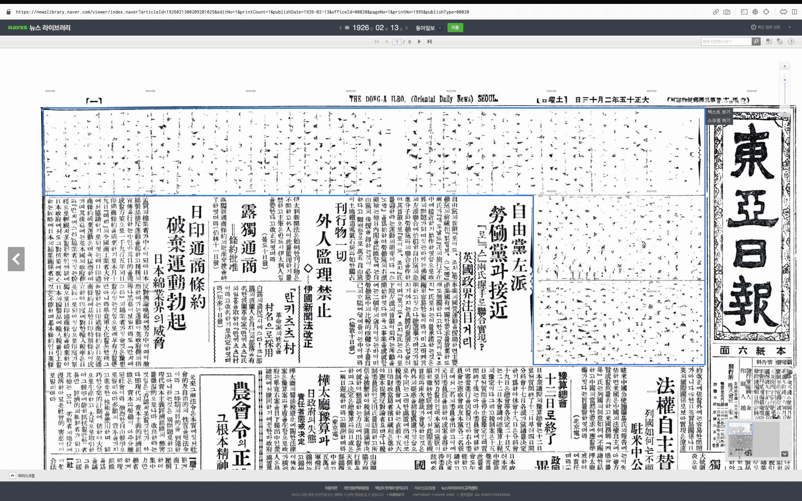

[[이완용]]에 대한 자료를 조사하던 중 묘하게 이상한 점을 발견했다. 이완용 사망 즉시 동아일보에서 발간한 유명한 기사 '무슨 낯으로 이 길을 떠나가나'의 원문을 찾아 읽어보고 싶었는데, [[Naver|네이버]] 뉴스 라이브러리에서는 이 항목이 검열되어 있었다. [바로가기](https://newslibrary.naver.com/viewer/index.naver?articleId=1926021300209201025&editNo=1&printCount=1&publishDate=1926-02-13&officeId=00020&pageNo=1&printNo=1995&publishType=00020)

```
https://newslibrary.naver.com/viewer/index.naver?articleId=1926021300209201025&editNo=1&printCount=1&publishDate=1926-02-13&officeId=00020&pageNo=1&printNo=1995&publishType=00020
```

import DisplayFlex from '@site/src/components/DisplayFlex'

<DisplayFlex>




</DisplayFlex>

아무튼 문의하였다.

![[8E9FDF.png]]

## 업데이트

![[E89E3E.png]]

조선총독부에서 동아일보에 압력을 넣어 동아일보가 삭제하였고 이 때의 스캔본이 아직까지 유지되고 있다는 것을 알게 되었다. [본보 압수](https://newslibrary.naver.com/viewer/index.naver?articleId=1926021400209201022&editNo=1&printCount=1&publishDate=1926-02-14&officeId=00020&pageNo=1&printNo=1996&publishType=00020)

어찌되었든 [[Naver|네이버]] 뉴스 라이브러리에서 원문을 확인할 수 없는 상태이므로 이에 대한 보존 여부에 대한 답장을 기다리고 있다.
