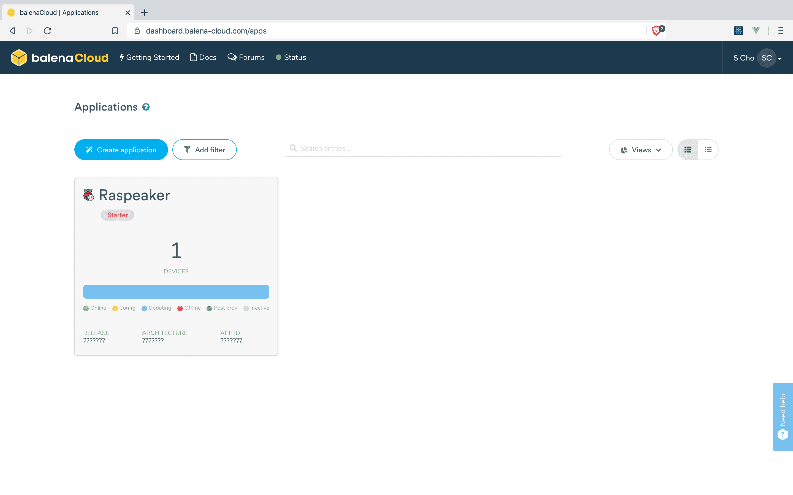

집에 괜찮은 오디오 시스템이 있었다. 하지만 안타깝게도 그 시스템이 읽을 수 있는 가장 최신 저장 매체가 고작 CD였다. 스트리밍으로 음악을 듣는 시대에 그 오디오에 남은 것은 약간의 추억과 10년의 먼지일 뿐이다.

하지만 이렇게 떠나보낼 수는 없다. 최근 알게 된 [[Project|프로젝트]] 중 라즈베리 파이로 스마트 오디오 시스템을 구축하는 [[Project|프로젝트]]가 있었다. 블루투스, 에어플레이, 스포티파이 커넥트를 사용할 수 있는 스마트 오디오 시스템을 구축해보며 노장이 마지막 투혼을 불사를 수 있게 해보자.

## 참고

이 글은 Balena 주식회사가 개발한 `balenaOS` 및 `balenaSound` [[Project|프로젝트]]를 활용한다. Balena는 [[Linux]] 장치들로 사물인터넷(IoT) 시스템을 구축할 수 있도록 도와주는 플랫폼이다. 이러한 [[Project|프로젝트]]를 진행해 주신 Balena 주식회사의 관계자분들께 큰 감사를 표한다. 다음은 이 글을 작성하며 참고한 자료들이다.

- [Raspberry Pi로 Hi-Fi 시스템을 구축하는 방법에 대한 공식 가이드](https://www.balena.io/blog/turn-your-old-speakers-or-hi-fi-into-bluetooth-receivers-using-only-a-raspberry-pi/)
- [balenaOS 공식 사이트](https://www.balena.io/os/)

또한 이 글에서 [[IP]] 주소와 디바이스 고유 주소 등은 [[HTML]] 값 수정으로 `?` 로 변경하거나 포토샵으로 삭제했다.

## 준비물

- [**작동하는 라즈베리 파이 4B, 3A+, 3B, 3B+, Zero W 시스템**](https://github.com/balenalabs/balena-sound/blob/master/DeviceSupport.md)  
  5V 2.5A의 전원 공급 장치와 Micro SD 카드 또한 필요하다.
- **스피커 시스템**
- **오디오 케이블**  
  스피커 시스템의 종류에 따라서 3.5mm 오디오 케이블을 바로 연결할 수 있는 경우도 있고, 3.5mm 아날로그 오디오 변환 케이블이 필요한 경우도 있다. 라즈베리 파이에 3.5mm 오디오 포트가 없다면 DAC HAT을 사용하는 등의 추가적인 작업이 필요하다. 시도해보지는 않았지만 HDMI 케이블을 통해 소리를 출력할 수도 있다고 한다. 이 글에서는 이 [변환 케이블](https://www.coupang.com/vp/products/40528383)을 사용했다.

## balena System 구축하기

balenaSound를 설치하기 위해서는 우선 balena System을 구축해야 한다. 먼저 [balenaCloud](https://dashboard.balena-cloud.com/)에 가입하자. balenaCloud는 IoT [[Project|프로젝트]]를 컴퓨터에서 원격으로 디플로이할 수 있도록 도와준다.

좌측 상단에 있는 **Create Application** 버튼을 누르면 애플리케이션 이름, 기본 디바이스 종류, 그리고 애플리케이션 종류를 선택할 수 있다. 애플리케이션 이름과 애플리케이션 종류는 자유롭게 선택하면 되고, 기본 디바이스 종류는 자신이 가지고 있는 라즈베리 파이의 종류를 확인하여 알맞은 값을 선택하면 된다. 여기서 입력한 앱 이름은 나중에 사용되니 꼭 기억하자! 이 글의 경우 앱 이름을 *Raspeaker*로 등록했다.

애플리케이션을 추가하고 나면 애플리케이션에 기기를 추가할 수 있다. 좌측 상단에 있는 **Add Device** 버튼을 누르면 다음과 같이 [[OS]]를 다운로드할 수 있는 창이 나타난다.

- **Select Device Type**  
  자신이 가지고 있는 라즈베리 파이 기종을 입력한다.
- **Select [[OS]] type**  
  무료 플랜을 사용한다면 balenaOS만 사용할 수 있을 것이다. balenaOS로도 모든 기능을 사용할 수 있다.
- **Select version**  
  이 글을 작성하는 시점을 기준으로 권장되는 버전은 `v2.47.0+rev1`이다. 만약 권장되는 새로운 버전이 있다면 그 버전을 선택하는 것이 좋을 것 같다.
- **Select edition**  
  두 버전을 모두 사용해본 결과 Development과 Production 모두 큰 차이가 없다. 만약 코드 등을 수정하여 로컬 테스트를 진행할 것이라면 Development를 선택해 주면 된다.
- **Network Connection**  
  Wi-Fi를 사용한다면 Wi-Fi + Ethernet을 선택한 뒤 Wi-Fi의 이름과 암호를 입력하면 된다. 만약 LAN 케이블을 직접 꽂아서 사용한다면 선택하지 않아도 된다.

모두 입력했으면 **Download balenaOS**를 누른 뒤 다운로드를 시작한다. (팁: [[United States of America|미국]] VPN 서버를 사용하면 다운로드 속도가 빨라진다.) 다운을 받는 동안 [balenaEtcher](https://www.balena.io/etcher/)를 설치하면 시간을 절약할 수 있다. balenaEtcher는 시스템 이미지를 저장 장치에 설치해 주는 도구다.

balenaEtcher를 실행해서 다음과 같이 시스템 이미지와 설치할 디스크를 선택한 뒤 **Flash!** 버튼을 눌러주면 [[OS]] 설치가 완료된다.

라즈베리 파이에 마이크로 SD 카드를 넣고 전원에 연결하면 자동으로 Wi-Fi에 연결할 것이다. 이더넷 모드만 사용하도록 [[OS]]를 설정했다면 이더넷 케이블을 연결하면 된다. 몇 분 안에 balenaCloud의 대시보드에 기기가 보일 것이다. 기기 이름은 무작위로 생성되는데 기기 이름을 누르면 변경할 수 있다.

## balenaSound 설치

우선 [balenaSound GitHub Repository](https://github.com/balenalabs/balena-sound)에 들어가서 저장소를 내려받는다. [[GitHub]]을 사용하지 않는 사람이라면 웹사이트에 있는 **Clone or Download** 버튼을 누른 뒤 **Download ZIP**를 누르고 압축을 해제하면 된다.

balenaSound를 디플로이하는 가장 간단한 방법은 balena CLI를 사용하는 것이다. [balena CLI GitHub Repository](https://github.com/balena-io/balena-cli)에 들어가서 자신에게 맞는 설치 방법을 찾아 balena CLI를 설치하자. 대부분의 경우 [Release 탭에 있는 Installer](https://github.com/balena-io/balena-cli/releases)를 사용하면 될 것이다. Installer는 `.pkg` 또는 `.exe` 확장자를 가지고 있다. 다운로드가 완료되면 Installer를 열고 화면에 나타나는 지시에 따라 balena CLI를 설치하면 된다. 설치가 마무리되면 터미널에서 `balena -v`를 입력했을 때 자신이 설치한 balena CLI의 버전이 나타나야 한다. `balena login`을 입력한 뒤 Web Authorization을 선택하면 balena CLI를 등록할 수 있다. Successfully logged in as: (아이디)가 나타나면 성공한 것이다.

마지막으로 터미널에서 balenaSound가 설치되어 있는 폴더로 이동한다. 그다음 `balena push (앱 이름)`을 입력한다. 이 글의 경우 앱 이름을 *Raspeaker*로 등록했으니 `balena push Raspeaker`을 입력했다. 앱 이름이 기억나지 않는 경우 [dashboard.balena-cloud.com/apps](https://dashboard.balena-cloud.com/apps)에서 확인할 수 있다. 대시보드에 접속했을 때 가장 크게 나타나는 이름이 앱 이름이다.

이때 약간의 시간을 주는 것이 좋다. 라즈베리 파이가 [[Project|프로젝트]]에 필요한 여러 라이브러리를 설치할 시간이 필요하기 때문이다. 설치 현황은 balenaCloud에서 확인할 수 있다.

## 개인 맞춤 설정

balenaCloud의 기기 설정에서 Environment Variables를 들어가면 여러 값들을 설정해 줄 수 있다.

| Name                       | Description                                 |
| -------------------------- | ------------------------------------------- |
| `DEVICE_NAME`              | 블루투스와 AirPlay에 나타날 디바이스의 이름 |
| `SYSTEM_OUTPUT_VOLUME`     | 라즈베리 파이 볼륨 (기본 75%)               |
| `CONNECTION_NOTIFY_VOLUME` | 연결 알림음 크기 (기본 75%)                 |

`SYSTEM_OUTPUT_VOLUME`을 100%로 둔 이유는 스마트폰만으로 볼륨을 조정하는 것이 편하기 때문이다. 자신이 편하게 느끼는 값들로 설정해 주면 된다. (`SYSTEM_OUTPUT_VOLUME`과 `CONNECTION_NOTIFY_VOLUME` 은 0 이상 100 이하의 정수를 입력해야 한다.)

이제 모든 설정이 끝났다.

## Bluetooth & AirPlay & Spotify Connect

자신의 오디오 시스템에 맞는 선을 찾아 연결하면 된다. 이 글의 경우 앞서 소개한 바와 같이 [이 케이블](https://www.coupang.com/vp/products/40528383)을 사용했다. (스피커를 AUX Input 모드로 변경해야 한다)

AirPlay를 지원하는 [[iOS]] / [[iOS|iPadOS]] 기기를 사용하는 경우 컨트롤 센터에서 바로 스피커를 확인할 수 있다. Mac도 마찬가지로 메뉴 바의 볼륨 아이콘 및 환경설정에서 확인할 수 있다. AirPlay를 사용하지 않아도 블루투스를 이용해서 손쉽게 연결할 수 있다.

Spotify를 사용한다면 Spotify Connect라는 기능도 작동한다고 한다.

## 마치며

balenaSound는 아직 많은 문제를 겪고 있다. 당장 블루투스와 AirPlay의 동기화 문제로 인해 모든 동작이 1~2초씩 지연된다. 소리의 크기가 균일하지 않은 경우가 있고, 블루투스 스피커에게 금기시되는 백색 소음이 발생할 때도 있다.

하지만 이 [[Project|프로젝트]]의 가치는 무에서 유를 창조한다는 점이다. 집에 있던 스피커는 무선 통신 기능이 없어 먼지만 쌓이고 있었다. 라즈베리 파이는 무선 통신 기능이 있었지만 신기한 장난감 수준에 그쳤기에 오랜 기간 서랍에 갇혀있었다. 공통점이라고는 "그다지 쓸모없다" 뿐인 두 개의 완전히 다른 것들이 조합되어 새로운 가치를 창출한 것이다.

이 [[Project|프로젝트]]의 또 다른 유용함은 바로 접근성이다. 사물인터넷이라고 해서 엄청나게 새로운 칩셋이나 임베디드 시스템이 필요한 것이 아니었다. 비교적 널리 보급된 라즈베리 파이만 있으면 바로 사용할 수 있고 개발 및 유지 보수도 원격으로 간편하게 진행된다.

