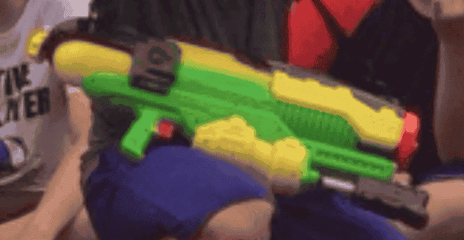

[[야광봉 (2014)]]을 참고하자.
아무튼 선생님의 지도 아래 여름 파티를 기획하고 있었고,
물총싸움을 하자는 아이디어를 낸다.
아마도 낮에 물총싸움을 하고 삼겹살을 구워먹은 후 저녁에 영화를 보러 모이는 일정이었나... 그랬을거다.

그래서 물총을 각자 들고 오기로 했다.
그때 물총 하나를 공짜로 얻게 됐는데, 출력이 장난 아니었다.
대포에 가깝다고 해도 될 정도로, 물은 2L 가까이 들어가는데, 몇 발 사이에 물을 다 쓴다.
스플래툰의 'Trizooka'의 현실판이라 하면 정확할 정도로, 완벽한 물벼락이었다.

우리는 서바이벌 혹은 헝거게임 식으로 게임을 진행하기로 했고, 끝까지 물에 젖지 않은 사람에게는 무슨 상?을 주기로 했던 기억이 난다.
나는 그 말을 너무도 진지하게 받아들였고, 정말 수풀 속에 완벽하게 숨어서 끝까지 전혀 안 젖은 채로 다시 짠 하고 나타났다.

그러자 선생님께서 개탄하시며 말씀하시길,

> 반장인 네가 악착같이 이기자고 반나절 숨어있다 나타나면 어떡하니... 그 대단한 물벼락을 가지고... 애들 좀 맞추고 뛰어다니고 네가 먼저 그랬어야지.

어쩌면 이는 내 성격을 보여주는지도 모르겠다.
