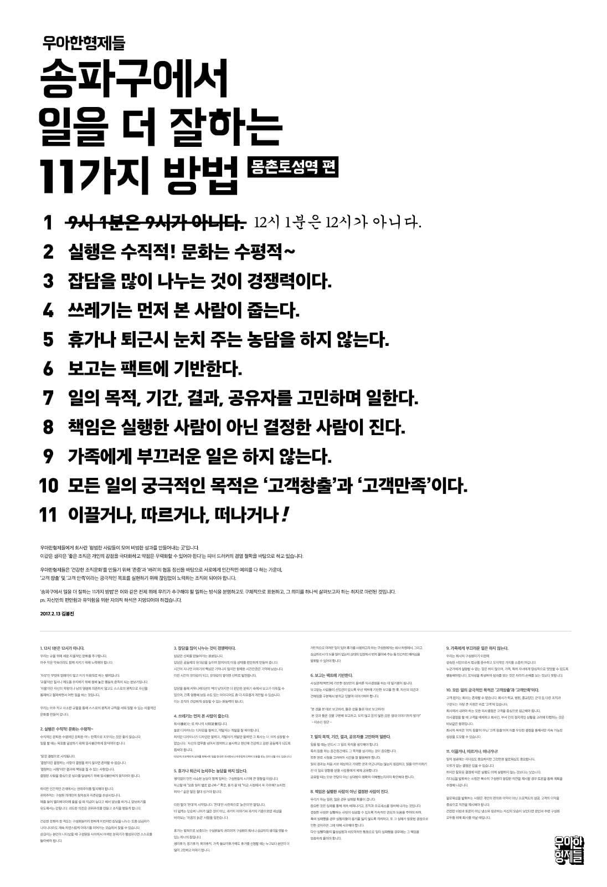

[[2020-07-20]]

2020년 7월 15일 [[배달의민족]] 김민태 개발자님께서 발표해주신 내용 전부를 그대로 받아 적어 정리하였다. H2 태그는 새로운 슬라이드를 의미한다.

(이하 발표 내용)

- 김민태 개발자님의 개인적 목표는 **100세 코딩**이다.

## Immutable & mutable

[[Front-end|프론트엔드]] 개발자들 사이에서는 다양한 내용들이 자주 화두로 나타난다. 이런 주제들은 모양만 바뀔 뿐 계속 반복된다.

## 웹 [[Front-end|프론트엔드]] 개발 그룹

여기 계신 모든 분들이 [[배달의민족|우아한형제들]]에 입사하시겠다는 목표를 가지고 계셨으면 좋겠다. 물론 경험을 위해서 온 사람도 있겠지만, 상황이 잘 맞아서 입사를 하셨으면 좋겠다. [[Front-end|프론트엔드]] 개발자로 입사를 하시게 되면 **웹 [[Front-end|프론트]] 개발 그룹**에 속하게 된다.

개발자를 구하기 힘들다. 그렇지만 기준치가 있어 아무나 뽑을 수는 없다. 더 많은 사람들이 필요하긴 하다.

## What

내부에 있는 개발자도 웹 [[Front-end|프론트]] 쪽이 아니라면, 그리고 일반 유저 대상 개발자라면, 대부분의 서비스가 앱으로 퍼블리싱 되고 있기 때문에 웹을 어디에 사용하는지 잘 모른다. (참고: [[배달의민족|배민]]에서 개발되는 소프트웨어는 크게 일반 유저 대상으로 한 소프트웨어와 사장님 유저 대상으로 한 소프트웨어로 나뉜다.)

서비스를 만드는 것은 빙산을 만드는 것이다. 사용자가 보는 것은 빙산의 일각이고, 그 아래 엄청난 기반 서비스들이 돌아가고 있다. 예를 들어 관리자 툴, 백오피스 같은 것들도 있다. 본 서비스보다도 더 규모가 클 수 있는 것들이다. [[배달의민족]]에는 이런 것들이 수십 개가 있고, 그마다 API 서버와 [[Front-end|프론트엔드]]도 다 있다. 그래서 서비스를 만드는 것은 빙산을 만드는 것이다.

일은 정말 차고 넘치고 많다. 그래서 이런 범용성을 갖출 수 있는 것은 웹 개발뿐이다. 서비스의 품질을 높이기는 위해선 웹 개발이 중요한 것이다.

## How

- Pair & Solo & Group Programming
- Upsource & [[Pull Request|PR]] & Root
- Slack & Jira & Confluence & Zeplin
- [[Google]], Line

다양한 도구를 사용하고 있다. 최근 10년간 **버드 워드** (업계에서 회자되는 [[Vocab|단어들]])로 [애자일](https://ko.wikipedia.org/wiki/%EC%95%A0%EC%9E%90%EC%9D%BC_%EC%86%8C%ED%94%84%ED%8A%B8%EC%9B%A8%EC%96%B4_%EA%B0%9C%EB%B0%9C), [워터폴](https://ko.wikipedia.org/wiki/%EC%95%A0%EC%9E%90%EC%9D%BC_%EC%86%8C%ED%94%84%ED%8A%B8%EC%9B%A8%EC%96%B4_%EA%B0%9C%EB%B0%9C) 등을 들어보았을 것이다. 요즘에는 잘 안 쓰는 [[Vocab|단어들]]. 2가지 측면이 있다. 애자일은 일하는 철학들과 프레임워크를 뜻한다. 실현하기 위한 다양한 기술이 있다. 한참 회자되던 시기에는 이런 업무 패턴을 도입하는 것이 도움이 될 거라 믿었는데, 요즘에는 애자일이 정착이 되어서 나름의 상황에 맞게 접목되기에 굳이 의미가 없어진 것이다. 즉 **애자일**이라는 의미론적 틀에 갇힐 필요가 없어진 것이다. 그래서 별로 쓸 일이 없는 [[Vocab|단어]]가 되었다.

페어 프로그래밍 같은 경우도 상황에 따라 적용된다. 솔로 프로그래밍도 많고, 기능 단위가 작은 경우에는 혼자 하는 것이 더 적합한 경우도 있다. 혼자 하고 코드 리뷰를 받는 등의 방법을 사용하는 것이다.

개발자들의 근본적인 도구는 코드라는 물리적인 형상이다. 코드를 잘 만들고 구성하고 잘 짜는지 확인하는 것이 중요하다. 이를 위해 [[배달의민족]]에서는 3가지 방법을 사용한다. 물론 케이스 바이 케이스이다.

초기에는 루트 권한을 가지고 모두가 사용했다. 빠른 것 같고 좋은데, 장애를 겪고 나면 생각이 달라진다. 예전에는 [[GitHub]]를 사용하다가 요즘에는 비슷한 도구 (GitLab) 을 사용한다. 그래서 [[Pull Request|PR]]을 하고 올리면 코드 리뷰 등을 해준다. [[Pull Request|PR]]도 단점이 있다. 2년 정도 전부터 [Upsource](https://www.jetbrains.com/upsource/)라는 코드 리뷰 전용 툴을 사용하기 시작했다. 코드를 리뷰하는 방식이나 라이프 사이클은 다 다르다. **그때그때 달라요**

[[Front-end|프론트]] 직군은 협업 라인이 가장 많다. 그래서 커뮤니케이션을 하는 방법이 중요하다. 메신저는 주로 슬랙을 사용하고, 일정을 플래닝하고 작업 단위를 설정하는 것은 지라를 사용한다. 이 안에 정리되는 문서는 컨플루언스를 사용하고, 디자이너와 협업할 때는 제플린을 사용한다. 내부에 포토샵을 사용하는 디자이너는 이제 사라졌고 스케치라는 벡터 디자인을 주로 사용한다. 그래서 제플린을 주로 사용한다. 가끔 라인 메신저도 사용한다. 메신저를 통일하려는 준비를 하고 있다. 창업 초기에는 라인 메신저를 주로 사용했다. 여전히 이 2가지는 병행해서 사용하고 있다. 코로나 때문에 더 많아졌다. [[Google|구글]] 행아웃, 줌 등을 사용한다. 온라인 중심 커뮤니케이션이 반강제로 주입되었기에 발빠르게 적응하고 있다.

변하지 않는 것과 변하는 것이 존재한다. 그중 변하는 것이 압도적으로 많다. 현실은 끊임없이 변한다. 중요도로 보면 또 다르겠지만.. 회사에 붙어있는 **송파구에서 일 잘 하는 11가지 방법** 정도가 변하지 않는 것이고, 나머지는 대부분 변한다. 무언가를 계속 동일하게 추구하면 집착이 생긴다. 그런 것들을 경계해야 한다.

일하는 방법을 소개하는 것도 그 시점에 정형화된 이야기일 뿐 일하는 방식도 끊임없이 바뀐다. 소프트웨어가 어려운 이유는 **현실의 문제를 해결하는 솔루션**인 소프트웨어도 발 빠르게 바뀌는 현실에 맞추어 끊임없이 바뀌어야 하기 때문이다. 이런 변화 안에서 바꾸기 어렵다면 개발하기 고통스러울 것이기에 [futureproof](https://en.wikipedia.org/wiki/Future_proof) 하게 만드는 것이다. 마치 별의 인생과 비슷하다. 별이 죽기 전에 점점 커지다가 비로소 죽음을 맞듯이, 코드도 점점 커지다 재개발의 순간이 오며 죽음을 맞는다.

모든 것들은 변화에 대한 적응을 연구하는 것이다. 대부분이 mutable 하고 그것을 인정해야 한다. 입사하고 나서 프로페셔널한 개발자가 된다면 당신의 역할은 무엇인가? 그것은 바로 AT라는 것이다.

## AT: Appropriate Technology

적정 기술을 제안하고 판단하는 사람이 되어야 한다. 단순히 **요즘 이 기술이 핫하고 좋대~**라는 이유로 선택하면 안 된다. 적정 기술을 사용할 수 있는 사람이라면 **이건 리액트가 아니라 바닐라 자바스크립트로 하는 것이 더 좋아요** 같은 방식으로 이야기할 수 있다.

물론 시기에 따라 적정 기술은 바뀌겠지만, 엔지니어는 그 변화의 흐름 안에서도 적정 기술을 포착하고 제안할 수 있어야 한다. 그를 위해서 여러분들이 가져야 할 생각은 유연성이다. 편견 없이 집착하지 않는 기술. 멋진 기술이 나와도 **그 기술 자체**에 취하면 안 된다. 그게 다가 아니기 때문에. 본질이 무엇인지를 파악하는 기술이 중요하다. 6개월 전에는 적정 기술이 아니었던 기술이 6개월 후에는 적정 기술이 되는 일도 생긴다.

장기적으로 해결해야 하는 문제들이 있다. 어떤 부분들은 빠르게 개발해야 하고 어떤 부분들은 느리게 개발해야 한다. 그런 식으로 유연하게 대처해야 생명력이 길어진다. 그게 **회사**라고 하는 그룹의 존재 이유이다. 그런 의미에서 [[배달의민족|배민]]이 이런 고민을 하는 것이 꽤 성장했다고 생각한다.

## 발표 중간에 언급된 추가 정보

### CBC

현업에 투입되면 가장 많이 듣고 가장 많이 하게 되는 [[Vocab|단어]] **CBC** = Case By Case. 입사하고 첫 몇 년은 이 말을 못 할 것이다. 너무 변화가 많기에 모든 것들은 케바케. 그만큼 상황이 복잡하고 미묘하다. 하지만 엔지니어라면 그 케바케를 여러 가지 근거를 설명할 수 있어야 한다. 그를 바탕으로 판단을 내려야 한다.

### Application vs Document

둘의 가장 큰 차이점은 변화의 상태이다. 상태를 관리해야 하면 애플리케이션. 상태가 없으면 단순한 문서.
