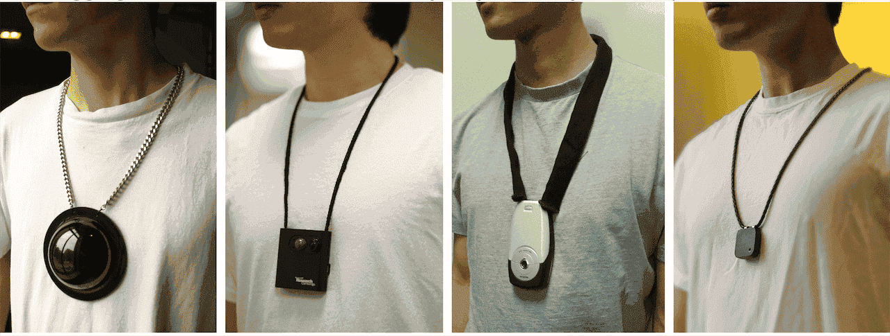
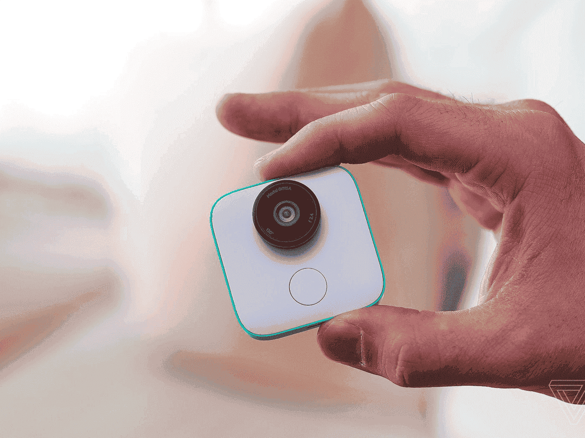

## 영구 기억 장치(Eidetic Memory Devices)의 역사

1945년 [[United States of America|미국]]의 과학자 [[Vannevar Bush|버니바 부시]]는 자신의 에세이 As You May Think에서 [[Memex]]([[Memex|메멕스]])라는 기기를 고안했다. 한 개인이 나눈 모든 대화, 기록, 통신을 압축하여 기계적으로 저장하고 그 기록들을 재빨리 불러올 수 있다면 [[Memex|메멕스]]를 통해 기억의 확장이자 증강으로 사용할 수 있다는 개념이다. 기억을 촘촘하게 연결하고 보강한다면 사람의 사고를 도울 수 있다는 점에서, [[Vannevar Bush|버니바 부시]]는 인터넷을 처음으로 상상했다는 평을 받는다. 당시는 에니악이 등장하기도 전이었다는 생각하면 이 얼마나 혁명적인 아이디어였는지 엿볼 수 있다.

![[5426B0.png]]

2013년, 현존 최고의 SF 작가 중 한 명인 [[Ted Chiang|테드 창]]은 자신의 소설 "사실적 진실, 감정적 진실"에서 또다른 형태의 기억 보조 장치를 상상한다. 가까운 미래에 한 기자가 "리멤"이라는 기기를 통해 생활의 모든 것을 기록하고 실시간으로 불러오는 경험을 한다. 구전으로만 역사를 전수하던 민족이 처음으로 "문자"를 발명하게 되며 발생하는 역학 구도의 파급력을 비교한다. "리멤"과 같은 개인용 영구적 기억 장치가 개발된다면, 마치 [[Memex|메멕스]]가 인터넷으로 실체화된 것처럼, 엄청난 격변이 일어날 것임을 상상할 수 있다.

그리고 그 일들이 현실로 다가오고 있다.

## 선사시대 라이프로그

1994년, [스티브 만](<https://en.wikipedia.org/wiki/Steve_Mann_(inventor)>)은 웨어러블 카메라와 웨어러블 디스플레이를 사용해 자신이 보고 있는 것을 실시간 생중계 했다. 1998년, 이는 "라이프로깅"이라는 장르로 태동했다. 이후 기기는 점점 축소화됐다. 그러다가 스마트폰이 등장하며, 대부분의 라이프로깅 기기는 시장에서 사장되었다. 기존의 수요는 본인의 기억을 증진한다는 목적보다는 사람들에게 실시간으로 무언가를 중계하는 것에 있었으며, 스마트폰은 "목적을 가지고" 모든 것을 송출하는 사람들에게는 최고의 기기였기 때문이다. 때문에 라이프로거들은 전문 기기를 버리고 스마트폰으로 넘어갔으며, 스트리머라는 새로운 직종을 탄생시키게 된다.

## 그리고 라이프로깅은 "더 많이 기억할 수 있도록" 목적을 변경하였다

스마트폰에 의한 방송을 위한 시장을 뺏기자 라이프로깅 기기는 더더욱 축소되어 기억을 보조하는 디바이스로 발전하기 시작했다. 한 예시로 2013년 Memoto 사의 [내러티브 클립](https://en.wikipedia.org/wiki/Narrative_Clip)이 있다. 이 기기는 30초마다 사진을 찍어 하루를 기록한다는 목적을 가지고 있었다.

![[A38ADA.png]]

하지만 그러면 하루에 수천장의 사진이 나오게 된다는 단점이 있었다. [[Information among Data|데이터 홍수 속 유의미한 정보를 찾기가 어렵다는 것이다.]] 2016년, 조금 더 발전한 형태의 [Google Clip](https://www.theverge.com/2018/2/27/17055618/google-clips-smart-camera-review)이 등장했다. [[Google|구글]]의 [[AI|인공지능]]으로 "기록할 만한" 순간이 지나간다면 사진을 찍는 카메라였다. [[Google|구글]]이 늘상 하는 일이 그렇듯이 조용히 출시되어 조용히 사장되었다.

## [[LLM]] 라이프로깅의 시작

이들은 주로 몸에 부착하는 초소형 카메라의 형태로 존재했다. 가장 큰 이유는 녹음을 이용한 요약은 마땅히 정리할 수 없었기 때문이다. 그리고 모두가 알다시피 [[ChatGPT]]가 등장했다.

[[LLM]] 영구 기억 장치로의 유의미한 최초의 시도는 2022년 11월 [Rober Dam](https://twitter.com/roberdam)이 제작한 [Wisper](https://roberdam.com/en/wisper.html)이다. 그는 휴대폰 앱으로 자신을 항상 녹음해 [[LLM]]을 이용한 정리를 시도했고, 완벽한 기억과 개인용 "심리학자"를 가질 수 있다는 장점으로 꼽았다 (자신의 모든 대화에서 감정 분석을 실행해서 감정을 모니터링했다). 하지만 휴대전화를 사용한다는 특성 상 한계가 명확했다. 소프트웨어를 상시 구동해야하는데, 성능과 배터리 문제가 적나라하게 나타났다. 이제 결론은 전용 기기를 만들거나, 스마트폰 [[OS]]에 네이티브하게 통합되는 일 밖에 없었다.

## 새로운 [[Apple|애플]]이 될 기회

폼팩터는 문화를 동반한다. 예를 들어 데스크톱의 등장은 방구석에서 벽만 쳐다보는 광경을 자연스럽게 만들었다. 스마트폰의 등장은 길 한가운데에서 은행 업무 보는 것을 자연스럽게 만들었다. 에어팟의 등장은 허공에 대고 말하는 것을 자연스럽게 만들었다. 폼팩터는 문화의 격변을 일으키고, 새로운 골리앗을 탄생시킨다. 그리고 이제 우리는 폼팩터의 변경을 목전에 두고 있다. 바로 **핀**이다.

이제 우리는 시계 혹은 스마트폰 없이 아이팟 셔플 크기의 작은 핀을 목에 두고 다닐지 모른다. 그 기기에서는 [[AI|인공지능]]이 상시 구동되고 있으며, 기기에 따라 내 손바닥에 영상을 투사할지 모른다. 디스플레이가 없기 때문에 배터리가 며칠 갈지도 모르고, 하루에 일어나는 모든 일들을 기록하고 기억해 나에게 요약본을 전달해줄지 모른다.

모두 공상 과학 이야기 같지만, 지금 바로 이 순간 전부 실현된 이야기만 써놓은 것이다. **이 제품들은 모두 개발되었고, 당장 내년 출시를 앞두고 있다.** 몇가지 예시를 보자.

2023년 10월, [Avi Schiffmann](https://twitter.com/AviSchiffmann)이 자신이 개발하던 기기, [Tab을 공개했다](https://twitter.com/AviSchiffmann/status/1708439854005321954).

![[C1D591.png]]

그에 질세라 [Rewind](https://twitter.com/RewindAI) 팀에서는 비슷한 기능을 하는 [[Rewind]] 팬던트를 공개했다.

![[A98330.png]]

마지막으로 [Mingjie Jiang](https://twitter.com/itsmingjie) 또한 Human 팬던트를 [공개했다](https://twitter.com/itsmingjie/status/1709039235913719973).

![[2FC7CE.png]]

세 제품 모두 [[OpenAI]] Whisper와 [[Generative Pre-trained Transformer|GPT]] 기술을 활용해 모든 것을 녹음해 기억하고 즉시 문답할 수 있는 팬던트형 [[AI]] 기기이다. 이게 10월의 시작 단 며칠만에 일어난 변화임을 미루어 볼 때 속도가 줄어들지는 않으리라 생각한다.

## 앰비언트 컴퓨팅

나아가 **앰비언트 컴퓨팅**이라는 개념이 태동하기 시작했다. [[Apple|애플]]에서 소프트웨어와 디자인 영역에서 일하던 디렉터 2명이 Humane이라는 회사를 창업하여 **항상 존재하지만, 만연하지는 않은** 컴퓨팅에 대한 고민을 하기 시작했다. 그들의 고민은 라이프로깅 기기와 비슷하게 핀 형태로 몸에 고정하지만, 고도로 발전한 레이저 프로젝터를 가지고 있어서 손으로 정보를 투사할 수 있는 형태를 가지고 있었다.

![[853594.png]]
![[E45497.png]]

그들의 요지는, 언제나 존재하기에 모든 것을 기억하고 당신을 보조할 수 있지만, 현대의 스마트폰처럼 스마트폰에 푹 빠져서 헤어나오지 못하는 디지털 중독 등의 문제를 야기하지는 않으리라는 것이었다. 즉, 전자기기와 "건강한 관계"를 구축할 수 있다는 것이다.

## 앰비언트 컴퓨팅 시대의 우리

앞서 언급한 [[Ted Chiang|테드 창]]의 소설 "사실적 진실, 감정적 진실"에서는 [[Ted Chiang|테드 창]]은 다음과 같이 기록한다.

> 심리학자들은 일반적인 지식을 뜻하는 의미 기억과 개인 경험으로 이루어진 일화 기억을 구분한다. 글이 발명된 이래 우리는 의미 기억을 위해 줄곧 기술적인 보조 수단을 활용해왔다. 처음에는 책, 그 뒤에는 [[Search Engine|검색 엔진]]이었다. 그와 대조적으로, 일화 기억에 대해 보조 수단을 채택하려는 시도는 역사적으로 많은 저항에 부딪혔다. 개인이 보유하는 일기장이나 앨범의 수는 그가 가진 보통 책의 수에 미치지 못한다... 우리는 무의식 중에 일화 기억을 우리 정체성의 필수 요소로 여기는 탓에, 그것을 표면화함으로써 책장의 책이나 컴퓨터 파일과 같은 존재로 격하시키는 것을 꺼리는 것은 아닐까.
>
> 내 마음의 일부는 이런 현상을 저지하고 싶어한다. 인생이 시작됐을 때의 경험을 여과해서 보는 어린아이 특유의 능력을 지켜줌으로써, 그들의 근원을 이루는 이 야기들이 차갑고 무감동한 동영상으로 대체되는 것을 막고 싶어하는 것이다. 그러나 어쩌면 그들은, 퇴색될 염려가 없는 디지털적 기억에 대해, 내가 불완전한 생체적 기억들에 대해 느끼는 것과 다를 바 없는 따뜻함을 느낄지도 모른다.
>
> 나는 내 시대의 산물이며, 시대는 변하기 마련이다. 구전 문화가 글의 도래를 막지 못했듯이,우리는 사람들이 디지털적 기억을 채택하는 추세를 막지 못한다. 그러므로 내가 할 수 있는 최선의 선택은 그 장점을 찾아보는 일이 될 것이다. 그리고 나는 디지털적 기억의 진짜 혜택을 발견했다고 생각한다. 정말로 중요한 것은 당신이 옳았다는 점을 증명하는 것이 아니라, 당신이 틀렸다는 사실을 인정하는 것이다... 나는 디지털적 기억이 그 이야기들을 최상의 행위를 강조하고 최악의 행위를 생략하는 우화 같은 이야기가 아니라, 스스로 틀릴 수 있다는 가능성을 인정하고 다른 사람의 가능성에 대해서도 섣불리 재단하지 않는 진실한 기록으로 바꿔주기를 희망한다.

나 또한 비슷한 미래를 상상한다. 기술의 상시성(readily-availableness)과 기술의 범람(Pervasiveness)은 구분되어야 한다. 기술은 언제든지 인간을 보조할 준비를 마치고 있되, 기술이 시도 때도 없이 만연히 존재하여 인간 지능의 주의력을 빼앗아가면 안된다. 인간이 기술을 사용해야 한다. 기술이 인간에게 있어 암세포처럼 저항 없이 과성장하여 우리의 모든 기력과 집중력을 빼앗아가면 안된다.

기술은 가치 중립적이지 않다. 이에 대한 반론으로 사람들은 "총을 쏘는 사람이 문제이지 총 자체는 가치중립적이다"고 주장한다. 하지만 그것은 하나의 편리한 예시일 뿐이다. 중립적이지 않은 기술도 많다. 기술은 그것을 절실히 원하는 수요자에 의해서 창시되며, 최초의 수요자는 그 "절실히 원하던 이유"가 있기 때문에 가치 중립적이지 않다. 예를 들어 질소 고정법을 창시한 프리츠 하버가 독일의 국수주의에 매료되어 염소 독가스를 개발한 것을 가치 중립적이라고 볼 수 있을까? 하버는 심지어 살상목적의 독극물 사용에 대한 국제법까지 공부해 이를 독일이 교묘하게 우회할 수 있도록 독가스 살포법까지 고안했다.

현대 시대에 만연한 [[Social Engineering|소셜 엔지니어링]] 또한 가치 중립적이지 않은 영역이다. [[Meta (Company)|페이스북]] 등의 SNS 팀에는 제품을 더 "중독적으로" 만들기 위한 전담 팀이 존재한다. 이들의 전략은 사실상 마약 카르텔이 더 자극적인 마약을 연구하는 과정과 크게 다르지 않으며, 어쩌면 먼 훗날 우리는 지금을 "소셜 미디어를 무제한적으로 엔지니어링하던 야만의 시기"로 기억할지도 모른다.

앰비언트 컴퓨팅에도 비슷한 걱정을 하는 사람들이 있다. 만약 우리가 안경에, 또는 홍채에, 무한히 스크롤되는 동영상 피드를 넣어버린다면, 우리의 도파민계는 안전할까... 나는 이렇게 새로 창시되는 기업들이 "기술과 더 건강한 관계"를 맺을 수 있도록 바라는 마음이다. 우리는 스마트폰 대격변기에는 건강한 관계를 맺는 것에 실패했다. 그렇기에 앰비언트 컴퓨팅 회사들이

- 단기적인 리텐션 지표보다는 **사람들의 마음의 평화를**
- 광적인 데이터 수집보다는 **인간 창의력의 증진을**
- 당장의 수익보다는 **인류 사고력의 번영을**

원하길 바란다. **항상 존재하지만, 만연하지는 않은** 컴퓨팅을 기대한다.
