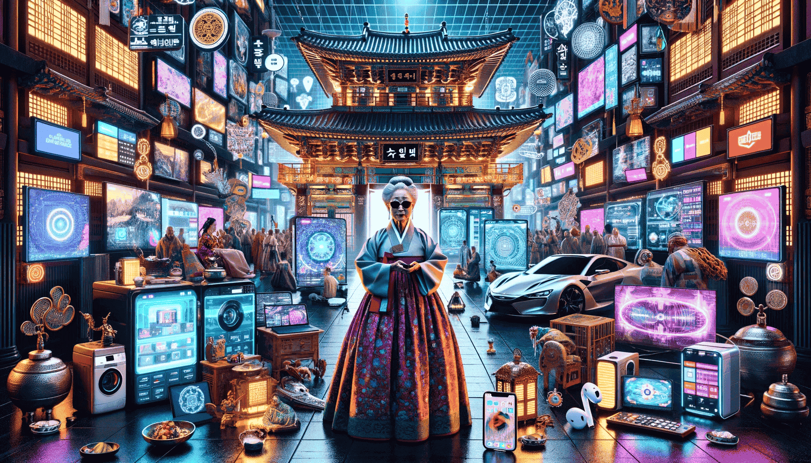

[[2024-05-23]]의 에세이.

외할머니는 어쩌면 내가 가장 닮고 싶은 분이다.

외할머니 댁은 항상 신비로웠다. 토속 신앙과 불교의 오묘한 교차점에 있는 그 집은, 어느 구석은 조왕신을 모시는 유물들이 있었고, 다른 구석에는 부처를 모시는 성스러운 장소들이, 또 다른 장소에는 [[장승]]이 우뚝 서 있었다. 민속과 불교는 점점 혼재되어, 각 종교의 상징물들이 매 걸음마다 하나씩 꼭 있었다. 나는 이것들이 [[대한민국|한국]] 민간 신앙의 표본(불교+토속+[[무교]]의 적절한 혼재)이라고 생각했다. 더군다나 할아버지는 유물을 수집하시는 취미가 있으셔서, 종종 희귀한 상징물을 보기도 했다.

그것보다 더 매혹적인 부분은 그런 한국 토착 신앙 사이사이에 테크놀로지가 스며들어 있었다는 점이다. 외할아버지는 일찍이 사업을 하셨었고, 1970년대 경부터 [[일본]] 출장이 잦으셨다. 그때마다 매번 새로운 전자제품을 수집하셨다. 특히 워크맨 시리즈를 모두 가지고 계셨고, 그때부터 외할머니, 외할아버지의 전자기기 문해력(Digital Literacy)는 점점 성장하셨나 보다.

때문에, 팔순을 넘기신 현재 나이에도 모든 전자제품과 그 생태계를 최대로 사용하고 계신다. 할머니는 스마트TV 2개, 아이패드 1개, 최신 갤럭시, 각종 안마 기계를 매일 전부 사용하고 계시고, 그 기기들은 [[Google|구글]] 생태계로 연결되어 있다. 에어팟과 비슷한 제품을 착용하고 스마트TV와 핸드폰을 자연스럽게 전환하며 사용하신다.

전자제품도 종교 상징물처럼 주변에 널려있다. [[2024-05-23]]에 왔을 때 새로운 TV가 3개나 있었고, 그 중 남는 TV 하나(삼성 스마트 TV M7)를 나 보고 그냥 가져가라고 하시더라. 냉장고와 세탁기도 오브제 시리즈 최신형으로 바뀌어 있었다. 하지만 반대로 다락방에 가면, 그야말로 과거 전자기기 보물창고였다. 옛날 카세트 테이프부터, 컴퓨터, 라디오, MP3 등등... 살아있는 컴퓨터 박물관이다.

그보다 더 놀라운 것은 할머니의 소프트웨어 이해 능력이다. 어쨌든 IT쪽 일하는 손자이기에, 우리 가족 모든 기기 수리 및 설정은 내가 도맡아서 한다. 때문에 무언가 고장나거나 설정이 꼬일 경우 내가 직접 수리를 해드리는데, 다른 친척 분들과는 다르게 문제의 원인을 직접 추리하셔서 물어보신다. [[2024-05-23]] 오늘 해드린 수리를 말해보자면,

> "얘, 이거 거실 스마트TV에서 유튜브를 아직 로그인을 안 했는데, 그랬더니 안방 스마트TV랑 동시에 재생이 돼서 좋더라. 근데 그러니까 유튜브 프리미엄이 안되고 자꾸 로그인하라고 뜨는데, 이거 로그인을 하면 TV 2개 중에 한개만 재생되는게 아니니? 아, 2개 동시에 재생되니? 그러면 로그인 해줘봐라."

> "아이패드를 오랜만에 켰더니 구글이랑 유튜브에 다시 다 로그인해야한다더라. 그거 좀 해줘봐라."

> "지난번에 삼성 브라우저에 깔아준 애드블록 있지? 삼성 브라우저에서는 이제 광고가 안 보이는데, 구글 앱 뉴스피드에서 눌러서 보는 기사들에서는 아직 보인다. 거기서도 광고 안 뜨게 가능하니?"

> "여기 이거 스마트TV에서 저 앱 아이콘을 없애고 얘를 옮기고 싶은데 이거는 어떻게 하니?"

젊은 세대가 보기에는 그렇게 복잡한 질문은 아니라고 생각할 수 있겠지만, 다시 말하지만 할머니는 팔순이 넘으셨다. 더군다나, 버그 리포트든 피처 리퀘스트든 다뤄보는 개발자라면 알겠지만, 저렇게 니즈와 디맨드를 명확하게 딱 찝어서 명쾌하게 질문하는 사람은 정말, 정말 드물다.

하여튼간 내게 외할머니댁은 [[건강한 한국 토착 신앙]]과 자본력, 테크놀로지, 그리고 문화유산들이 적절히 혼재되어 있는 마법 같은 공간이었다. 어쩌면 내가 그토록 바라는 [[건강한 한국 토착 신앙]], 자본력 있는 한국 문화의 세련되고 사이버펑크스러운 재해석, 그리고 [[네오 코리안 르네상스]]는 어쩌면 외할머니 댁을 모방하려는 것인지 모르겠다.
