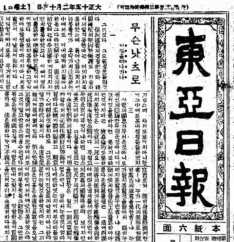

[[민사고|고등학교]]에 처음 들어갔을 때 받은 오리엔테이션 중 한 가지 기억에 남는 것은 **이완용이 되지 말라**는 강의였다. 내용 자체가 특별히 기억에 남진 않지만, 그 내용이 유별나지도 않았다는 것이 기억 난다. 단순하게 **이완용 = 매국노**라고 되뇌였던 완성했던 기억이 난다. 2019년 드라마 **미스터 션샤인**에서 악역으로 등장하는 이완익 또한 이완용에서 차용한 캐릭터임이 분명하다. 하여튼 우리는 **이완용 = 매국노**라는 공식을 완성하고 의문을 던지지 않는다. 그러다 얼마 전 [[University of Southern California|학교]] [[Doheny East Asian Book Stacks|도서관 동아시아관]]을 거닐던 중 우연히 발견한 책의 문구가 매우 인상적이었다.

> 지금까지 우리는 탐욕스럽고 패륜적이며 배은망덕한 인간 말종이라는 그럴듯한 '매국노 이완용 상'을 만들어 놓고 거기에 삿대질을 하면서 망국과 매국의 모든 책임을 그에게 떠넘겨왔다. 이것은 우리에게 망국의 치욕감을 덜어주는 위안이 될 수 있을지는 모른다. 그러나 진실은 아니다. 진실이 아닌 것에서 역사의 교훈을 얻을 수는 없다. 이제 문제는 '엉뚱한 이완용 상'에 욕설을 퍼붓는 것이 아니라 한때 대단히 애국적이었던 인물이 어떻게 해서 만고의 매국노로 전락하게 되었는가 하는 그 비극적 과정과 변신의 논리를 밝히는 데 있다. 우리는 이런 작업을 통해서만이 그의 매국 행위의 본질을 파악할 수 있는 동시에 제2의 이완용이 나타나는 것을 막을 수 있을 것이다.

일본 제국의 전쟁 범죄에 대한 무게는 철저히 일본 제국에 있다. 이는 변하지 않는 사실이다. 하지만 다시 위협에 노출되지 않기 위해, 그 역사를 다시 해부하고 분석하여 재발을 방지하는 것은 우리의 역할이다. 그렇다면 이완용이라는 인물이 탄생할 때까지 국가는 무엇을 했으며 어떻게 재발을 방지할 수 있을까.

:::warning

저자가 자신의 정치적 견해를 녹여낸 부분들도 있었다. 또한 저자 윤덕한은 현재까지도 호불호가 갈리는 인물이고, 그의 가치 판단이 다분히 포함된 서술도 적잖아 존재한다. 이를 확실히 인지하고 역사적 사실만을 중심으로 읽어보자.

:::

## 무능한 지배 집단

을사오적에게 책임을 전가하는 일은 을사늑약이 체결된 직후부터 있었다. 우리는 이를 관성적으로 되뇌이지만, 초기 관리들의 처지를 살펴보면 씁쓸한 감이 없지 않다.

> 그러나 사실 이들 상소문을 올린 전, 현직 고관들이나 시골 유생들은 17일 어전회의와 조약 체결 과정에서 실제로 일어난 일을 알지 못하고 있었으며 또 알 수 있는 위치에 있지도 않았다. 아니 알았다고 해도 신하가 전제군주에게 책임을 추궁할 수는 없는 일이다. 그들은 그저 짐작으로 황제는 반대했는데 역적들이 대신 감투에 연연해 일을 저질렀다고 결론을 내리고 보호조약의 모든 책임을 이른바 을사오적에게 돌리고 있었던 것이다.
>
> **그러나 을사조약의 최고 책임자가 고종이며 이 조약과 관련해 가장 비난받아야 할 당사자가 고종이라는 것은 역사의 기록이 증언하는 부인할 수 없는 사실이다**. 고종이 이토의 요구를 단호히 거부하지 못하고 내각에 책임을 떠넘긴 데 이어 나중에는 '협의하여 처리하라고 지시함'으로써 내각 대신들로 하여금 선택의 여지를 없게 만들어버린 것이다.
>
> 사실 전제군주 국가에서 황제의 명령은 최종적인 것이며 따라서 황제가 협의해서 처리하라고 지시했는데 대신들이 이를 끝까지 거부할 수는 없는 일이다. 그래서 이토와 하야시는 고종의 이 지시를 최대의 무기로 삼아 대신들을 내리눌렀던 것이다.
>
> 오늘날에도 우리의 일부 애국적인 학자들은 고종이 을사조약에 반대했고 비준하지 않았으므로 무효라는 주장을 펴고 있다. 을사조약이 무효라는 것은 그것이 일제의 군사적인 점령이 이루어진 상태에서 강요된 조약이라는 점에서 충분히 설득력이 있다. 군사적 강제를 전제로 한 국제조약은 시효에 관계없이 무효라고 하는 법 해석이 오늘날 국제적으로 일반화되어 가고 있기 때문이다. 당시 [[대한민국|한국]]은 러일전쟁에 출병했던 일본군에 의해 사실상 점령 상태에 있었다.
>
> 그러나 고종이 반대하고 비준을 하지 않았다는 것은 사실이 아니다. 그러한 주장은 '애국적'일지 모르지만 진실은 아니다. 그리고 진실이 아닌 것에서 진정한 애국심이 솟을 수는 없다. 나라의 체면을 생각해 무능한 군주를 감싸는 억지 주장을 펴기보다는 통렬하게 책임을 물음으로써 역사에서 교훈을 얻으려는 자세가 보다 애국적인 것이 아닐까.

을사늑약이 무효이며 '늑약'이라는 것은 변함이 없다. 하지만 그렇다고 무엇이 달라지는가. 국제 관계는 정의로 움직이지 않는다. 고종은 이처럼 책임을 회피하기 급급하는 모럴 해저드를 범했다. 이에 이어지는 관리들의 모럴 해저드를 관찰해보자.

> 이완용의 제의는 언뜻 매우 현실적이고 합리적인 의견처럼 보인다. 그러나 이는 근본적으로 타협의 대상이 될 수 없는 [[일본]]의 보호 조약 강요를 현실적으로 접근했다는 그 자체가 일제의 침략 야욕에 동조하는 결과가 되고 만다는 것을 간과한 것이다. 이것이 바로 현실주의자의 함정인 것이다. 물론 이러한 이완용의 제의 밑바닥에는 고종의 우유부단함에 대한 불신이 깔려 있었던 것도 사실이다.

구한말은 **조선적 병폐**가 만연한 사회였다. 대한매일신보는 **황족과 정부 대관들이 모두 나라를 파는 종**이라고 지적했다. 비록 저자가 지적한 **소위 황족 가운데 일제의 병탄 음모에 항거하는 시늉이라도 한 자가 있었던가.**는 의친왕의 예시로 보아 틀린 말이지만, 황족의 절대 다수는 **이왕가** 대접을 받으며 친일파로 전향하여 살았다는 점에서 크게 틀렸다 하기도 애매하다 (저자 윤덕한은 의친왕 또한 부정적으로 평가한다는 점에서 이런 서술을 한 듯 하다). 결과적으로 구한말 지배 집단의 실상은 이렇게 처참하였다.

> 당시 일반 민중들은 '조선 왕실은 일제 침략의 피해자며 이완용은 그 일제를 등에 업고 왕실을 핍박한 가해자'로 생각하고 있었다. 또 우리 역사도 그런 식으로 기술하고 있다. 그러나 왕실과 이완용과의 관계는 전혀 그런 것이 아니었다. 그 둘은 합방 전과 마찬가지로 합방 후에도 항상 서로를 깊이 신뢰하고 충성을 바치는 군신관계를 유지하고 있었다...

더군다나 [[United States of America|미국]]을 답사한 관리들이 악취로 가득했다는 점이 매우 부끄러웠다. [[한민족]]으로 반성을 하게 되었다.

## 정치적 순진함

더군다나 지배 집단은 정치적으로 너무나도 순진하고 감각이 없었다.

> 그러나 이완용 때문에 나라가 망했다는 것은 사실도 아니며 망국과 매국의 모든 책임을 이완용 한 사람에게만 돌리는 것 역시 이성적인 역사인식이 아니라는 점만은 지적해둘 필요가 있다. 이런 식의 단세포적인 역사인식이 계속되는 한, 우리는 역사에서 아무런 교훈도 얻지 못할 것이기 때문이다. 사실 **한일합방은 어느 날 갑자기 닥쳐온 것이 아니다. 냉정하게 얘기해서 러일전쟁이 끝났을 때쯤에는 이미 대한 제국의 운명은 돌이킬 수 없는 지경에 와 있었다**. 문제는 상황이 거기에 이를 때까지 이 나라 지배집단이 한 일이 무엇인가에 있다. 1884년 갑신정변 이후 러일전쟁에 이르기까지 20년 동안 대한 제국은 일제와 청국, 러시아 등 주변 열강의 속박으로부터 벗어날 수 있는 기회를 몇 차례 맞았었다. 갑신정변 후 청일 양국이 군사적 충돌을 피하기 위해 조선에서 서로 철군을 단행했을 때라든 가, 그 후의 갑오경장은 이용하기에 따라 이 나라가 외세의 영향에서 벗어나 자주독립 국가를 건설할 수 있는 절호의 기회였다. 그러나 그 호기를 이 나라 지배집단은 어떻게 보냈는가.

가쓰라-태프트 밀약과 포츠머스 조약에도 불구하고 [[United States of America|미국]]에 대한 환상을 가진 점에서 이것이 특별히 드러난다. 고종은 1882년 조미 수호 통상 조약의 **거중조정(居中調停)** 조항을 과신하고 있었다. 물론 고종 입장에서 최후의 몸부림이었다는 주장도 있지만, [[헤이그 특사]] 파견이 1907년이니, 25년 동안 변화한 정세를 읽지 못한 셈이다. 결과적으로 정치적으로 치밀하지 못했음을 부정할 수는 없다.

외국인들에 대한 무조건적 신뢰와 의지 또한 문제였다. 결과적으로 외국인들의 관심은 자신들의 한일병합으로 인한 치외법권 상실에 있었다.

## 기록 문화의 중요성

조선왕조실록으로 유명한 기록광 [[한민족]]은 어디에 갔는가. 19세기 후반 외국으로 답사하고 온 관리들의 답사기는 매우 부실하다. 이들의 귀중한 정보가 정리되고 유통되었다면 유용한 통찰이 되었을텐데.

## 이완용의 모순적 행동

지배 집단의 병폐에 대해 알아보았으니 이완용 개인의 모순적 행동에 대해서도 알아보자. 이완용은 학부대신으로서 [[대한민국|한국]]에 의무 교육 제도를 처음으로 도입해 법제화한 인물이다. 그런데 1924년 이완용은 자신에게 배당된 학교비 납세를 거부했다. 학교비는 당시 건설되기 시작한 보통학교의 건설비를 충당하기 위한 [[Tax|세금]]이었다. 이완용이 학부대신으로, 독립협회의 일원으로 우민(愚民) 정치를 원한 것도 아니거니와 일제 치하 [[일본어]] 의무교육을 도입한 것으로 미루어 보아 자신이 원한 국민 계몽 방식이 일제의 방식과 크게 달랐다고 보기도 어렵다. 그럼에도 이완용은 이후에도 납세고지서를 거부하며 완강한 반대 의사를 보였다.

말과 행동이 다른 사람도 많다. 하지만 더 나아가서 말과 행동이 같아도, 자신의 돈으로 하는 행동과 남의 돈으로 하는 행동이 다른 사람도 있다. 이완용은 국민이 계몽된 사회를 꿈꾸었지만 자신의 돈으로는 하기 싫었던 것일까.

> 위의 일화는 이완용이 사망하기 1년 전 매일신보 기자에게 **세상에서 제일 처신하기 힘든 일이 세 가지가 있다. 쇠약한 나라의 재상과 파산한 회사의 청산인, 빈궁한 가정의 주부가 그것이다**라고 말했다고 한다.
>
> 이완용의 이런 말에서 우리는 [[일본인]]의 주구 노릇을 하면서 그가 겪는 고뇌의 일단을 엿볼 수도 있다. 그러나 그가 스스로 '세상에서 제일 처신하기 힘든 일'을 기꺼이 맡아, 아니 그 역할에서 밀려나지 않으려고 기를 썼다는 점에서 이는 어디까지나 자기변명에 불과한 것이다.

그가 자기변명으로 구차한 핑계를 댔다는 점은 틀림없다. 그는 이상을 꿈꾸었지만 이상을 제손으로 이루고 싶지는 않았나보다.

## 결론

> 거듭 강조하지만 이완용은 만고의 매국노다. **그러나 그가 결코 멀쩡한 나라를 팔아먹은 것은 아니다**. 독립협회 활동에서 보여주듯이 그는 한때나마 나라의 독립을 위해 헌신했으며 [[한민족|민족]]의 장래를 두고 깊이 고뇌한 적도 있다. 위에 열거한 이하영이나 민병석으로부터는 그러한 고뇌의 흔적조차도 찾아볼 수 없는 것이 사실이다.
>
> 망국에 이르기까지의 과정에서 민비나 대원군이 역사와 [[한민족|민족]] 앞에 저지른 죄과는 이완용의 그것에 비교가 되지 않을 정도로 크고 무거운 것이다. 우리는 이완용에 대한 단죄와 함께 이들 망국배와 매국노들에 대해서도 공정한 역사의 심판을 내려야 한다. 그렇지 않고 망국과 매국의 모든 책임을 이완용 한 사람에게만 묻는다면 그것은 또 다른 역사의 이지메이며 그를 속죄양으로 삼은 대다수 매국노들의 비열한 책임전가라는 평가를 면치 못할 것이다.

위 문단이 이완용을 가장 잘 정리하는 문단이다.

본디 역사란 승자의 기준에서 재해석되는 것이다. 즉 기록이 아닌 해석이다. 우리는 이 점을 잘 기억하며 역사를 바라볼 때 우리가 그렇게 바라보도록 유도되고 있는지 명확하게 이해해야 한다. 하다못해 독일이 승전했다면 처칠이 범죄자로 히틀러가 영웅으로 추앙되었을 것이라는 말이 괜히 나오는 것이 아니다. 결국 역사는 절대악과 절대선 없이 모두가 악행을 저지르는 추저분한 일이며 승자의 악행은 은밀히 묻히고 패자의 악행만이 강조되는 것이다.

[[한민족의 동족상잔]]와 [[헤이그 특사]] 항목에서 볼 수 있듯이 20세기 초 관리들 사이에서는 일제에 대한 거부감 만큼이나 부패한 조선에 대한 거부감 또한 만연하였다. 헤이그에 파견된 이위종 특사는 일제 침략 뿐만이 아니라 조선과 고종의 부패와 병폐에 대해서도 통렬히 지적하였다.

> [[대한민국|한국]] 국민과 정부는 [[대한민국|한국]]의 독립 유지와 영토 보존을 위해서라는 [[일본]]의 정중한 약속을 믿고 [[일본]]과 동맹관계를 맺었다. 이 조약의 결과로서 [[대한민국|한국]]은 모든 수단을 동원하여 [[일본]]의 전쟁 수행을 지원하였다. **또 장기집권으로 인한 부패, 과도한 [[Tax|세금]] 징수와 가혹한 행정에 허덕여왔던 [[대한민국|한국]] 국민과 정부는 애원과 희망으로 [[일본인]]들을 환영하였다. 그 당시 [[한국인]]들은 [[일본]]이 부패한 정부 관리들을 엄격히 처벌해 주고, 일반 백성에게는 정의감을 북돋워 주고, 정부 당국의 정치. 행정에 대해 진실한 조언자가 되고, [[한국인|한국민]]들의 개혁 운동을 잘 인도해 줄 것으로 확신하였다.** [[일본인]]들은 거듭하여 그들의 [[대한민국|한국]] 진출 은 그들 자신만의 이익을 위해서가 아니라 모든 문명국들의 행위와 마찬가지로 [[대한민국|한국]]의 문호 개방과 모든 백성을 위한 기회균등의 보존을 공고히 하기 위함이라고 극구 강조하였다.
>
> 이위종(Ye We Chong), **A Plea for [[대한민국|Korea]],** The Independent, Vol. 63, No.3064, [[New York City|New York]], 1907.8.22. 이선근, 한국사 : 현대편, 을유문화사, 1963, 946-951쪽에 실린 번역문

일제의 전쟁 범죄 또한 용서 받을 수 없지만 동족을 상잔하며 자신들의 안위만을 생각한 황실의 타락 또한 우리가 뼈저리게 반성해야하는 역사이다. 부전승이지만 그래도 '승자'인 [[대한민국]] 정부의 이해관계와 맞아떨어지는 덕택으로 고종과 명성황후는 국부와 국모로, 그리고 그에 반대했던 모든 정파들은 매국의 부끄러움을 전가 당한다. 실상으로는 고종과 명성황후는 아관파천과 임오군란 등을 미루어 볼 때 결국 처음에는 청에, 그 다음에는 러시아의 외세에 기댄 것일 뿐이다. 반대로 러일전쟁에서 러시아가 승리하여 노제강점기 (露帝強占期, 러시아 제국 치하 조선)을 거친 후 독립했다면 우리는 고종과 명성황후를 매국의 근원으로 칭했을 것인가?

다시 한 번 강조하지만 이완용을 재평가하는 것이 아니다. 다만 역사는 언제나 입체적이며 인류는 편리한대로 역사를 기억하고 싶어한다는 점을 기억하자. 또 이완용이라는 만고의 악역이 등장하여 나라를 팔아 넘기기까지 그를 방지하지 못한 유약하고 부패한 정권을 다시금 반성하자.

이완용은 새로운 개국공신이 되기를 바란 듯 하다. 만약 역사가 다르게 흘러갔다면 그런 취급을 받았을지도 모른다. 하지만 역사에 만약은 없다. **역사의 소용돌이 속 그의 무모한 도박은 마침내 실패했으며 그 과정에서 저지른 악행에 대해 영원히 비판 받을 것이다**.

