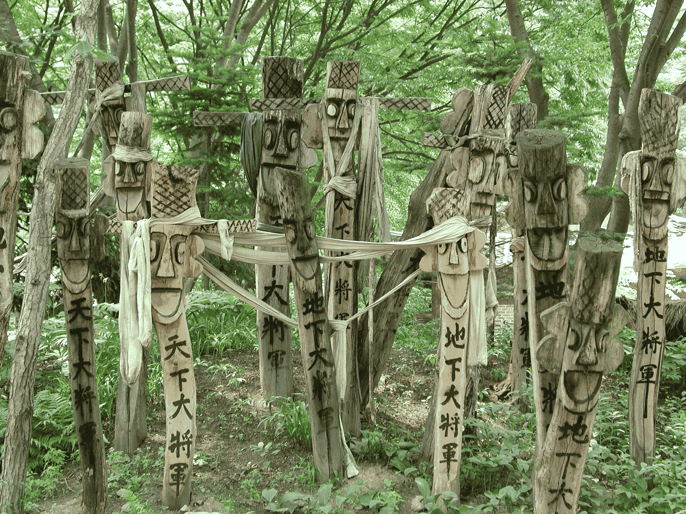

[[한민족의 문화]] 건축물로,
장승은 마을 또는 절 입구 등에 세운 사람의 얼굴 모양을 새긴 기둥이다.
장승은 마을의 경계를 표시하거나 귀신을 쫓는 마을의 수호신 역할을 한다.
장승은 돌로 만든 석장승과 나무로 만든 목장승이 있으며,
지방에 따라 장승, 정성, 벅수, 법수, 당산할아버지, 수살목, 장생, 장생표주, 목방장생표, 석적장생표, 석비장생표, 국장생, 황장생 등의 명칭으로 기록되었다.

장승은 신라와 고려시대에는 역참 제도의 일부로, 국도나 관로를 안내하는 푯말로 사용되었다.
장승은 조선시대에도 계속 사용되었으나, 1895년에 역참 제도가 폐지되면서 사라졌고, 일제강점기에 조선총독부에 의해 미신적인 것으로 간주되어 철거되었다.
장승은 현재 [[대한민국|한국]]의 전통문화로 인식되고 있으며, 장승제, 장승마을, 돌하르방, 벅수 등의 형태로 전승되고 있다.
비슷한 예시로 [[솟대]]나 [[서낭당]]이 있다.
벅수와 장승은 서로 역할이 다른 것으로, 우리가 알고 있는 장승의 본래 명칭은 벅수(法首)이며, 일제 강점기의 언문철자법통일안으로 인해 장승이라고 와전된 것이라는 주장도 있다.

