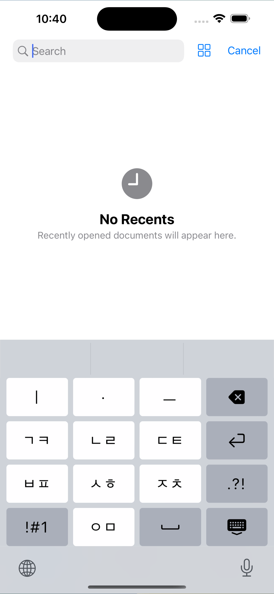
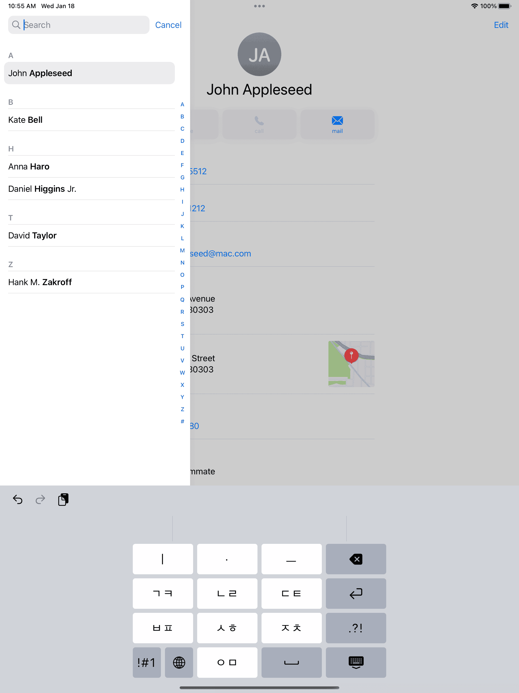

import DisplayFlex from '@site/src/components/DisplayFlex'

상위 문서: [[하늘땅사람]] 참고

## [[2022-12-19]]

[[아이폰 천지인 자판 프로젝트의 실현 가능성 연구]]를 통해 제작이 충분히 가능함을 확인.
다음과 같이 기술 [[Proof of Concept|개념 증명]] 완료.

### 기술의 구현 방향

일단 `ViewController` 내에 버튼과 로직을 때려박아 개발하는 것은 쉬워보임.
다만 코드를 분산시키고 좋은 품질을 유지하기 위해 [[SwiftUI]]를 사용하는 방안을 연구 중.
[이런 문서](https://www.createwithswift.com/using-a-swiftui-view-in-a-uikit-app/)를 볼 때
UIKit ViewController 안에서도 [[SwiftUI]] View를 이용하는 것이 가능해보임.
2020년에 소개된 [SwiftUI Grid Layout](https://blog.logrocket.com/understanding-the-swiftui-grid-layout/)을 활용하면 깔끔한 구현체를 만들 수 있을 것으로 기대.

CloudKit Persistence를 이용하여 사용자 설정이 iCloud를 통해 동기화되도록 구현할 예정.
부가적인 기능 없이 MVP로 천지인 입력이 가능한 키보드로 구현할 생각.

![[5B9AFC.png]]

### 있으면 좋을

- 간단한 맞춤법 검사
- `( •_•)` `⊹⋛⋋( ՞ਊ ՞)⋌⋚⊹) `와 같은 이모티콘. [[Naver|네이버]] 스마트 키보드의 기능 중 꽤 좋은 기능이었다.
- [[Naver|네이버]] 스마트 키보드에 있던 오타 보정. [발표 자료](https://www.slideshare.net/deview/135-ai), [발표 영상.](https://tv.naver.com/v/4578547)

## [[2022-12-20]]

Grid 대신 VStack과 HStack으로 충분하다고 판단하여 개발함.
버튼을 눌렀을 때 간단한 동작을 하도록 구현.
숫자 버튼을 눌렀을 때 키보드를 변환하도록 만들기 위해 2가지 뷰를 바뀌도록 해야할 듯?
System 색을 맞추는 것에 약간의 시간이 들었다.
예상과 다르게 아이폰의 키보드 컬러는 `Color(uiColor: UIColor.system...)`에서의 어떤 Semantic Color와도 일치하지 않았다.
그래서 일단 눈대중으로 다크모드와 라이트모드에 적당히 괜찮은 색깔을 보여주도록 하드코딩해두었다.
이렇게 할 경우 접근성의 면에서 문제가 발생할 수 있다 (예: 사용자가 High Contrast를 켜놓은 경우 등.)
일단 MVP 개발까지를 위해 이 정도로 타협하기로 했다.

<DisplayFlex>
![[A02D58.png]]
![[85D135.png]]
</DisplayFlex>

잠깐 타이핑의 로직을 생각해보았는데, 적당히 골치 아프겠다.
엣지케이스가 꽤 많다.

## [[2022-12-27]]

천지인 로직 구현 시작.
키보드를 제작하는 것에는 [raywenderlich](https://www.kodeco.com/49-custom-keyboard-extensions-getting-started)가 참고하기 좋았다.

`NSRange`와 `setMarkedText`를 사용하여 마지막 텍스트를 선택할 수 있는 방법에 대해서 연구해보고 있었는데, 아무래도 기대와 조금 다르게 동작하여 사용에 어려움이 있다.

```swift
let range = NSRange(location: 1, length: 0)
proxy.setMarkedText(text, selectedRange: range)
```

![[B9DE45.png]]

`ㅇ` 근처 배경에 회색 배경이 있음을 확인하자.
그리고 이거는 보니까 [[중국어]]처럼 글자 조합 후에 글씨가 입력되는 경우를 위한 것 같다.
타이핑 도중에는 검색이 안 된다.

- [유니코드 옛한글 1638750자, 문자 집합 위키](https://charset.fandom.com/ko/wiki/%EC%9C%A0%EB%8B%88%EC%BD%94%EB%93%9C_%EC%98%9B%ED%95%9C%EA%B8%80_1638750%EC%9E%90)
- [현대 한글 11172자/28자씩/국가 표준 완성형 통합, 문자 집합 위키](https://charset.fandom.com/ko/wiki/%ED%98%84%EB%8C%80_%ED%95%9C%EA%B8%80_11172%EC%9E%90/28%EC%9E%90%EC%94%A9/%EA%B5%AD%EA%B0%80_%ED%91%9C%EC%A4%80_%EC%99%84%EC%84%B1%ED%98%95_%ED%86%B5%ED%95%A9)

천지인 로직을 그냥 선처리해놓고 [[json]]에 덤핑하여 사용하면 어떨까 실험을 해보았다.
[4년 전 조성현이 무척이나 나를 도와주고 있다!](https://github.com/anaclumos/hangulbreak/blob/master/Python/HangulDecomposeModule.py)

![[B1C8D0.png]]

근데 단순하게 마지막 한 글자를 가지고 처리하는 것은 예외 사항이 많다. 우선 전 두 글자를 읽어와서 검색한 이후, 없으면 한 글자를 확인해야겠다.

- `안ㅅ` + `ㅅ` = `않`
- `앉` + `ㅡ` = `안즈`: 마지막 종성 하나가 추출 가능한지 확인해야 한다.

어차피 가능한 한글의 가지 수는 약 만 여개인데다가, 누를 수 있는 버튼은 10개이다.
`않`을 입력하기 위한 `안ㅅ` 등의 항목을 추가하더라도
조합은 많아야 10만 단위에서 넘어가지 않을 것으로 예상한다.
충분히 하드코딩하고 사용할 가치가 있다.

반면에 State Machine 기반으로 가장 그럴 듯한 구현체로 [김윤상](https://github.com/kys-zeda)님의 [[Java]] [[Android]] [천지인 키보드](https://blog.naver.com/irineu2/220337849480)([kys-zeda/chunjiin](https://github.com/kys-zeda/chunjiin/blob/master/Chunjiin/src/com/zeda/chunjiin/Chunjiin.java))를 발견했다.
오토마타 기반으로 제작하셨는데, 아주 잘 작동한다.
보아하니 [[대한민국|한국]] 대학 컴공과에서는 State Machine 수업을 할 때 천지인을 하나의 예제로 사용하나보다.
우린 좁은 그리드 위의 팩맨으로 했었는데!

어쨌든 하드코딩을 해서 사용할지, 아니면 오토마타 로직을 사용할지 고민이 된다.
하드코딩 [[JSON]]을 만들 경우 다른 개발자들이 "정말 아무 Friction 없이" 가져다가 사용할 수 있다.
오토마타 로직을 사용할 경우... 좋은 점이 있나?
로직이 깔끔할 것 같지도 않고 잘 모르겠다.

## [[2022-12-28]]

![[171C7C.png]]

종성에 한해서는 지도를 완성했다.

![[EC8120.png]]

천과 인도 완성했다.

- `할까` 케이스 고려해야함 → 완성

[KR20000049347A - 천지인 제자 원리에 기반한 한글 입력 장치 및 방법 - Google Patents](https://patents.google.com/patent/KR20000049347A/ko)

## [[2023-01-02]]

천, 지, 인을 입력했을 때 마지막 종성이 빠지면서 입력되는 경우도 모두 완성했다.
[아래아 관련해서 참고하면 좋을 자료](https://www.fileformat.info/info/unicode/char/119e/index.htm).
일단 현재 생각한 케이스들은 모두 [[Swift]] Constant에 박아두었다.
전체 경우의 수는 5만 케이스가 조금 안 된다.
내가 생각하지 못한 케이스가 있는지 모르겠지만...
[[Swift]]로 만들어서 빌드해보았다. 빌드에 15분 이상 걸려서 다시 확인해봐야겠다.

![[69DFE5.png]]
![[4B2B9B.png]]

일단 간단하게 테스트해본 결과 잘 작동한다!

![[EAADF1.mp4]]

## [[2023-01-03]]

현재 발견된 문제

- `ㅠ` 입력 불가. 초성이 없는 경우에도 모음과 이중모음까지는 조합이 가능하도록 만들어야겠다. ← [[2023-01-15]] 해결
- [[HTML]] input 태그에서 `아`를 입력 불가능함. `누`, `노` 등도 불가능함. ← [[2023-01-15]] 해결

[[Apple]] QuickType과 비슷한 자동완성 기능은 필수적인데, 보니까 [[Apple]]에서는 QuickType을 제삼자에게 열어주지 않은 것 같다. 대신 [`completions(forPartialWordRange:in:language:)`](https://developer.apple.com/documentation/uikit/uitextchecker/1621034-completions)를 통해 할 수 있음으로 보인다.

```swift
func completions(
    forPartialWordRange range: NSRange,
    in string: String,
    language: String
) -> [String]?
```

[NSHipster](https://nshipster.com/uitextchecker/) 문서에도 다음과 같은 제안을 한다.

> Writing a keyboard extension? With `UITextChecker` and `UILexicon`, which provides common and user-defined words from the system-wide dictionary and first and last names from the user's address book, you can support nearly any language without creating your own dictionaries!

이를 사용하면 아래 **있으면 좋을** 항목에 언급한 **간단한 맞춤법 검사**를 달성할 수 있다.
또한 오타 보정은 큰 필요가 없어 보인다. 어차피 천지인은 키 하나 하나의 크기가 상당히 크기 때문이다.

## [[2023-01-15]]

- [Core Haptics](https://developer.apple.com/documentation/corehaptics) 적용해보려고 했는데 알 수 없는 이유로 동작하지 않음
- [[HTML]] `input` 태그에서 `아` 등을 입력할 수 있도록 변경. [[HTML]] `input`에서 자동 기능을 제공하는 경우 `input` 태그가 키보드와 연결 해제되었다가 재연결되는 것으로 보이는데, 이 과정에서 `textDocumentProxy`가 초기화되면서 내부 정보에 접근할 수 없는 문제로 보임.
- 이때 초기화되는 것은 `textDocumentProxy` 뿐, `UIHostingController`는 아님.
- `proxyBackup`로 초기화되기 전 백업해두어 문제를 해결함.
- 글자별로 지우기 구현 완료 (`proxyHistory`)

![[80F5B1.png]]

Predictive Text를 구현하기는 했는데, [UITextChecker](https://developer.apple.com/documentation/uikit/uitextchecker)는 다음 단어를 추천해주지 않고 기존 단어 안에서만 추천을 해주는 버그가 있다. [Predictive text / suggest next word in sentence on iOS?](https://developer.apple.com/forums/thread/47354) 일단 이대로 두기로 했다.

- "어떻게"를 입력하지 못함 ← 수정 완료

<DisplayFlex>
![[35109C.jpeg]]
![[5D6BBD.jpeg]]
![[D6B132.jpeg]]
![[77CE6B.jpeg]]
![[A6EFFE.jpeg]]
</DisplayFlex>

마지막으로 간단한 안내 문구도 달았다.

![[B91CA8.jpeg]]

아 오늘은 이제 그만 쉬어야지!

![[A16A91.png]]

## [[2023-01-16]]

많은 버그를 다 고쳤다!
특히 Combine이랑 타이머를 이용해서 Long Press 동작을 구현했다.
일반 자판을 길게 누를 경우 숫자가, 삭제 버튼을 길게 누를 경우 뗄 떼까지 0.2초에 한 글자씩 지운다.

[[Subproject]]로 JSON 집합체를 [[활자]]라는 이름으로 배포했다: [anaclumos/hwalja: 활자: 세상에서 가장 단순한 천지인 구현체](https://github.com/anaclumos/hwalja)

![[CD56C6.png]]

## [[2023-01-17]]

[[Midjourney]]를 이용해서 앱 아이콘을 그랬다.

[[활자]] [[Project|프로젝트]]에 대해 이성광 님께서 "NFD로 문자열 정규화를 해서 초중종성을 떼어놓고 만들면 좀 더 경우의 수가 줄지 않을까"에 대한 지적을 해주셨다.
나는 완성형 한글만 놓고 생각했는데, 말씀해주신대로 조합형으로 제작 후 정규화를 거치면 경우의 수가 확실히 많이 준다.
예를 들어 `안 ᄂᆞᆞㅣㅇ` 같이 풀어두고 `ᆞᆞㅣ` 부분만 `ㅕ`로 조합한 뒤, `ㄴㅕㅇ`을 정규화 과정을 통해 `녕`으로 변환하는 방식이다.
내가 생각지도 못한 부분을 정확하게 알려주셔서 감사했다.

물론 활자 [[Project|프로젝트]]의 경우 현 접근을 유지하기로 했는데,
활자는 **가장 쉽고 단순한 천지인 구현체**를 지향하는 만큼
현재의 접근이 substring + replace 만으로 구현할 수 있기 때문이다.
만약 NFD와 정규화에 대한 정보를 추가해야한다면, 비록 활자 [[Project|프로젝트]] 자체는 가벼워지겠지만, 그를 사용하는 개발자 측에서 NFD와 정규화에 대한 추가적인 학습 및 구현이 필요하기 때문이다.
오토마타를 이용한 학습 곡선에 불편함을 느껴 모든 정보를 하드코딩해 가장 단순한 형태로 구현하기로 한 활자 [[Project|프로젝트]]의 본 목적에 어긋난다.
더불어 이미 minified된 버전은 500KB 수준이기에 입력 엔진으로 사용하기에 부담이 되는 크기가 아니다.

<DisplayFlex>

![[B0D7D3.png]]
![[5F35F3.png]]
![[904C50.png]]
![[293DFB.png]]

</DisplayFlex>
<DisplayFlex>

![[621B52.png]]
![[16B648.png]]
![[BB99F5.png]]

</DisplayFlex>
<DisplayFlex>

![[EB4262.png]]
![[76E2D2.png]]
![[5855F2.png]]
![[54DC34.png]]

</DisplayFlex>
<DisplayFlex>

![[AA66EE.png]]
![[39AE60.png]]
![[45CDAB.png]]

</DisplayFlex>

## [[2023-01-18]]


- [[하늘땅사람 개인 정보 보호 정책]]
- [[하늘땅사람 지원 문서]]

![[CB642E.png]]

<DisplayFlex>




</DisplayFlex>
