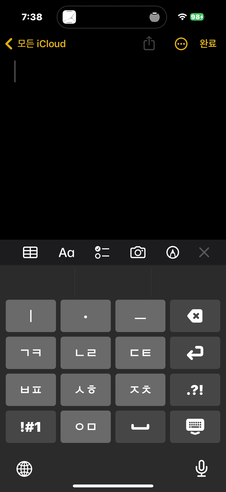

import DisplayFlex from '@site/src/components/DisplayFlex'

## 1.0.5 [[2023-01-21]]

- 소리와 진동 피드백을 사용할 수 있습니다.
- 사용자가 접근성에서 "볼드체 텍스트"를 활성화한 경우 이를 적용합니다.

(참고: 진동 피드백은 "전체 접근 허용"이 활성화된 상태에서만 가능합니다.)

<DisplayFlex>

</DisplayFlex>

## 1.0.4 [[2023-01-18]]

- 버튼 클릭 시각 피드백을 추가했습니다. Thank you [yoonseok312](https://github.com/yoonseok312)!

## 1.0.3

- '앓' '않' 등의 글자가 입력 불가능한 문제를 해결했습니다.

## 1.0.2

- 4.7인치, 5.5인치 아이폰과 아이패드에서 사용성을 향상했습니다.
- iOS 15에서도 하늘땅사람 키보드를 사용할 수 있습니다.
