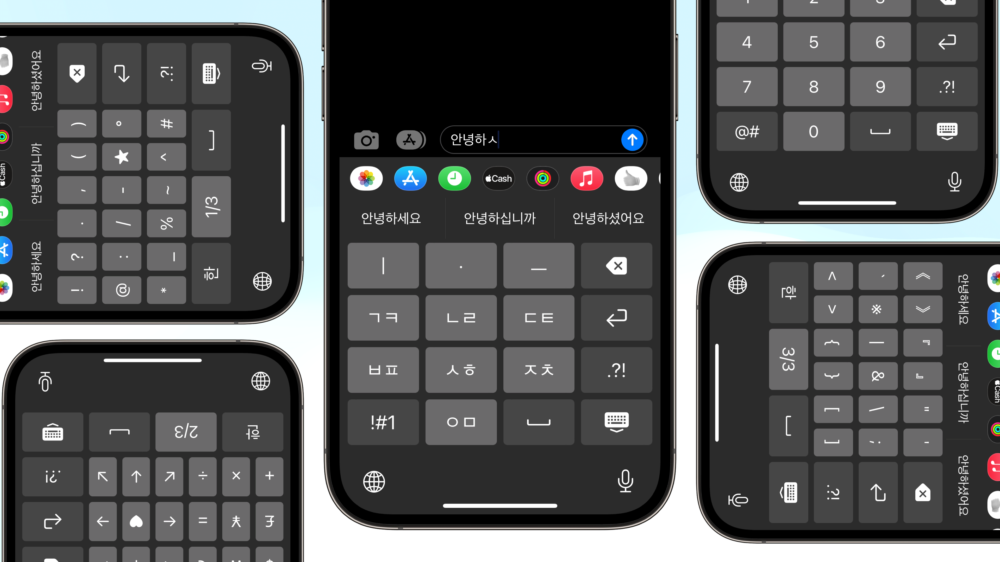
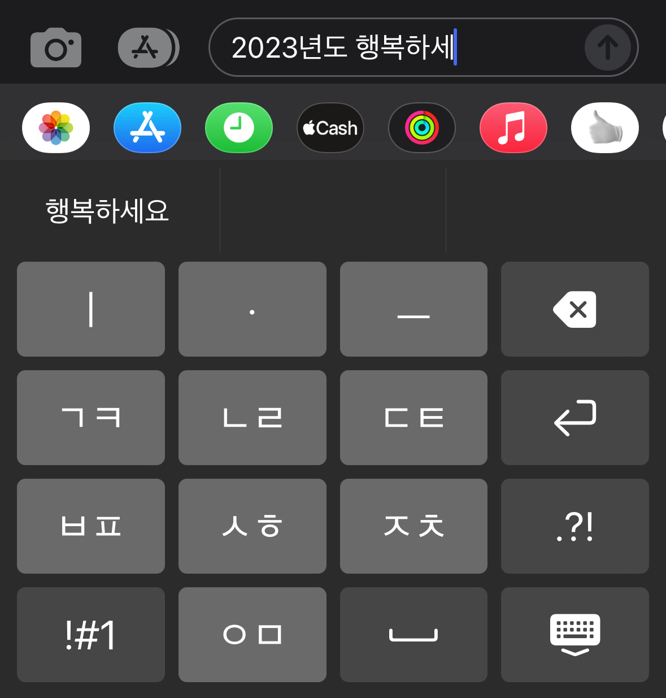
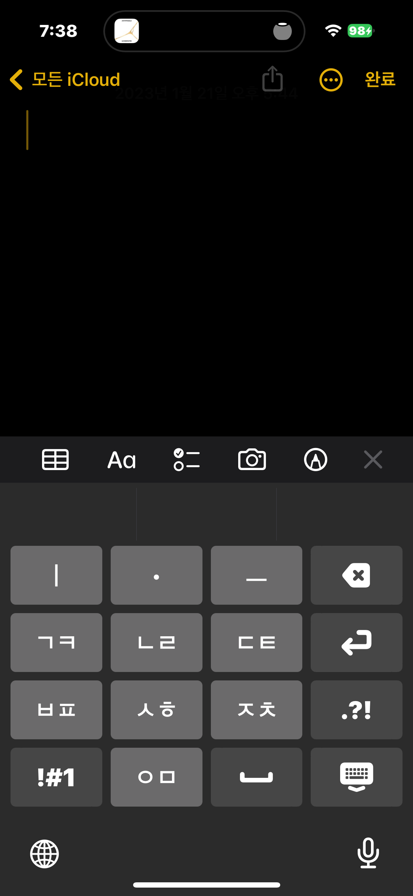
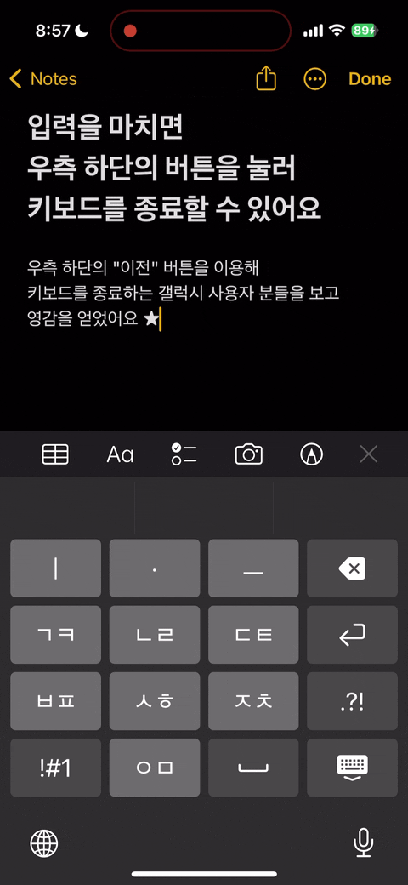

import Admonition from '@theme/Admonition';
import DisplayFlex from '@site/src/components/DisplayFlex'
import YouTube from '@site/src/components/YouTube'

# iPhone 🇰🇷 Keyboard for those who miss Galaxy Keyboards ⌨️


<figure>




</figure>

<Admonition type="info" title="Give me the App Store Link first" icon="💎">

Of course! Here is the [App Store Link](https://apps.apple.com/app/id/1666355842).
Also available on [GitHub](https://github.com/anaclumos/sky-earth-human).

</Admonition>

More and more Korean citizen considers iPhones.
Interestingly, elderly Korean generations purchases iPhone more than ever.
Many pick the two primary reasons for picking a Galaxy as Call Recording and Samsung Pay,
but my personal observation after my parents switched to iPhones differed.

Unexpectedly, the greatest difficulty for older generations was the **keyboard**.
Korean customers had no problem typing Korean with 10-key dial pad since the very early days,
because we had a powerful input method known as "천지인" (Cheon-Ji-In. Translates to _Sky, Earth, and Human_) to input Hangul, the Korean Characters.
Unlike Roman alphabet keyboard which required several alphabets to be crammed in a single button,
Koreans had far fewer needs to switch to QWERTY keyboards because of this.
Many people still use Cheon-Ji-In unless they are Gen-Z's who grew up with smartphones.

After the patent of Cheon-Ji-In entered public domain since 2010,
iPhone added support for Cheon-Ji-In in 2013, but weirdly enough the shape differed from standard Cheon-Ji-In.
The most stark difference was that the **space** button and **next character** button were two separate buttons.


<figure>


<figcaption>The Space button and the Next Character button</figcaption>
</figure>

<Admonition type="info" title='For example, to type "오 안녕"...' icon="💎">

- Galaxy: `ㅇ` `ᆞ` `ㅡ` → Space → `ㅇ` `ㅣ` `ᆞ` `ㄴ` → **Space** → `ㄴ` `ᆞ` `ᆞ` `ㅣ` `ㅇ`
- iPhone: `ㅇ` `ᆞ` `ㅡ` → Space → `ㅇ` `ㅣ` `ᆞ` `ㄴ` → **Next Character** → `ㄴ` `ᆞ` `ᆞ` `ㅣ` `ㅇ`

</Admonition>

More than having two different buttons, the size of each button were smaller,
making people typing more typos than ever.
For these reasons, I came to a conclusion wanting to replicate the exact Galaxy Cheon-Ji-In experience on iPhones.

<Admonition type="info" title="Goal" icon="💎">

Let's recreate the original Cheon-Ji-In for iPhone!

</Admonition>

<Admonition type="tip" title="Extra Tip" icon="🍯">

I also open-sourced the [research notes](/r/C222D1) for this project.

</Admonition>

## 📜 Patents and Legal Rights

First of all, I checked if there were no issues with the legal rights.
I found that the [Patent Holder 조관현 (Cho Kwan-Hyeon)](https://doi.org/10.8080/1019960047925) donated the patent to the Korean Government
and the Cheon-Ji-In became the national standard for input methods, therefore [publicizing the legal rights of the keyboard](https://www.korea.kr/news/policyBriefingView.do?newsId=148700827).
I confirmed such details and then moved on to the development

## 🛠 Readying the Tech

I first read through Apple's [Creating a Custom Keyboard](https://developer.apple.com/documentation/uikit/keyboards_and_input/creating_a_custom_keyboard) document.
It turned out to be similar to creating a regular iOS app; to create ViewControllers and embed the logic inside.
However, I wanted to try out SwiftUI since I have never used it before.
I first imagined [SwiftUI Grid](https://developer.apple.com/documentation/swiftui/grid) would be a clean approach to organize buttons,
but then figured that this class is more suitable for things like the Photos app, which has insurmountable amounts of elements to lay out,
and in my case a simple HStack and Vstack (similar to display: flex on the Web ecosystem) would suffice my needs.

iPhone third-party keyboards use a unique structure known as **extensions**.
Anything other than running on the main iOS app is extensions — custom keyboards are extensions, iOS widgets are extensions, and parts of Apple Watch apps are also extensions.
I read through [Ray Wenderlich](https://www.kodeco.com/49-custom-keyboard-extensions-getting-started) and understood how Keyboard extensions worked.

<figure>

<DisplayFlex>

<figure>


<figure>


</figure>

</figure>

<figure>


<figure>


</figure>

</figure>

<figure>


<figure>


</figure>

</figure>

</DisplayFlex>

<figcaption>

A few early prototypes

</figcaption>

</figure>

The gray background of "ㅇ" was iOS's NSRange and setMarkedText.
It helped entering the text by marking the currently editing charactyers,
but such methods seemed to be more suitable for Pinyins in Chinsese, not Cheon-Ji-In for Hanguls.
Another interesting observation was that the colors of the default iPhone keyboards differed from any default systemColors provided with iOS.
I had to extract the color with Color Meters one by one.

## 😶‍🌫️ But then how do we make Cheon-Ji-In

<details>
<summary>Supplementary YouTube video on how Hangul system works.</summary>

<YouTube id="t_YsTEhcTpo"/>

</details>

I first thought of individual cases to figure out the input logic of Cheon-Ji-In,
then figured that this is tremendously difficult.
For example, take:

- To input `않`, we start from `안ㅅ` and press `ㅅㅎ` to acquire `않`. That is, we must check if the characters are "re-mergable" with the character before.
- From `앉`, when we input `ㅡ`, it must be `안즈`. We must check if the last consonant is extractable from the previous character.
- From `깚`, when we input `ㅂㅍ`, it should result in `깔ㅃ`. We must check if the consonsants are extractable **and** switch between fortis and lenis (strong and weak sounds, like '/p/ and /b/', '/t/ and /d/', or '/k/ and /ɡ/' in English).
- From `갌`, when we input `ㅅㅎ`, it should result in `갏`. More than switching between `ㅅ`, `ㅎ`, and `ㅆ`, we must consider double consonant endings like `ㄽ`.

These are just few examples. Even if we use [KS X 1001 Combinational Korean Encodings](https://en.wikipedia.org/wiki/KS_X_1001),
it was extremely difficult to consider all of the cases.
I concluded that to use a **Finite State Machine**, it required more than 20 data stacks and dozens of states.
(I am unsure of this calculation because I guessworked some parts of it; there may be a simpler implementation. If you want to try building such algorithm, refer to the diagrams on this [patent](https://patents.google.com/patent/KR20000049347A/ko).)
I found some implementations online, but it was long and spagettified that not only translating to the Swift langauge but also even understanding the codes would take a significant time.

But then I came to an epiphany:

<Admonition type="info" title='If there are too many cases' icon="💎">

Why don't I just **hard code** every combination?

</Admonition>

After all, aren't keyboards supposed to **input the same character, given the input sequence are the same**?
What if I just generate all possible combinations and put them into a giant JSON file?
Korean character combinations are around 11,000, and even considering previous characters, the conmbinations did not seem to exceed 100K level.
The size of the JSON file will not exceed 2MB.

We are not living in an era where we need to golf with KBs of RAM on an embedded hardwares.
As long as Hangul coexists with human species, someone will recreate Cheon-Ji-In in the future,\*\*
and that makes constructing the complete Hangul map worth it.

## 🖨️ Hwalja: The simplest Cheon-Ji-In implementation.

Therefore I created Hwalja: the complete map 🗺️ of Hangul, containing all such states and combinations of Cheon-Ji-In.
There are around 50,000 states, and the minified JSON is around 500KB.
(Note: Hwalja means Movable type in Korean)

To implement further higher-level features
(such as removing consonants, not characters, on backspace, or using timers to auto-insert "next character" buttons)
we need more functional workarounds,
but the key input logic is as simple as the following:

```ts
const type = (prev: string, Hwalja: hwalja, key: string, editing: boolean) => {
  const last_two_char = prev.slice(-1)
  const last_one_char = prev.slice(-2)
  if (editing && last_one_char in Hwalja[key]) return prev.slice(0, -2) + Hwalja[key][last_one_char]
  if (editing && last_two_char in Hwalja[key]) return prev.slice(0, -1) + Hwalja[key][last_two_char]
  return prev + Hwalja[key]['']
}
```

I boldly claim this is the simplest implementation of Cheon-Ji-In, given it's five-liner.

Some may ask how I preprocessed such large combinations,
I set the 11,000 final Hangul characters as the destination
and traced back what would've been the previous state and what button the user must have entered laast.
For example, to input **`역`, the previous state must have been `여` and the key press must have been `ㄱ`.**
Of course there were many more edge cases.
[Myself from 4 years ago helped a lot.](https://github.com/anaclumos/hangulbreak/blob/master/Python/HangulDecomposeModule.py)

<Admonition type="tip" title="Let's try!" icon="🧪">
The following is an interactive example of Cheon-Ji-In, made with Hwalja.
</Admonition>

<figure>

<iframe src="https://hwalja.cho.sh/" title="Hwalja Demo" height="450"/>

<figcaption>

[I open-sourced Hwalja for platform-agnostic usage.](https://github.com/anaclumos/hwalja)<br/>Let's try out with the above demo!

</figcaption>
</figure>

<Admonition type="info" title='Hwalja is' icon="💎">
the <strong>simplest</strong> implementation, not the <strong>lightest</strong>. Don't be mistaken.
</Admonition>

<details>
<summary>Can't we use combinatory Hangul sets and normalize the combinations to reduce the case count?</summary>

On the Hwalja project, Engineer 이성광 (Lee Sung-kwang) pointed out that [using Normalization Form D and decomposing consonants will reduce the case count.](https://www.facebook.com/groups/codingeverybody/posts/8942515352455588/?comment_id=8946907612016362)
I only considered Normalization Form D, but Engineer 이성광 is correct on that.
For example, we decompose `안녕` as `안 ᄂᆞᆞㅣㅇ` and use Hwalja to gather `ᆞᆞㅣ` into `ㅕ`, then normalize `ㄴㅕㅇ` into `녕`.

I decided to maintain Hwalja's current approach.
Hwalja aims to be the **most easiest and simplest Cheon-Ji-In implementation**,
and the current approach enables developers to stick with `substring` and `replace`.
If I add dependencies on Normalization Form D and Unicode Normalization,
the Hwalja project may be lighter,
but the developers using Hwalja must add additional handlers for Normalizations.
I created Hwalja because using Automata and Finite State Machines had a steep learning curves,
and thus requiring any learning curves to use Hwalja violates the original purpose.
Also, the final minified version is already standing at 500KB,
not to much to be worried about in size for an input engine.

</details>

## 🤖 Implementing Keyboard Autocompletes.

The reason Cheon-Ji-In users can type in blazing speeds
is because of their actively use [autocompleted texts](https://support.apple.com/ko-kr/guide/iphone/iphd4ea90231/ios) (Apple QuickType).
These autocompleted texts [continuously learn](https://developer.apple.com/design/human-interface-guidelines/technologies/machine-learning/roles/) from the user to assist typings.

Fortunately, Apple's UIKit supports [UITextChecker](https://developer.apple.com/documentation/uikit/uitextchecker)
which frees us from going down to Core ML and Neural Engine level.
Korean is also supported, and we can use `learnWord()` and `unlearnWord()` to record data on user activities.

```swift
import UIKit

let uiTextChecker = UITextChecker()
let input = "행복하"
let guesses = uiTextChecker.completions(
    forPartialWordRange: NSRange(location: 0, length: input.count),
    in: input,
    language: "ko-KR"
)

/*
[
  "행복한", "행복합니다", "행복하게", "행복할", "행복하다", "행복하고", "행복하지",
  "행복하다고", "행복하다는", "행복하기", "행복하면", "행복할까", "행복하길",
  "행복함을", "행복하기를", "행복함", "행복하니", "행복한테", "행복하자", "행복하네"
]
*/

```

I used such features to implement the autocomplete feature.
Sometimes the flow feels unnatural or the keyboard does not suggests anything at all,
but this is a perfect implementation for an MVP.


<figure>




<figcaption>Happy 2023 💙</figcaption>
</figure>

## ⌨️ Advancing Keyboard Functionalities

Cheon-Ji-In, rooting from the 10-key keypad, has many higher level functionalities,
such as long-pressing backspace to delete multiple characters until you release the key,
or holding any key to input the corresponding number key.
I used Swift's closure to extend the keyboard component.

<figure>

```swift
struct KeyboardButton: View {
  var onPress: () -> Void
  var onLongPress: () -> Void
  var onLongPressFinished: () -> Void
  var body: some View {
    Button(action: {})
      .simultaneousGesture(
        DragGesture(minimumDistance: 0) // <-- A
          .onChanged { _ in
            // Code to be executed when long pressed or dragged
            onLongPress()
          }
          .onEnded { _ in
            // When long press or drag gesture finishes
            onLongPressFinished()
          }
      )
      .highPriorityGesture(
        TapGesture()
          .onEnded { _ in
            // Code to be executed on tap
            onPress()
          }
      )
  }
}
```

</figure>

<figcaption>

Code simplified for explanation. [KeyboardButton.swift](https://github.com/anaclumos/sky-earth-human/blob/main/keyboard/KeyboardButton.swift)

</figcaption>

I found an ingenious implementation on the part marked A.
With this, I can successfully implement two features with one code.

- Flicking(swiping) on a button to input numbers.
- Long-pressing on a button to input numbers.

It utilizes iOS's behavior when the minimumDistance of DragGesture is set to 0,
iOS cancels the highPriorityGesture when it recognizes long-press,
and falls back to DragGesture.

Furthermore, I used [Combine](https://developer.apple.com/documentation/combine) introduced with iOS13.
Combine Framework is a Declarative Swift API to implement asynchronous operations.
With this, we can create timers to implement "long press backspace" action.

<figure>

```swift
struct DeleteButton: View {
  @State var timer: AnyCancellable?
  var body: some View {
    KeyboardButton(systemName: "delete.left.fill", primary: false, action: {
      // on tap, execute the default delete action.
      options.deleteAction()
    },
    onLongPress: {
      // when long pressed, create a timer that will trigger every 0.1 seconds.
      timer = Timer.publish(every: 0.1, on: .main, in: .common)
        .autoconnect()
        .sink { _ in
          // while pressing the button, execute the delete action every 0.1 seconds.
          options.deleteAction()
        }
    },
    onLongPressFinished: {
      // when the long press finishes, cancel the timer.
      timer?.cancel()
    })
  }
}
```

<figcaption>

Code simplified for explanation. [HangulView.swift](https://github.com/anaclumos/sky-earth-human/blob/main/keyboard/HangulView.swift)

</figcaption>

</figure>

With these codes, I implemented special functionalities using long-press or drag gestures.

## 🦾 Accessibility and Usabilities

I added a few useful accessibility features.
For example, if the user enabled "Bold Text", the keyboard button will reflect such chagnge.
The following code implements such behavior.

```swift
let fontWeight: UIAccessibility.isBoldTextEnabled ? .bold : .regular
```

<DisplayFlex>


<figure>


<figcaption>Bold Text Enabled</figcaption>
</figure>


<figure>




<figcaption>Bold Text Disabled</figcaption>
</figure>

</DisplayFlex>

Also I found one feature particularly inspirational.
This keyboard is primarily for those who came from Galaxy Android devices,
which has a "back" button the the bottom right corner.
Galaxy users will dismiss the keyboard with the "back" button.
So I placed the keyboard dismiss button on the bottom right corner to resemble such behavior.


<figure>




<figcaption>Pressing the bottom right corner button will dismiss the keyboard.</figcaption>
</figure>

## 🧑🏻‍🎨 Using Midjourney to create the App image

<figure>


<figure>


</figure>

<figcaption>

Images created with Midjourney

</figcaption>

</figure>

I used Midjourney, a text-to-image AI, to create the app icon.
These are called prompt engineering, but I just found drawing paintings with various keywords very amusing.

## ☁️ CI/CD with Xcode Cloud

Finally, I built CI/CD using Xcode Cloud, which was released in 2022.
If you use this, it's like if you push your React code to GitHub, Vercel will build and deploy it on its own.
iOS apps are compiled and stored on the Apple Xcode Cloud servers.
In the case of Apple iPhone apps, there is App Store review process, so it is not completely automatically distributed
(you still have to select a build in the App Store console and hit the Request Review button)
but it's a lot easier than previously having to create an archive file in Xcode and manually upload it.

<DisplayFlex>

<figure>


<figure>


<figcaption>You can check the build linked with GitHub in the App Store console.</figcaption>
</figure>

</figure>

<figure>


<figure>


<figcaption>It also supports Push Notifications.</figcaption>
</figure>

</figure>

</DisplayFlex>

## 🏁 Finishing up

It's been a while since I've been developing for iOS; it was a thrilling experience.
It felt like the iOS platform had matured a lot.
In particular, while working on Hwalja, I felt that **Hangul was so meticulously engineered**.
Most of all, I felt good because I made this app for my parents as a present.
Ending the article by attaching the links.

<Admonition type="info" title="A 5-star review on the App Store and a star on GitHub helps me a lot!" icon="💙">

- [App Store](https://apps.apple.com/app/id/1666355842)
- [GitHub Repo](https://github.com/anaclumos/sky-earth-human)
- [Subproject "Hwalja" GitHub Repo](https://github.com/anaclumos/hwalja)

</Admonition>
