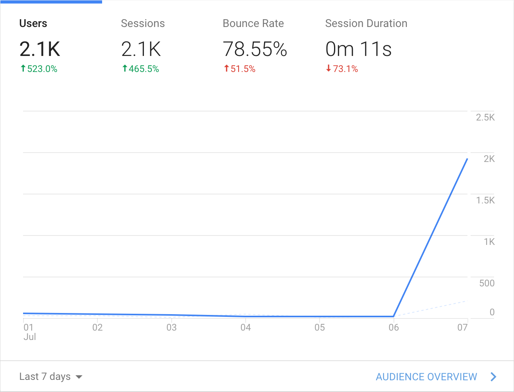
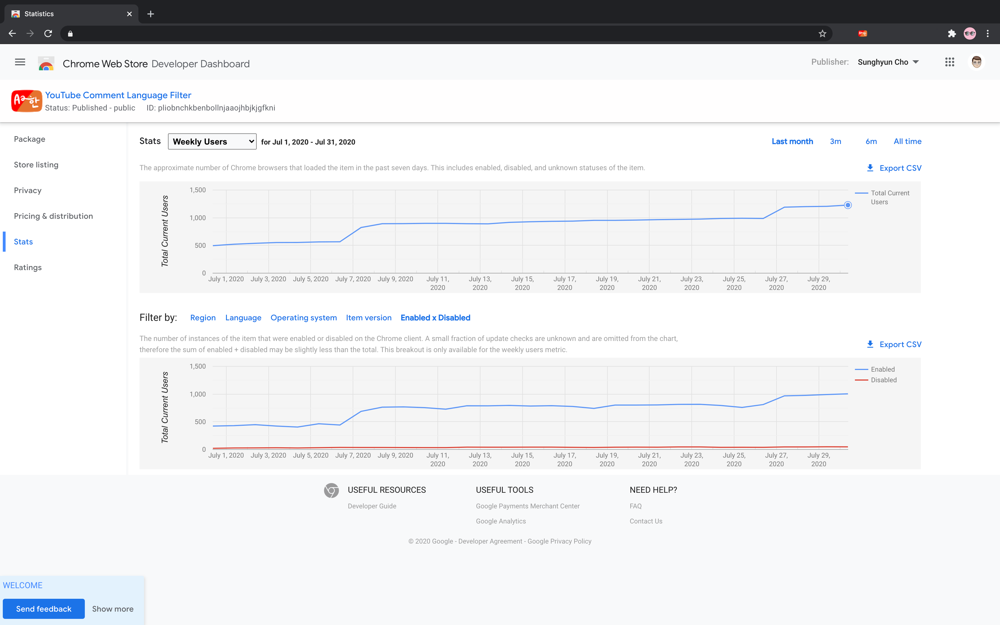
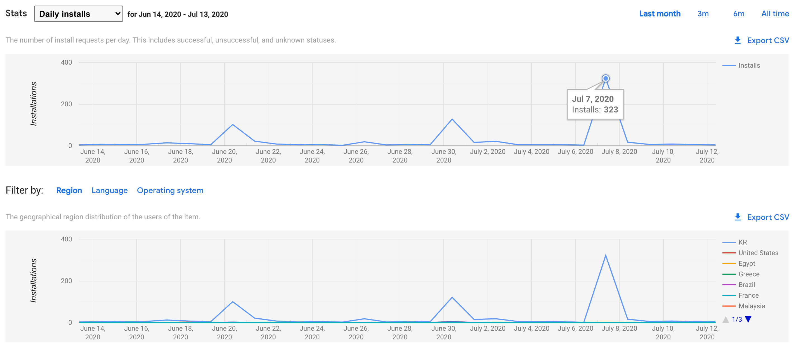

# yclf-주간-사용자-1000명-🎉

## Summary

1,000+명의 사용자 여러분 정말 감사드립니다 🎉

## Content

<figure class="kg-card kg-image-card kg-card-hascaption"><figcaption>7월 7일의 행운... 정말 프로젝트의 원동력 🔥 이었다. 2.1K는 <strong>조회수</strong>이고 이날 약 300분께서 익스텐션을 설치해주셨다.</figcaption></figure>
<a href="https://chrome.google.com/webstore/detail/youtube-comment-language/pliobnchkbenbollnjaaojhbjkjgfkni">YouTube Comment Language Filter</a>의 주간 사용자가 1,000명을 돌파했다. 사용자 분들께 조금이나마 감사한 마음을 공유하고자 약간의 TMI를 적어볼 것이다.
<h2 id="-1-">#1. 크롬 익스텐션 스토어의 집계</h2>
정말 부정확하다. 며칠 단위로 과거 기록이 <strong>보정</strong>된다. 우선 <a href="https://groups.google.com/a/chromium.org/g/chromium-apps/c/Sie4cmSTZmk/m/d-YJtCdcvW0J">Chrome Web Store의 Developer Relations Lead의 글</a>에 따르면 크롬 익스텐션의 주간 사용자는 <strong>한 주 동안 익스텐션의 업데이트를 확인한 유저의 수</strong>를 기준으로 집계된다고 한다. 또 <a href="https://stackoverflow.com/questions/30245932/how-do-i-check-if-a-google-chrome-extension-needs-to-be-updated">이 글</a>에 따르면 크롬은 약 5시간에 한 번씩 익스텐션의 업데이트를 확인한다고 한다.

근데 이 집계 시스템에 오류가 있는 것인지 과거의 숫자가 변한다. 한 일주일 정도 지나면 숫자는 고정되지만 3~5일 이전의 숫자는 계속해서 변한다.
<figure class="kg-card kg-image-card"></figure>
크롬 익스텐션은 위와 같은 주간 사용자 지표를 제공하는데 이 그래프가 조금씩 높낮이가 바뀌는 것 같아 CSV로 저장해서 비교해보니 정말로 바뀌고 있었다.
<!--kg-card-begin: markdown--><table>
<thead>
<tr>
<th>날짜 (2020)</th>
<th>7/31 오후 집계</th>
<th>8/1 새벽 집계</th>
<th>8/1 오후 집계</th>
</tr>
</thead>
<tbody>
<tr>
<td>이전</td>
<td>동일</td>
<td>동일</td>
<td>동일</td>
</tr>
<tr>
<td>7/24</td>
<td>986</td>
<td>986</td>
<td>986</td>
</tr>
<tr>
<td>7/25</td>
<td>990</td>
<td>990</td>
<td>1198</td>
</tr>
<tr>
<td>7/26</td>
<td>986</td>
<td>986</td>
<td>1191</td>
</tr>
<tr>
<td>7/27</td>
<td>981</td>
<td>1191</td>
<td>1191</td>
</tr>
<tr>
<td>7/28</td>
<td>986</td>
<td>1200</td>
<td>1200</td>
</tr>
<tr>
<td>7/29</td>
<td>1206</td>
<td>1206</td>
<td>1206</td>
</tr>
<tr>
<td>7/30</td>
<td>n/a</td>
<td>1228</td>
<td>1228</td>
</tr>
</tbody>
</table>
<!--kg-card-end: markdown-->
또 익스텐션 설치 페이지 사용자 수는 혼자 따로 논다 (...)
<h2 id="2-">2. 커뮤니티의 홍보 게시글</h2>
<a href="https://chosunghyun.com/youtube-comment-language-filter/updates/#v13">5월 말 경에 스토어 링크 복사 버튼을 추가</a>했다. 유튜브 데스크톱에서 관련 확장 프로그램까지 설치해서 쓸 사람이라면 이미 비슷한 사람들이 모이는 커뮤니티에서 활동을 하고 있을 것 같았고 홍보를 간편하게 도와주는 것만으로 자발적인 홍보 효과가 날 것이라고 생각했기 때문이다. 이후 신규 사용자가 급증하는 날이 몇 차례 있었다. 커뮤니티에 관련 게시물 또는 댓글이 올라간 것이었다.
<figure class="kg-card kg-image-card kg-card-hascaption"><figcaption>산 하나가 홍보 게시글 또는 댓글이었다 🙌</figcaption></figure>
Google Analytics Referrals 추적 기능을 통해 어느 링크를 타고 들어오는지 파악이 가능했다. 댓글로 등판하진 않았지만 이 익스텐션을 다룬 글은 거의 다 읽었다. 게시물 또는 댓글을 작성해주신 분들께 정말 감사하다는 인사를 하고 싶다.
<h2 id="3-">3. 앞으로</h2>
GitHub 이슈를 남겨준 분들도 계셨고 메일을 보내주신 분들도 계셨다. 유용한 피드백을 많이 주셨다. 정말 감사했다. 지금 여름 인턴을 하고 있는 관계로 당장 관련 기능들을 뚝딱 구현하진 못하지만 <a href="https://github.com/anaclumos/youtube-comment-language-filter/issues">이슈</a>에 등록해두었고 차차 진행할 계획이다 (정말이다..!)

