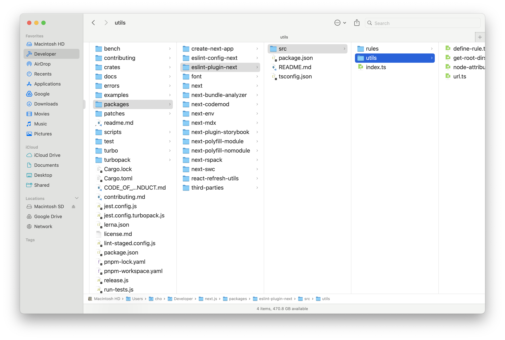

import { KoreaNetherlandsGlobe } from './korea-netherlands'
import Video from 'next-video'

최근 가장 많은 노력을 쏟은 것은 루닛에서의 MLOps 업무이다. 첫 직장인 이곳에서 MLOps 플랫폼의 프론트엔드 전체를 현대적으로 재개발을 리드했는데, 결과적으로 성공 반, 실패 반으로 끝났다. 그 이야기를 조심스레 해보려 한다.

## AutoML

우선 우리 팀, AutoML 팀을 먼저 소개하는 것이 좋겠다. AutoML 팀은 루닛 사내에서 MLOps 플랫폼 INCL을 운영한다.

의료AI 기업 루닛에서는 매일 수백 개의 ML 실험이 일어난다. 초기에는 높은 계산 성능을 경제적으로 감당하기 위해 온프레미스 서버를 사용했지만, 수많은 수동 작업 때문에 빈번한 공수가 들었다. 우선 온프레미스 서버는 확장이 어렵다. 팀원 수가 늘면 자원 수요가 증가하고, 마감이 다가오면 학습 수요가 급증한다. 새 하드웨어 구매에는 비용, 시간이 많이 들며, 필요한 용량 예측도 어려워 과소, 과대 투자 위험이 있다. 또한 서버 노후화로 GPU 장애가 빈번하다. 구식 GPU는 성능 저하나 고장으로 이어져 다운타임과 유지비를 높인다.

이 때문에 클라우드로의 마이그레이션을 고민했으나, 클라우드를 사용함에 따른 별도의 번거로움이 제일 큰 문제였다. 일반적으로 클라우드에서는 가상 머신 생성, 학습 환경 설정, 모델 학습, 클라우드 스토리지 저장, 가상 머신 삭제의 순서를 거치는데, 이 과정 내내 과학자가 번거롭게 관리해 줘야 한다. 이뿐만이 아니라, 실험 결과 관리, 로그 모니터링, 오류 처리 등 추가적인 공수가 훨씬 더 많이 필요하다.

이 과정을 자동화하기 위해 2021년 경부터 루닛에서는 INCL이라는 MLOps 플랫폼을 구축했다. 시중의 [Weight & Bias](https://wandb.ai/), [Vessl](https://vessl.ai/), [SkyPilot](https://github.com/skypilot-org/skypilot)과 유사하지만, 이를 의료AI 도메인에 맞추어 구축한 것. 일반 MLOps 플랫폼처럼 실험 코드와 추적할 지표 이름을 제공하기만 하면 자동으로 클라우드에서 실험을 진행하고 보기 좋은 그래프로 정리해준다. 덕분에 실험의 속도가 압도적으로 빨라질 수 있었고, 출시된지 4년 정도 지난 지금까지 약 800만개의 실험이 일어났다. 이에 대해서 궁금하다면 [루닛의 공식 블로그 포스트](https://medium.com/lunit/intelligent-cloud-part-1-introduction-to-lunits-cloud-deep-learning-platform-for-efficient-94fd2da2a3f2) 또는 내 [요약본](.//ko/r/FC0D3A)을 참고해보자.

<Callout type="info" title="나는 이전 팀 리더님 말씀이 인상 깊었는데" icon="👑">

우리는 인프라를 독자적으로 관리하고 우리의 스케줄에 맞추어 작업한다는 점에서 루닛이라는 회사를 고객으로 하는 기업 내 스타트업의 느낌이 상당히 강하다.

</Callout>

<figure src="./02AAEE.png" alt="서비스 다이어그램" caption="서비스 다이어그램" />

허나 인터널 앱이라는 특성 상 기술 부채가 심해져갔다. 그저 _동작만_ 하면 되기 때문이다. 최적화 또는 코드 정리는 신규 기능에 밀려 항상 뒷전일 수 밖에 없었고, 결과적으로 크고 무거운 웹 서비스가 되고 말았다.

루닛에 합류한 2024년 5월부터 나는 이것을 개선하자는 의견을 피력해왔다. 첫째는 모든 동작이 수 초간의 로딩이 걸리는 것이 쌓여 연구자들의 시간을 달마다 수십 시간씩 뺏고 있다는 계산이고, 둘째는 이 서비스를 개편하면 오픈 서비스로 만들 수 있겠다는 기대 때문이었다. 팀에서도 오픈 서비스로 나아가는 좋은 방향성이라는 것에 대해서 동의했다. 팀 입장에서는, 더 나아가 새로 추가하고 싶었던 기능들이 다양하게 있었는데 기존의 거대해진 코드베이스 때문에 변경이 매우 어려워졌다는 점, 그래서 사용자들이 요청하는 기능들이 항상 계류되고 있다는 점을 타파하기 위한 좋은 기회로 보았다.

**동상이몽**이었지만, 어찌 되었든 INCL을 가장 매력적인 MLOps 서비스로 만들자는 점에는 동의하고 있었다.

## 네덜란드와 데이터 페칭 패러다임

우선 INCL 시스템에는 직관적으로는 쉽사리 이해되지 않는 치명적인 엔지니어링 부채가 존재했으니, 모든 클라우드 리소스가 **네덜란드**에 존재한다는 점이다. 이유는 처음에 서버 위치를 선정할 당시 네덜란드 GCP 서버에 유휴 자원이 가장 많았기 때문이다. 백엔드 서버 또한 컨테이너에서 돌아가는 수많은 데이터를 기록하고 추적해야하고 외부에 있다면 이그레스 비용이 별도로 발생하기에 네덜란드에 있을 수 밖에 없었다. 결과적으로 모든 백엔드 자원이 네덜란드에 발이 묶였다. 물리적으로 시간이 오래 걸릴 수 밖에 없었다. 거리가 잘 상상이 되지 않는다면 **아래 버튼을 눌러 거리를 직접 가늠해보자**. 일부 페이지는 네트워크 요청이 4번 체인되는 경우도 있었는데, 그러면 총 8번 저 거리를 다녀와야 한다!

<KoreaNetherlandsGlobe lang="ko" />

하지만 예로부터 독한 병엔 극약처방이 필요하다고 했었던가? 난세에는 영웅이 등장하는 법이다. 이번에는 `pnpm init` 부터 다시 했던 관계로, 이 기술 부채를 해결하기 위해 모든 것을 변경할 수 있는 기회였다. 새로운 Next.js와 리액트 기술인 앱 라우터와 리액트 서버 컴포넌트에 맞추어 초장부터 갈아엎을 절호의 기회였고 우리의 네덜란드 이슈를 단박에 해결할 수도 있는 기술적 돌파구일 수 있었다. 때문에 초기 탐색을 하며 어떻게 서버 컴포넌트와 SWR, 그리고 스트리밍 서버 사이드 렌더링 (Streaming SSR)과 부분 프리렌더링(Partial Prerendering)을 쓸 수 있을지 각양각색으로 연구했다.

클라이언트 페칭

- 👍 실험 데이터를 실시간으로 볼 수 있음
- 👍 SWR이나 React Query 등을 사용해 정기적으로 최신 데이터를 가져올 수 있음
- 👎 클라이언트 페칭만 사용하면 속도가 너무 느림.
- 👎 일부 클라이언트 페치에 체인된 네트워크 콜 최적화로 약간의 속도 향상은 가능하나 큰 차이는 없음

<Mermaid
  chart="
sequenceDiagram
    title 클라이언트 페칭
    autonumber
    actor 클라이언트
    participant 서버
    participant API
    participant API2
    클라이언트->>서버: INCL 요청
    서버->>클라이언트: HTML
    Note over 클라이언트: JS 실행 (스피너)
    클라이언트->>API: 페치
    API->>클라이언트: 신규 데이터
    클라이언트->>API2: 페치
    API2->>클라이언트: 신규 데이터
    클라이언트->>클라이언트: UI 렌더
"
/>

부분 프리렌더링 (리액트 서버 컴포넌트의 최신 패러다임)

- 👍 번들 사이즈 최적화로 매우 빠른 로딩 속도
- 👎 데이터 페칭 자체를 개선하지 않음 (네덜란드 왕복 문제 해결에 큰 도움 안 됨).
- 👎 Stale-While-Revalidate 패턴으로 옛날 데이터가 먼저 보이고 백그라운드에서 업데이트됨.
- 👎 최신 정보를 보려면 선방문이 필요하기에, 개인화된 정보가 많은 앱에는 부적합

<Mermaid
  chart="
sequenceDiagram
    title 부분 프리렌더링
    autonumber
    actor 클라이언트
    participant 엣지
    participant 서버
    participant API
    participant API2 as API 2
    loop ISR
        서버->>API: 페치
        API->>서버: 데이터
        서버->>API2: 페치
        API2->>서버: 데이터
        서버->>엣지: 정적 HTML
    end
    %% request-time
    클라이언트->>엣지: incl.lunit.io 요청
    엣지->>클라이언트: 정적 HTML
    서버->>클라이언트: 점진적 스트리밍 렌더
"
/>

## 하이브리드

<Mermaid
  chart="
sequenceDiagram
    title Hybrid
    autonumber
    actor 클라이언트
    participant 엣지
    participant 서버 as Next 서버 컴포넌트
    participant API
    loop 갱신
        서버->>API: 페치
        API->>서버: 데이터
        서버->>엣지: 캐시 업데이트
    end
    %% request-time flow
    클라이언트->>엣지: incl.lunit.io 요청
    엣지->>클라이언트: HTML 스트리밍 + 초기 데이터 캐싱
    Note over 클라이언트: SWR 폴백 캐시 설정
    %% 클라이언트-side 라이브 업데이트
    클라이언트->>API: SWR 갱신 페치
    API->>클라이언트: 신규 데이터
    클라이언트->>클라이언트: UI 업데이트
"
/>

결과적으로 당시의 편법적인 방식으로 SWR의 폴백 데이터에 서버에서 온 씨드 데이터를 넣어주고, SWR의 초기 `isLoading` 값을 의도적으로 꺼주는 방식을 택했다. Next.js의 캐시 레이어를 활용해 Next.js 서버 컴포넌트에서 데이터를 넣어주고, Streaming SSR로 서버 컴포넌트 데이터를 즉각 SWR에 폴백 데이터로 전달하면, 번들 사이즈를 희생해 **서버 컴포넌트의 빠른 초기 로딩 속도와 SWR의 라이브 데이터를 모두 얻을 수 있다**.

- 👍 데이터 페칭 자체를 개선 (최초로 보이는 데이터는 캐시되어 있음)
- 👍 Client-side SWR로 최신 정보로 몇 초 뒤 업데이트됨
- 👍 Client-side SWR로, 화면을 새로고침하지 않아도 화면이 자동으로 업데이트됨
- 👍 개인화된 정보가 많은 앱에도 적합
- 👎 번들 사이즈가 상대적으로 커짐

import videoF70351 from './F70351.mp4'

<figure>

<Video src={videoF70351} loop muted autoPlay />

<figcaption>

화면을 새로고침하지 않아도 최신 데이터로 자동으로 업데이트된다. 실험 결과를 지속적으로 모니터링하는 연구자 분들의 삶의 질을 가장 높여준 기능이다!

</figcaption>

</figure>

`isLoading`을 의도적으로 꺼주는 방식으로 제어한 이유는, 로딩 상태 제어를 SWR의 `isLoading`으로 일원화하고 싶었는데, SWR의 `isLoading`은 폴백 데이터가 있어도 최초 로딩에는 항상 참이기 때문에 서버에서 온 씨드 데이터가 있어도 로딩 화면이 보였기 때문이다. 현재는 여기서 더 발전한 패턴들이 존재하는데, 가장 대표적으로 Server에서 시작된 데이터로딩 프리페치 Promise를 클라이언트로 내려준 뒤 use 훅을 이용해 소비(consume)하는 방식이 있다. 다만 이 또한 서버 사이드 데이터 페칭이 오래 걸린다면 여전히 여러 방면으로 캐싱에 대한 고민을 해야한다.

결과적으로, 나는 PPR이나 서버 컴포넌트는 인터랙션이 많은 앱에는 부적합하다고 생각한다. 우리가 서버 컴포넌트를 쓴 이유는 Vercel에서 홍보하는 서버 컴포넌트의 이득보다는 Next.js Server Cache Directive를 쓰기 위함이 더 컸다. 만약 DB와 API 서버가 가까운 곳으로 옮겨지게 된다면, SWR만으로 충분할 것 같다. 실험 데이터는 수십 MB가 되는 경우도 있는데, Next.js Cache의 최대 크기가 2MB이기에 추가적인 우회가 필요했다는 것도 아쉽다.

## 현대적인 웹을 향해

### 넥스트 앱 라우터

이번에 Next App Router를 전격적으로 도입했는데, 다른 것들은 기존의 Pages Router와 방식이 달라졌을 뿐 압도적인 편의를 느끼지는 못했는데, Nested Layout은 압도적으로 편리했다 (`layout`과 `children`이 사각형이 아니면 그리기 어렵다는 문제가 있었지만 말이다). 이 패턴을 적극적으로 활용하여 다음과 같은 레이아웃도 구성할 수 있었는데...

### 밀러 컬럼

[밀러 컬럼](https://en.wikipedia.org/wiki/Miller_columns)이란, 여러 위계가 섞여있는 디렉터리에서 여러 컬럼들이 좌우로 길게 늘어선 것을 뜻한다.

<figure>

<figcaption>

가령, 맥 파인더에서 볼 수 있는 이 화면도 밀러 컬럼의 일환이다.

</figcaption>

</figure>

유저, 프로젝트, 잡이 많고, 서로 다른 프로젝트의 많은 잡을 오고가야 하는 일이 있는데, 기존 구조는 이를 단순하게 Tree 구조 안에 엮어놓고, Tree 안에 Pagination까지 있는 구조라 Job을 찾기 매우 어려웠다.

때문에, 다음과 같은 구조를 만들어내고 싶었다.

<figure>

<figcaption>

이를 흔히 생각하는 중첩 레이아웃이라고 오해했지만, 그렇다면 모바일에서 메인 컨텐츠가 아닌 **리스트 뷰**가 보이게 하는 것이 어렵다.

</figcaption>

</figure>

얼핏 보면 단순해보이지만 App Router의 Nested Layout 없이는 정말로 골치 아프다. 결국 Blitz.js 및 FlightControl.dev의 Brandon Bayer님의 [메시지](https://x.com/flybayer/status/1818009089735279057)를 통해 큰 도움을 얻었는데, 바로 `layout.tsx`에 콘텐츠를 넣고, `page.tsx`를 의도적으로 비워놓는 것이다.

import video5F8BA9 from './5F8BA9.mp4'

<figure>

<Video src={video5F8BA9} loop muted />

<figcaption>

여러 위계가 구분되어야하는 복잡한 데이터를, UI 편의성에 대한 심도 있는 고민과, Nested `layout.tsx`이라는 신기술을 기술적으로 깊게 이해하여 단 수백줄 선에서 구현한 것이 뿌듯했다.

</figcaption>

</figure>

최종적으로는 위와 같이 구현할 수 있었다. 여러 컬럼이 겹쳐있고, 선택되어 있는 컬럼은 마치 책꽂이에 꽂힌 책처럼 세로로 글자가 나타나며 접힌다. 당연히 각 컬럼마다 인피니트 스크롤, 컨텍스트 메뉴 (점 세개 메뉴), 정렬 및 필터링도 지원한다.

아직 초기여서 새로운 인터페이스에 적응하지 못한 분들도 있고 개선 피드백도 받고 있지만, 이와 같은 사용자 UX를 모든 면에 걸쳐 배려심 많은 인터페이스를 개발했고, 전반적으로 사용자들도 좋아하신다는 점을 확인했다.

<figure>

<figcaption>

만든 몇 가지 컴포넌트. 직접 사용해보자 (키보드 단축키는 위 `iframe`을 한 번 클릭하여 포커스를 줘야지만 동작한다.)

</figcaption>

</figure>

### 모바일 지원

어떤 작업을 하는 **작업 스튜디오** 앱은 주로 데스크톱 앱에만 집중하는 경향이 있다. 대부분의 작업이 데스크톱에서 이뤄질 것이기 때문이다. INCL도 그러했는데, AI 훈련은 기본 몇 시간 단위로 걸리기 때문에 이동 중에 짬짬이 훈련이 잘 되고 있는지 모바일에서 확인할 수요가 꾸준히 존재했다. 기존에는 모바일을 전혀 고려하지 않았기 때문에 사용자들이 매우 불편해했고, 이번에는 Tailwind의 반응형 UI를 활용해, **대부분의 코드를 공유하여** 데스크톱과 모바일에서 모두 잘 보이도록 개선했다.

<figure>

<figure>

<figcaption>

메트릭 그래프 뷰

</figcaption>

</figure>

<figure>

<figcaption>

잡 리스트 뷰

</figcaption>

</figure>

<figure>

<figcaption>

프로젝트 테이블 뷰

</figcaption>

</figure>

<figcaption>

모바일에서도 시인성과 가독성을 고려하여, 내 나름대로 Apple의 휴먼 인터페이스 가이드라인이 지향하는 바를 모방해 디자인했다.

</figcaption>

</figure>

## 오픈된 생태계를 향해

작업을 하면서 [TanStack/table](https://github.com/TanStack/table), [shadcn-ui/ui](https://github.com/shadcn-ui/ui) 같은 메이저 라이브러리는 물론 [toss/es-toolkit](https://github.com/toss/es-toolkit)나 [47ng/nuqs](https://github.com/47ng/nuqs)와 같은 새로운 오픈소스 라이브러리들을 적극 차용하고 개선하여 적재적소에 활용했을 뿐만 아니라, 기여하여 그들의 로드맵을 빚는데 도움을 주기도 했다. **하다가 막히는 상황이 생기면 업스트림 코드에 기여하는건 일상이 됐다**. 아래는 몇 가지 예시.

- [toss/es-toolkit: (feature) Add Custom Delimiter Support to flattenObject Utility #933](https://github.com/toss/es-toolkit/pull/933)
- [47ng/nuqs: Server-side \`clearOnDefault\` and \`urlKeys\`](https://github.com/47ng/nuqs/issues/679)
- [juliencrn/usehooks-ts: useLocalStorage Hydration Mismatch -- Need to setIsClient everywhere](https://github.com/juliencrn/usehooks-ts/issues/644)
- [vercel/next.js: Using Async Tags with Revalidate on Next.js Server Fetch Contaminates JSON Response](https://github.com/vercel/next.js/issues/73874)
- [vercel/swr: \`revalidateOnMount\` With Fallback triggers \`isLoading\` instead of \`isValidating\`](https://github.com/vercel/swr/issues/3046)
- [vercel/swr: Visiting 404 Not Found clears all SWR Cache](https://github.com/vercel/swr/issues/3002)

오픈 소스에 몇 가지 아쉬운 점을 적어보자면, TanStack 테이블은 데이터가 실시간으로 바뀌는 Row 데이터를 상정하고 제작한 것 같지 않았다. 예를 들어 Row 값이 변경되었을 때 테이블 페이지, 선택된 Row, 화면에 보여야하는 컬럼의 종류 등을 다루는 커스텀 로직들을 작성해줘야 한다.

`shadcn/ui`의 경우, 다이얼로그가 `React Portal`로 나오는데, 드래그 앤 드랍을 구현할 때 화면의 마우스 `offset`을 계산하기 번거로워지는 문제가 있었다. 결국 드래그 앤 드랍 다이얼로그는 Shadcn 다이얼로그와 동일하게 생긴 다이얼로그로 구현했다.

## 상태 관리

SWR을 사용하게 되면서 내가 줄곧 주창했던 것은 상태 관리를 따로 하지 않아도 된다는 것이다. 어차피 모든 정보는 서버에서 관리되어야 하고, 서버 데이터를 직접 업데이트하고 그 데이터가 실시간으로 클라이언트에 SWR로 업데이트되면서 상태가 최신으로 유지될 것이기 때문에 굳이 상태 관리를 할 필요가 없다는 것이다.

흔히들 이런 말을 하면 복잡한 앱을 만든 경험이 없어서 그렇다고 논의가 일축되는 경향이 있고, 복잡한 앱에서 왜 그게 안 되는지 물어보아도 설득될만한 합당한 근거가 없었다. 그래서 내가 직접 그 경험을 해보았고, 복잡한 앱을 만든 경험이 없어서 그렇다는게 어떤 뜻인지 알게 되었다. 생각해보면, **프론트엔드 복잡성의 모든 문제는 API 통제의 부재에서 온다**. SWR은 하나의 엔드포인트에서 오는 상태를 최신으로 유지하고 관리하는데 특화되어 있는데, 여러가지 데이터가 조합되어서 상태를 표시하는 그래프의 경우 여러 가지 SWR을 훅을 `청기 🔵 들어` `백기 ⚪ 들어` 하는 거대한 SWR 훅을 만들어야 했다. 이를 나중에 커스텀 페치 함수를 만들어 확연한 간소화를 하긴 했지만, 결과적으로 여러 API들에서 오는 정보들을 **조합해서** 관리해야할 경우는 SWR 자체 만으로는 상태관리가 어렵다는 것이 결론이었다.

SWR만으로 상태관리를 한다는 것은, 하나의 기능을 위한 하나의 통합 API가 있을 때만 할 수 있던 이상적인 그림이었다. 그런 면에서 API들의 조합 SWR 훅들이 늘어나 관리 포인트가 늘어난 것이 무척 아쉽다. API 사양을 철저하게 명세를 못 한 문제였고, 우리 팀에 아직 명시적인 기술 PM이 없다는 점이 크게 와닿았다.

또한 서버에 저장되지 않는 정보들도 있다는 것이 문제였다. 예를 들어 사용자들이 설정해둔 그래프의 값이나 테이블 뷰 설정 등은 나는 [처음부터 URL에 기록되어야 한다고 생각했고](https://x.com/leerob/status/1708280997488333078), 그 URL을 사용자들이 북마크해서 사용해야한다고 생각했다. 근데 URL에 담기 어려운 대용량 데이터가 생기기 시작했고, 결국 [로컬 스토리지의 데이터와 URL 상태를 동기화해주는 코드](https://github.com/47ng/nuqs/discussions/606#discussioncomment-11850582)를 작성할 수 밖에 없었다. 이는 URL을 로컬 상태의 원천으로 잡고 싶어하는 내 상황에서는 최선 같기도 했다. 허나, 테이블 정보 등의 데이터는 `useLocalStorage`만을 전적으로 사용해야 했다.

<Callout type="info" title="물론 나는 여전히 상태관리 라이브러리를 도입하는 것보다" icon="📊">

하나의 View를 위한 하나의 API를 백엔드에서 구성해주거나, 최소한 여러 BE API를 조합해서 정리해주는 BFF를 구성해줘야 한다고 생각한다. 다만, 여러 현실적인 어려움으로, 다시 기회가 주어진다면 일부 정보들은 Local Storage Persistence를 사용하는 Zustand를 활용할 것 같다.

</Callout>

## 앞으로

리빌드에 대한 이야기를 했으니, 이제 왜 우리가 리빌드를 했고 어떤 꿈을 꾸고 있는지 알아보자.

### Cursor for ML

루닛은 ML의 Cursor를 만들고 싶어한다. 그 작업의 일환으로 INCL이라는 MLOps 플랫폼의 프론트엔드를 리빌드한 것이다. 이제 루닛은 여기에 여러 Agentic AI를 접목하여

<Callout type="info" title="사용자" icon="🧑‍💻">

지난번 하이퍼파라미터 최적화 실험에서, 서치 스페이스를 조금 늘려서 실험을 다시 해보자. 이번에는 V100 대신 A100을 써. 다 실행해서 정확도가 98%가 넘으면 나한테 슬랙으로 알려줘.

</Callout>

라고 유저가 입력하면 실험이 **알잘딱깔센** 진행되는 플랫폼을 만들고, 그를 이용해 의료 AI 발전을 가속화하는 비전을 꿈꾸고 있다. 즉, AutoML의 의미를 Automated ML에서 Autonomous ML로 전환하고 싶어한다.

### AI의 AWS

나는 그 과정에서 중간 단계 부산물 제품들, 가령 우리의 MLOps 제품들을 외부로 공개하여 플랫폼 기업으로 성장할 수 있다고 생각한다. 그 과정에서 이 중간 제품들을 의료 AI를 위한 캐시카우로 키울 수 있다고 생각한다.

예를 들어, 아마존이 AWS를 왜 공개했을까? 당시 아마존은 인터넷 상점 1등을 공고히 하기 전이었고, AWS 제품군의 공개는 오히려 다른 오프라인 경쟁사들의 클라우드 전환을 도움으로 아마존을 위협할 수 있는 위험한 결정이었다. 그럼에도 아마존이 AWS를 공개한 것은 AWS를 아마존에 독립적인 상품군으로 키워 포트폴리오를 다각화하여 재정 안정성을 키움과 동시에 AWS 외부 고객을 통해 플랫폼을 안정화할 수 있는 방법이었기 때문이다. 이제는 AWS의 압도적인 영업이익률이 아마존의 박리다매 전략을 사실상 든든하게 뒷받침하고 있고, 아마존이 명실상부한 1등 이커머스로 성장할 수 있는 마중물이 되었다. 이 모든 것은, AWS를 외부로 공개하지 않았다면 일어날 수 없는 일이라고 생각한다.

나는 루닛의 ML 제품군이 비슷한 역할을 할 수 있다고 생각한다. 비록 시장에 수많은 제품군이 존재하지만, 루닛만큼 엔드-투-엔드 비용 최적화에 진심인 회사는 거의 없다. **요컨대 대부분의 MLOps 플랫폼 회사들은 고객이 손쉽게 비용 최적화를 할 수 없게 하는 것에 집중한다**. 때문에, 최소한의 비용 최적화만 해주고 고객에게 남은 금액을 청구하는 비즈니스 모델을 가진 반면, 루닛은 자신이 ML 트레이닝의 고객이기도 하고 ML 트레이닝 플랫폼의 제공자기도 하다. 양쪽의 정보를 모두 알고 있으니 전체 파이프라인에 걸쳐 모든 비용 최적화를 할 수 있고, [INCL은 거기에 특화되어 있다.](https://cho.sh/ko/r/C669C9). INCL을 사용하면 클라우드 유휴 자원을 적극적으로 절약하기에, 비용이 60-91% 가까이 절약된다. 고객 입장에서 메리트가 있지 않겠는가?

이런 이유로 나는 루닛의 MLOps 제품군이 외부로 공개되어 플랫폼 기업으로 성장할 수 있다고 생각한다.

## 우리 팀은 채용 중

- [시니어](https://wrkbl.ink/aw1ZHsB)
- [주니어](https://wrkbl.ink/6YGf3CJ)

이 맥락으로... 우리 팀에서 **나와 직접 일할 분**을 채용 중이다. 가장 뛰어난 MLOps 플랫폼을 발전시키고, Agent를 접목시켜서 ML계의 Cursor를 만들 사람을 찾고 있다. 이를 위해서는 백엔드, 프론트엔드, 인프라, AI 생태계 전반에 걸친 이해가 필요하다. 하나의 예를 들자면, 나는 LLM 등은 클라우드에서 유휴 자원을 찾기 어렵다는 문제를 해결하기 위해 개인 GPU 환경에서도 모델 학습 실험을 추적할 수 있도록 연동 작업을 진행 중이다. 클라우드 트레이닝의 편리함과, 유저 개인이 보유한 GPU의 강력함을 결합하는 작업이다. GitHub Action의 Self-hosted Runner와 비슷하다.

만약 자신이 **플랫폼에 대한 전반적으로 이해하고 있는 엔지니어라면** 그리고 **ML의 Cursor를 만드는 꿈**에 함께하고 싶은 사람이라면 채용 공고에 **무작정** 지원을 해보자. 이렇게 이야기할 수 있는 이유는 나 역시 루닛에 무작정 지원했고 그 _두드리면 열릴 것이다!_ 라는 마음가짐이 나를 여기까지 데려왔기 때문이다.

🏋️ 임팩트

- 업무 효율 증가 및 재정적 영향
  - 사용자 1인당 하루 평균 절약 시간: 약 8.45분
  - 월간 총 절약 시간(30명 기준): 약 10.5일
  - [AI 직군 평균 연봉 1억원](https://biz.heraldcorp.com/article/3355824#:~:text=AI%20%EB%93%B1%20%EA%B0%9C%EB%B0%9C%20%EC%A7%81%EA%B5%B0%EC%9D%98%20%EC%97%B0%EB%B4%89%EC%9D%80%201%EC%96%B5100%EB%A7%8C%EC%9B%90)으로 계산할 시 **연간 2억 원 이상의 비용 절감 효과**

- 새로운 INCL의 사용자 만족도
  - 기존 INCL 평균 만족도: 7.14 / 10
  - 새로운 INCL 평균 만족도: 8.48 / 10
  - 생산성 향상 경험: 사용자의 84%가 생산성 증가를 느낌

